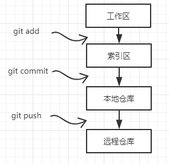
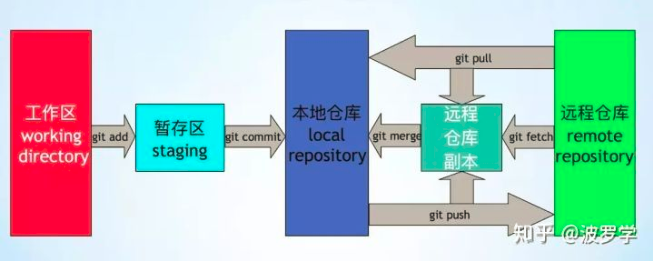
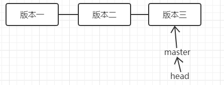
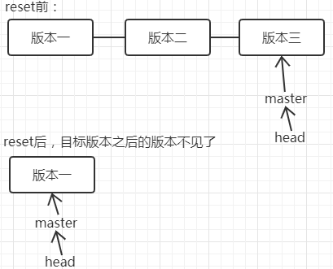
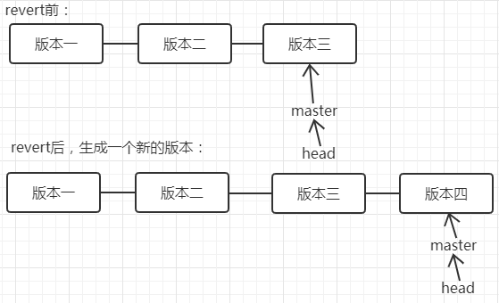
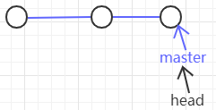
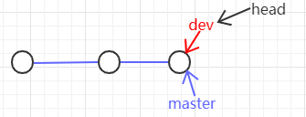
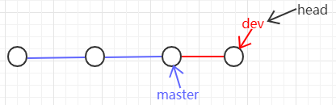

# 一文弄懂git的工作区、索引区、本地仓库、远程仓库以及add、commit、push三个操作

https://www.cnblogs.com/Jing-Wang/p/10991008.html

git中文件所在位置有四个，在工作区内、在索引区内、在本地仓库、在远程仓库。处于四个位置中文件的状态分别为untracked、unmodified、modified、staged。通过三个操作可以把文件进行状态转移：git add 把工作区文件添加到索引区；git commit 把索引区文件添加到本地仓库；git push 把本地仓库文件添加到远程仓库。



为了方便记忆，自己想了一个不确定是否恰当的类比：如果类比我们平时的一个文档编辑活动。文件在工作区时，我们可以类比成我们准备好了一段要存储的内容；在索引区时，可以类比为我们在某个位置新建了一个word文档，往里输入了我们刚刚准备的内容，但是没有保存相当于这个时候git才知道这个文件的存在；文件在本地仓库时，相当于ctrl +s 把文件保存到了文件系统中；在远程仓库，就相当于我们把本地文件存储到了云盘。



- **工作区(working directory)，** 简言之就是你工作的区域。对于git而言，就是的本地工作目录。工作区的内容会包含提交到暂存区和版本库(当前提交点)的内容，同时也包含自己的修改内容。

- **暂存区(stage area,** 又称为索引区index)，是git中一个非常重要的概念。是我们把修改提交版本库前的一个过渡阶段。查看GIT自带帮助手册的时候，通常以index来表示暂存区。在工作目录下有一个.git的目录，里面有个index文件，存储着关于暂存区的内容。git add命令将工作区内容添加到暂存区。

- **本地仓库(local repository)，** 版本控制系统的仓库，存在于本地。当执行git commit命令后，会将暂存区内容提交到仓库之中。在工作区下面有.git的目录，这个目录下的内容不属于工作区，里面便是仓库的数据信息，暂存区相关内容也在其中。这里也可以使用merge或rebase将远程仓库副本合并到本地仓库。图中的只有merge，注意这里也可以使用rebase。

- **远程版本库(remote repository)，** 与本地仓库概念基本一致，不同之处在于一个存在远程，可用于远程协作，一个却是存在于本地。通过push/pull可实现本地与远程的交互；

- **远程仓库副本,** 本地的一个分支，可以理解为存在于本地的远程仓库缓存。如需更新，可通过git fetch/pull命令获取远程仓库内容。

## 本地各区域之间的操作

### 工作区与本地缓存区

> 撤销对工作区的修改 (即在文件已经修改、但尚未add之前撤销对文件的修改）：git checkout

使用方法：

```sh
git checkout 文件名
撤销对工作区修改；这个命令是以最新的存储时间节点（add和commit）为参照，覆盖工作区对应文件file；这个命令改变的是工作区
```

> 将本地距离上次commit之后的修改从工作区添加到缓存区 ： git add

使用方法：

```sh
git add 文件名
添加单个文件

git add .
将修改操作的文件和未跟踪新添加的文件添加到git系统的暂存区，注意不包括删除  

git add -u
将已跟踪文件中的修改和删除的文件添加到暂存区，不包括新增加的文件，注意这些被删除的文件被加入到暂存区再被提交并推送到服务器的版本库之后这个文件就会从git系统中消失了。 

git add -A
表示将所有的已跟踪的文件的修改与删除和新增的未跟踪的文件都添加到暂存区。
```

> 撤销向缓存区的add ： git reset

使用方法：

```sh
git reset HEAD 文件名
清空add命令向暂存区提交的关于file文件的修改；这个命令将修改重新放回到工作区，仅改变暂存区，并不改变工作区，这意味着在无任何其他操作的情况下，工作区中的实际文件同该命令运行之前无任何变化

git reset HEAD
如果后面什么都不跟的话 就是上一次add 里面的全部撤销了
```

### 本地缓存区与本地仓库

> 将本地缓存区中的修改提交到本地仓库 ： git commit

使用方法：

```sh
git commit -m "提交说明"
将add到缓存区的全部修改提交到本次仓库
```

**注意：**

- 使用 git log 命令可以查看全部commit历史信息。
- commit命令会记录一条log，生成当前分支上的一个log节点（即一个版本），commit的一个个版本形成分支的生命线。 



## 本地各版本之间的操作

### 版本向后推进

```sh
git add
git commit -m "info"
```

### 版本回退 ： git reset

修改头指针指向之前的版本，目标版本之后的版本都不再存储。



使用方法：

```sh
git log
查找要回退到的目标版本号

git reset --hard 目标版本号
回退到目标版本
```

- **适用场景：** 如果想恢复到之前某个提交的版本，且那个版本之后提交的版本我们都不要了，就可以用这种方法。

- **注意：** 此时如果git push 到远程会报错，因为当前本地版本比远程版本要低，使用git push -f 可以强制推上去（当然前提得远程允许推，公司的代码库一般会有限制）

### 撤销提交 ： git revert

撤销某次提交，和reset不同的是之前commit的历史都还保存在版本库中。



比如，我们commit了三个版本（版本一、版本二、 版本三），突然发现版本二不行（如：有bug），想要撤销版本二的提交，但又不想撤销版本三的提交，就可以用 git revert 命令来逆向操作版本二，生成新的版本四，这个版本四里会保留版本三的东西，但撤销了版本二的东西。

使用方法：

```sh
git log
查看要反做的目标版本号

git revert  -n 目标版本号
撤销目标版本号所做的修改

git commit -m "message"
commit此次反做操作
```

**适用场景：** 如果我们想撤销之前的某一版本，但是又想保留该目标版本后面的版本，记录下这整个版本变动流程，就可以用这种方法。

## 本地各分支之间的操作

### 默认master分支

一个分支就是一条时间线，默认有一条时间线master，其中有个指针master，这个master指针是指向提交的，每次提交，master指针都会向后移一位，这样不断去提交，master分支就会越来越长。还有个HEAD指针，这个指针指向当前所在分支的的指针。



### 分支创建

若创建新分支，如dev分支，git会新建一个dev指针，与master指针功能一样。先是指向和master同样的位置，当checkout切换到dev分支时候，HEAD指针就指向了dev指针了，当在dev分支下提交，dev指针向后移动。





使用方法：

```sh
git branch branch_name
基于当前commit创建一个新的分支

git branch
查看全部分支
```

### 分支切换

即移动head指针，指向目标分支指针：git checkout branch_a。注意只有分支干净的时候才能提交，要是分支干净共有两种方法，要么把修改commit提交，要么把修改暂存

使用方法：

commit方法

```sh
git add .  
git commit -m "message" 
git checkout branch_b
```

或，stash暂存

```sh
git add .
git stash
git checkout branch_b

在branch_b做完操作又想回到branch_a的时候

git checkout branch_a
git stash pop
```

### git stash 具体使用

- **注意：** 在切换分支之前一定要commit 或 stash 当前分支上的修改，否则在当前分支上做的操作会直接带到目标分支，当在目标分支上执行commit操作的时候这些修改就被提交到目标分支，容易造成代码混乱。

- git commit会把修改提交，体现在分支的时间线上。如果还不想提交（过多没有阶段性成果的提交会使得分支时间线不清晰） git stash是把修改暂存，不会体现在时间线上，重新回到分支后，pop之前暂存的内容，可以继续修改

git stash使用

```sh
git stash
将未提交的修改保存至堆栈中

git stash save "stash message info"
为此次stash添加说明信息，便于以后查看

git stash list
查看stash栈中的内容

git stash pop
将stash中的内容弹出，并应用到当前分支对应的工作目录上，该命令将堆栈中最近保存的内容删除（出栈操作）

git stash apply stash名称
将指定id的内容应用到当前分支的工作目录，内容不会删除，可以在多个分支上重复进行操作

git stash drop stash名称
从堆栈中移除某个指定的stash

git stash clear
清除堆栈中的所有 内容

git stash show
查看堆栈中最新保存的stash和当前目录的差异。

git stash branch
从最新的stash创建分支。
应用场景：当储藏了部分工作，暂时不去理会，继续在当前分支进行开发，后续想将stash中的内容恢复到当前工作目录时，如果是针对同一个文件的修改（即便不是同行数据），那么可能会发生冲突，恢复失败，这里通过创建新的分支来解决。可以用于解决stash中的内容和当前目录的内容发生冲突的情景。
```

### 合并分支

分支合并，操作很简单，若将dev分支内容合到master上，就是将master的指针指向dev指针指向的位置即可。

```sh
git merge --no-ff branch_name
将branch_name分支合并到当前分支。
```

git merge：默认情况下，Git执行"快进式合并"（fast-farward merge），会直接将Master分支指向Develop分支。 使用--no-ff参数后，会执行正常合并，在Master分支上生成一个新节点。为了保证版本演进的清晰，建议采用这种方法。

- git rebase

解决冲突

删除分支

删除分支就是将指向分支的指针（如dev）删除掉

```sh
git checkout branch_a 切换到其他分支
git branch -d branch_b 删除分支
```

## 本地与远程之间的操作

### 向远端

git push 将本地仓库推送到远端仓库

```sh
git add
git commit
git pull 
解决冲突
git push
```

### 向本地

```sh
git fetch
使用远程仓库中的内容更新远程仓库副本。此时并未合并到本地仓库，即本地仓库的代码没有被修改，知识拉取了远程commit数据。

git merge
实现远程仓库与本地仓库的合并

git pull
下拉远程分支并与本地分支合并（使用远程仓库的内容更新远程仓库副本以及本地仓库）。根据配置的不同，相当于git fetch + git merge 或 git fetch + git rebase。

git clone
本地没有 repository 时，将远程 repository 整个下载过来。
```

# 常见面试题

## 列举工作中常用的几个git命令？

- 新增文件的命令：git add file或者git add .
- 提交文件的命令：git commit –m或者git commit –a
- 查看工作区状况：git status –s
- 拉取合并远程分支的操作：git fetch/git merge或者git pull
- 查看提交记录命令：git reflog

## 提交时发生冲突，你能解释冲突是如何产生的吗？你是如何解决的？

开发过程中，我们都有自己的特性分支，所以冲突发生的并不多，但也碰到过。诸如公共类的公共方法，我和别人同时修改同一个文件，他提交后我再提交就会报冲突的错误。
发生冲突，在IDE里面一般都是对比本地文件和远程分支的文件，然后把远程分支上文件的内容手工修改到本地文件，然后再提交冲突的文件使其保证与远程分支的文件一致，这样才会消除冲突，然后再提交自己修改的部分。特别要注意下，修改本地冲突文件使其与远程仓库的文件保持一致后，需要提交后才能消除冲突，否则无法继续提交。必要时可与同事交流，消除冲突。
发生冲突，也可以使用命令。

- 通过git stash命令，把工作区的修改提交到栈区，目的是保存工作区的修改；
- 通过git pull命令，拉取远程分支上的代码并合并到本地分支，目的是消除冲突；
- 通过git stash pop命令，把保存在栈区的修改部分合并到最新的工作空间中；

## 如果本次提交误操作，如何撤销？

- 如果想撤销提交到索引区的文件，可以通过`git reset HEAD file`；

- 如果想撤销提交到本地仓库的文件，可以通过`git reset –soft HEAD^n`恢复当前分支的版本库至上一次提交的状态，**索引区和工作空间不变更**；
- 可以通过`git reset –mixed HEAD^n`恢复当前分支的版本库和索引区至上一次提交的状态，**工作区不变更**；
- 可以通过`git reset –hard HEAD^n`恢复**当前分支的版本库、索引区和工作空间至上一次提交的状态**。

## 如果我想修改提交的历史信息，应该用什么命令？

- 如果修改最近一次提交的历史记录，就可以用**git commit –amend**命令；vim编辑的方式；

- 如果修改之前提交的历史记录，就需要按照下面的步骤：

  - **第一步**：首先查看前三次的提交历史记录：

  ```sh
  $ git log -3
  commit a762fcafecbd92bbde088054644e1b0586589c4b (HEAD -> slave)
  Author: 18073638 <18073638@cnsuning.com>
  Date:   Sat Mar 30 10:58:44 2019 +0800
  
      four commit
  
  commit eedbc93d58780f63dd47f8388f8217892096e89a
  Author: 18073638 <18073638@cnsuning.com>
  Date:   Thu Mar 28 17:19:52 2019 +0800
  
      third commit third commit
  
  commit 05396135eba85140602107e01e5c211d74f6c739
  Author: 18073638 <18073638@cnsuning.com>
  Date:   Thu Mar 28 16:56:19 2019 +0800
  
      second commit
  ```

  ​	注意：这里我们想把053961的committer对象信息修改为“second commit second commit”.

  - **第二步**：执行命令git rebase –i HEAD~3，会把前3次的提交记录按照倒叙列出来；

  ```sh
  pick 0539613 second commit
  pick eedbc93 third commit third commit
  pick a762fca four commit
  
  # Rebase c8d7ad7..a762fca onto c8d7ad7 (3 commands)
  #
  # Commands:
  # p, pick <commit> = use commit
  # r, reword <commit> = use commit, but edit the commit message
  # e, edit <commit> = use commit, but stop for amending
  # s, squash <commit> = use commit, but meld into previous commit
  # f, fixup <commit> = like "squash", but discard this commit's log message
  # x, exec <command> = run command (the rest of the line) using shell
  # b, break = stop here (continue rebase later with 'git rebase --continue')
  # d, drop <commit> = remove commit
  # l, label <label> = label current HEAD with a name
  # t, reset <label> = reset HEAD to a label
  # m, merge [-C <commit> | -c <commit>] <label> [# <oneline>]
  # .       create a merge commit using the original merge commit's
  # .       message (or the oneline, if no original merge commit was
  # .       specified). Use -c <commit> to reword the commit message.
  #
  # These lines can be re-ordered; they are executed from top to bottom.
  #
  # If you remove a line here THAT COMMIT WILL BE LOST.
  #
  # However, if you remove everything, the rebase will be aborted.
  #
  # Note that empty commits are commented out
  ```

  这里把第一行的‘pick’修改为‘edit’，然后esc + :wq退出vim编辑器；

  ```sh
  $ git rebase -i HEAD~3
  Stopped at 0539613...  second commit
  You can amend the commit now, with
  
    git commit --amend
  
  Once you are satisfied with your changes, run
  
    git rebase --continue
  ```

  - **第三步**：根据提示，执行git commit –amend命令，进入vim编辑器并修改提交信息。

  ```sh
  $ git commit --amend
  [detached HEAD 20fe643] second commit second commit
   Date: Thu Mar 28 16:56:19 2019 +0800
   1 file changed, 1 insertion(+)
  ```

  - **第四步**：然后执行git rebase –continue命令

  ```sh
  $ git rebase --continue
  Successfully rebased and updated refs/heads/slave.
  ```

  - 查看修改结果，修改成功。

  ```sh
  $ git log -3
  commit 9024049ef990e79fa61295d5c2b64d70017cf412 (HEAD -> slave)
  Author: 18073638 <18073638@cnsuning.com>
  Date:   Sat Mar 30 10:58:44 2019 +0800
  
      four commit
  
  commit 79cb4e26dd300591e6352d0488802f43b65c8ba2
  Author: 18073638 <18073638@cnsuning.com>
  Date:   Thu Mar 28 17:19:52 2019 +0800
  
      third commit third commit
  
  commit 20fe643cbf80cdcc649d732065e8ebf4caf773c7
  Author: 18073638 <18073638@cnsuning.com>
  Date:   Thu Mar 28 16:56:19 2019 +0800
  
      second commit second commit
  ```

## 你使用过git stash命令吗？你一般什么情况下会使用它？

命令git stash是把工作区修改的内容存储在栈区。
以下几种情况会使用到它：

- 解决冲突文件时，会先执行git stash，然后解决冲突；
- 遇到紧急开发任务但目前任务不能提交时，会先执行git stash，然后进行紧急任务的开发，然后通过git stash pop取出栈区的内容继续开发；
- 切换分支时，当前工作空间内容不能提交时，会先执行git stash再进行分支切换；

## 如何查看分支提交的历史记录？查看某个文件的历史记录呢？

查看分支的提交历史记录：

- 命令`git log –number`：表示查看当前分支前number个详细的提交历史记录；
- 命令`git log –number –pretty=oneline`：在上个命令的基础上进行简化，只显示sha-1码和提交信息；
- 命令`git reflog –number`: 表示查看所有分支前number个简化的提交历史记录；
- 命令`git reflog –number –pretty=oneline`：显示简化的信息历史信息；如果要查看某文件的提交历史记录，直接在上面命令后面加上文件名即可。注意：如果没有number则显示全部提交次数。

## 能不能说一下git fetch和git pull命令之间的区别？

简单来说：git fetch branch是把名为branch的远程分支拉取到本地；而git pull branch是在fetch的基础上，把branch分支与当前分支进行merge；因此pull = fetch + merge。

## 使用过git merge和git rebase吗？它们之间有什么区别？

简单的说，git merge和git rebase都是合并分支的命令。
git merge branch会把branch分支的差异内容pull到本地，然后与本地分支的内容一并形成一个committer对象提交到主分支上，合并后的分支与主分支一致；
git rebase branch会把branch分支优先合并到主分支，然后把本地分支的commit放到主分支后面，合并后的分支就好像从合并后主分支又拉了一个分支一样，本地分支本身不会保留提交历史。

## 能说一下git系统中HEAD、工作树和索引之间的区别吗？

- **HEAD文件**包含当前分支的引用（指针）；
- **工作树**是把当前分支检出到工作空间后形成的目录树，一般的开发工作都会基于工作树进行；
- **索引index文件**是对工作树进行代码修改后，通过add命令更新索引文件；GIT系统通过索引index文件生成tree对象；

## 之前项目中是使用的GitFlow工作流程吗？它有什么好处？

GitFlow可以用来管理分支。GitFlow工作流中常用的分支有下面几类：
- master分支：最为稳定功能比较完整的随时可发布的代码，即代码开发完成，经过测试，没有明显的bug，才能合并到 master 中。请注意永远不要在 master 分支上直接开发和提交代码，以确保 master 上的代码一直可用；
- develop分支；用作平时开发的主分支，并一直存在，永远是功能最新最全的分支，包含所有要发布 到下一个 release 的代码，主要用于合并其他分支，比如 feature 分支； 如果修改代码，新建 feature 分支修改完再合并到 develop 分支。所有的 feature、release 分支都是从 develop 分支上拉的。
- feature分支；这个分支主要是用来开发新的功能，一旦开发完成，通过测试没问题（这个测试，测试新功能没问题），我们合并回develop 分支进入下一个 release
- release分支；用于发布准备的专门分支。当开发进行到一定程度，或者说快到了既定的发布日，可以发布时，建立一个 release 分支并指定版本号(可以在 finish 的时候添加)。开发人员可以对 release 分支上的代码进行集中测试和修改bug。（这个测试，测试新功能与已有的功能是否有冲突，兼容性）全部完成经过测试没有问题后，将 release 分支上的代码合并到 master 分支和 develop 分支
- hotfix分支；用于修复线上代码的bug。**从 master 分支上拉。**完成 hotfix 后，打上 tag 我们合并回 master 和 develop 分支。

> GitFlow主要工作流程

1. 初始化项目为gitflow , 默认创建master分支 , 然后从master拉取第一个develop分支
2. 从develop拉取feature分支进行编码开发(多个开发人员拉取多个feature同时进行并行开发 , 互不影响)
3. feature分支完成后 , 合并到develop(不推送 , feature功能完成还未提测 , 推送后会影响其他功能分支的开发)；合并feature到develop , 可以选择删除当前feature , 也可以不删除。但当前feature就不可更改了，必须从release分支继续编码修改
4. 从develop拉取release分支进行提测 , 提测过程中在release分支上修改BUG
5. release分支上线后 , 合并release分支到develop/master并推送；合并之后，可选删除当前release分支，若不删除，则当前release不可修改。线上有问题也必须从master拉取hotfix分支进行修改；
6. 上线之后若发现线上BUG , 从master拉取hotfix进行BUG修改；
7. hotfix通过测试上线后，合并hotfix分支到develop/master并推送；合并之后，可选删除当前hotfix ，若不删除，则当前hotfix不可修改，若补丁未修复，需要从master拉取新的hotfix继续修改；
8. 当进行一个feature时 , 若develop分支有变动 , 如其他开发人员完成功能并上线 , 则需要将完成的功能合并到自己分支上，即合并develop到当前feature分支；
9. 当进行一个release分支时 , 若develop分支有变动 , 如其他开发人员完成功能并上线 , 则需要将完成的功能合并到自己分支上，即合并develop到当前release分支 (!!! 因为当前release分支通过测试后会发布到线上 , 如果不合并最新的develop分支 , 就会发生丢代码的情况)；

> GitFlow的好处

为不同的分支分配一个明确的角色，并定义分支之间如何交互以及什么时间交互；可以帮助大型项目理清分支之间的关系，简化分支的复杂度。

## 使用过git cherry-pick，有什么作用？

命令git cherry-pick可以把branch A的commit复制到branch B上。
在branch B上进行命令操作：

复制单个提交：git cherry-pick commitId
复制多个提交：git cherry-pick commitId1…commitId3
注意：复制多个提交的命令不包含commitId1

## git跟其他版本控制器有啥区别？

GIT是分布式版本控制系统，其他类似于SVN是集中式版本控制系统。
分布式区别于集中式在于：每个节点的地位都是平等，拥有自己的版本库，在没有网络的情况下，对工作空间内代码的修改可以提交到本地仓库，此时的本地仓库相当于集中式的远程仓库，可以基于本地仓库进行提交、撤销等常规操作，从而方便日常开发。

## 我们在本地工程常会修改一些配置文件，这些文件不需要被提交，而我们又不想每次执行git status时都让这些文件显示出来，我们该如何操作？

首先利用命令touch .gitignore新建文件

```sh
$ touch .gitignore
```

然后往文件中添加需要忽略哪些文件夹下的什么类型的文件

```sh
$ vim .gitignore
$ cat .gitignore
/target/class
.settings
.imp
*.ini
```

注意：忽略/target/class文件夹下所有后缀名为.settings，.imp的文件，忽略所有后缀名为.ini的文件。

## 如何把本地仓库的内容推向一个空的远程仓库？

首先确保本地仓库与远程之间是连同的。如果提交失败，则需要进行下面的命令进行连通：

```sh
git remote add origin XXXX
```

注意：XXXX是你的远程仓库地址。
如果是第一次推送，则进行下面命令

```sh
git push -u origin master
```

注意：-u 是指定origin为默认主分支
之后的提交，只需要下面的命令：

```sh
git push origin master
```

