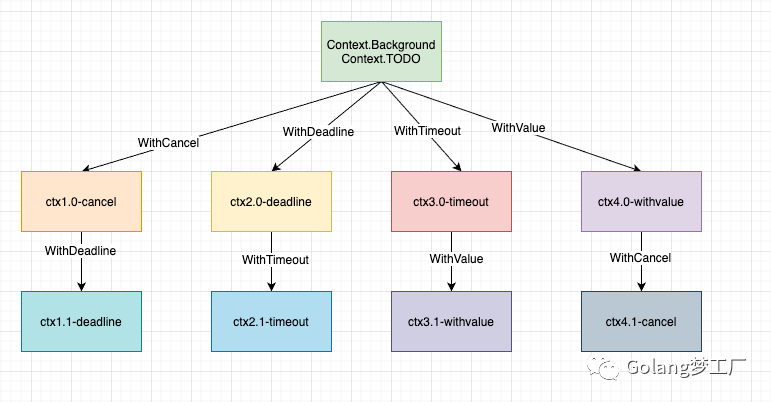
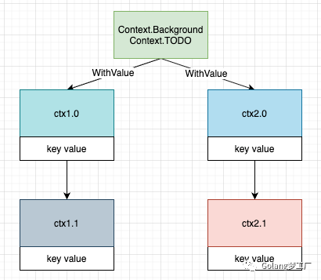

# Go语言设计与实现

https://draveness.me/golang/docs/part2-foundation/ch05-keyword/golang-make-and-new/

# 代码实现

## 顺序打印

（Goroutine）有三个函数，分别打印"cat", "fish","dog"要求每一个函数都用一个goroutine，按照顺序打印100次。

此题目考察channel，用三个无缓冲channel，如果一个channel收到信号则通知下一个。

```go
package main

import (
	"fmt"
	"time"
)

var dog = make(chan struct{})
var cat = make(chan struct{})
var fish = make(chan struct{})

func Dog() {
	<-fish
	fmt.Println("dog")
	dog <- struct{}{}
}

func Cat() {
	<-dog
	fmt.Println("cat")
	cat <- struct{}{}
}

func Fish() {
	<-cat
	fmt.Println("fish")
	fish <- struct{}{}
}

func main() {
	for i := 0; i < 100; i++ {
		go Dog()
		go Cat()
		go Fish()
	}
	fish <- struct{}{}

	time.Sleep(10 * time.Second)
}
```

## 两个协程交替打印10个字母和数字

思路：采用channel来协调goroutine之间顺序。

主线程一般要waitGroup等待协程退出，这里简化了一下直接sleep。

```go
package main

import (
	"fmt"
	"time"
)

var word = make(chan struct{}, 1)
var num = make(chan struct{}, 1)

func printNums() {
	for i := 0; i < 10; i++ {
		<-word
		fmt.Println(1)
		num <- struct{}{}
	}
}
func printWords() {
	for i := 0; i < 10; i++ {
		<-num
		fmt.Println("a")
		word <- struct{}{}
	}
}

func main() {
	num <- struct{}{}
	go printNums()
	go printWords()
	time.Sleep(time.Second * 1)
}
```

## 启动 2个groutine 2秒后取消， 第一个协程1秒执行完，第二个协程3秒执行完。

思路：采用`ctx, _ := context.WithTimeout(context.Background(), time.Second*2)`实现2s取消。协程执行完后通过channel通知，是否超时。

```go
package main

import (
	"context"
	"fmt"
	"time"
)

func f1(in chan struct{}) {
	time.Sleep(1 * time.Second)
	in <- struct{}{}

}

func f2(in chan struct{}) {
	time.Sleep(3 * time.Second)
	in <- struct{}{}
}

func main() {
	ch1 := make(chan struct{})
	ch2 := make(chan struct{})
	ctx, _ := context.WithTimeout(context.Background(), 2*time.Second)

	go func() {
		go f1(ch1)
		select {
		case <-ctx.Done():
			fmt.Println("f1 timeout")
			break
		case <-ch1:
			fmt.Println("f1 done")
		}
	}()

	go func() {
		go f2(ch2)
		select {
		case <-ctx.Done():
			fmt.Println("f2 timeout")
			break
		case <-ch2:
			fmt.Println("f2 done")
		}
	}()
	time.Sleep(time.Second * 5)
}
```

输出结果

```go
f1 done
f2 timeout
```

## 当select监控多个chan同时到达就绪态时，如何先执行某个任务？

可以在子case再加一个for select语句。

```go
func priority_select(ch1, ch2 <-chan string) {
	for {
		select {
		case val := <-ch1:
			fmt.Println(val)
		case val2 := <-ch2:
		priority:
			for {
				select {
				case val1 := <-ch1:
					fmt.Println(val1)

				default:
					break priority
				}
			}
			fmt.Println(val2)
		}
	}
}
```

## 实现使用字符串函数名，调用函数。

思路：采用反射的Call方法实现。

```go
import (
	"fmt"
    "reflect"
)

type Animal struct{
    
}

func (a *Animal) Eat(){
    fmt.Println("Eat")
}

func main(){
    a := Animal{}
    reflect.ValueOf(&a).MethodByName("Eat").Call([]reflect.Value{})
    
}
```

# channel多路复用

## 1. 为什么需要多路复用

Go 程序在并发处理一些任务的时，会为每一个任务创建一个 goroutine，然后需要根据不同的 goroutine 的返回的结果做不同的处理。

如果按照通常的做法，分别获取每个 channel 的结果：

```go
taskCh1 := make(chan bool)
taskCh2 := make(chan bool)
taskCh3 := make(chan bool)

go run(taskCh1)
go run(taskCh2)
go run(taskCh3)

for {
    // 接收通道 1 的结果
    result1 := <-taskCh1
    // 接收通道 2 的结果
    result2 := <-taskCh2
    // 接收通道 3 的结果
    result3 := <-taskCh3
}
```

然后再根据不同 goroutine 返回的结果做后续的处理，这个代码有个问题，需要等待所有的 goroutine 都执行完成之后才能做出结果，这样实现的效率很低，因为每一个获取 channel 值的过程都是阻塞的。

在处理多个通道时，想同时接收多个通道的数据将会变的很困难。

而且在一些情况下，需要根据先返回通道的做出不同的处理，上面那种方式无法做到，这就**需要使用多路复用**。

Go 提供了 select 机制来解决这个问题。

## 2. select 基本使用

select 语法形式和 switch 很相似，switch 接收一个变量，然后根据变量的值做不同的处理，select 操作接收的是通道操作：

```go
ch := make(chan int, 1) // 这个例子中，这里必须用缓冲通道

for {
	select {
	case <-ch:
		time.Sleep(time.Second)
		fmt.Println("case 1 invoke")
	case data := <-ch:
		time.Sleep(time.Second)
		fmt.Printf("case 2 invoke %d\n", data)
	case ch <- 100:
		time.Sleep(time.Second)
		fmt.Println("case3 invoke")
}
```

在 select 的 case 中，可以执行三种操作：

1. <- ch：接收通道，但是对值不处理
2. data := <-ch：接收通道，并处理从通道中得到的结果
3. ch <- 100：向通道中发送数据

上面的程序运行起来之后，case 3 会首先执行，然后 case1 和 case2 会随机执行一个，程序就这样一直交替运行下去。

如果用 select 改造上面第一个例子中的代码，就是下面这样：

```go
for {
		select {
		// 接收通道 1 的结果
		case r := <-taskCh1:
			fmt.Printf("task1 result %+v\n", r)
		// 接收通道 2 的结果
		case r := <-taskCh2:
			fmt.Printf("task2 result %+v\n", r)
		// 接收通道 3 的结果
		case r := <-taskCh3:
			fmt.Printf("task3 result %+v\n", r)
		}
}
```

select 会及时响应每一个就绪的 channel，无论是发送数据还是接收数据。

## 3. 处理超时情况

select 除了用于同时处理多个通道之外，还可以用来处理一些通道超时的情况，通道在阻塞的时候，如果没有外界的干扰，会一直等下去，但是可以通过 select 设置一个超时时间，来打断阻塞：

```go
ch := make(chan int, 1)

select {
case data := <- ch:
	fmt.Printf("case invoke %+v\n", data)
case <-time.After(3 * time.Second):
	fmt.Println("channel timeout")

}
```

上面的代码在创建了一个通道，但没有向通道中发送数据，如果不用 select，程序就会死锁。

select 中添加了两个 case，一个从通道中获取数据， 但肯定获取不到，所以在 3 秒钟之后，另一个 case 就会执行，返回通道超时的提示，这样就避免了程序会一直等待下去。

还有一个情况是我们有时候需用通过键盘获取其他输入设备向程序发送信号，也可以通过这种方式来实现，把上面的程序再修改一下：

```go
ch := make(chan int, 1)

quitCh := make(chan bool, 1)

go func(ch chan bool) {
	var quit string
	fmt.Printf("quit? are you sure?: ")
	fmt.Scanln(&quit)
	quitCh <- true
}(quitCh)

select {
case data := <- ch:
	fmt.Printf("case invoke %+v\n", data)
case <-quitCh:
	fmt.Println("program quit")

}
```

这次不再通过超时来控制，而是通过键盘来控制，新建了一个通道，只有在键盘输入之后，才会向通道中发送数据，这样就可以做到自由控制程序的退出。

## 4. 非阻塞的 select

在上面的示例代码中，其实还少写了一部分，看下面的代码：

```go
ch := make(chan int)

for {
	select {
	case <-ch:
		fmt.Println("case invoke")
	}
}
```

上面的代码会出现死锁，因为这个 select 只有一个 case，而这个 case 永远都不会接收到数据，所以 select 本身也被阻塞了，程序无法继续运行，就会造成死锁，对于这种情况，我们设置一个可用的 case，让 select 变成非阻塞，就可以解决这个问题。

```go
ch := make(chan int)

for {
	select {
	case <-ch:
		fmt.Println("case invoke")
	default:
		time.Sleep(time.Second)
		fmt.Println("default invoke")
	}
}
```

这样，程序就不会死锁，而是不断的执行 default 中的内容。

## 5. 小结

在这篇文章中，我们介绍了通道的多路复用，并说明了可以用到多路复用的场景。下篇文章中，我们来详细聊一下 Go 是如何实现传统的并发模型。

# Bitmap实现

```go
type BitMap struct {
	vec  []byte
	size int
}

func New(size int) *BitMap {
	return &BitMap{
		size: size,
		vec:  make([]byte, size),
	}
}

func (bm *BitMap) Set(num int) (ok bool, err error) {
	if num/8 >= bm.size {
		return false, errors.New("the num overflows the size of bitmap")
	}
	bm.vec[num/8] |= 1 << (num % 8)
	return true, nil
}

func (bm *BitMap) Exist(num int) bool {
	if num/8 >= bm.size {
		return false
	}
	return bm.vec[num/8]&(1<<(num%8)) > 0
}

func (bm *BitMap) Sort() (ret []int) {
	ret = make([]int, 0)
	for i := 0; i < (8 * bm.size); i++ {
		if bm.Exist(i) {
			ret = append(ret, i)
		}
	}
	return
}
```

# grpc为啥好，基本原理是什么，和http比呢

官方介绍：gRPC 是一个现代开源的**高性能远程过程调用** (RPC) 框架，可以在**任何环境**中运行。它可以通过对负载平衡、跟踪、健康检查和身份验证的可插拔支持有效地连接数据中心内和跨数据中心的服务。它也适用于分布式计算的最后一英里，将设备、移动应用程序和浏览器连接到后端服务。

区别：

- rpc是远程过程调用，就是本地去调用一个远程的函数，而http是通过 url和符合restful风格的数据包去发送和获取数据；
- rpc的一般使用的编解码协议更加高效，比如grpc使用protobuf编解码。而http的一般使用json进行编解码，数据相比rpc更加直观，但是数据包也更大，效率低下；
- rpc一般用在服务内部的相互调用，而http则用于和用户交互；

相似点：
都有类似的机制，例如grpc的metadata机制和http的头机制作用相似，而且web框架，和rpc框架中都有拦截器的概念。grpc使用的是http2.0协议。
官网：[gRPC](https://link.zhihu.com/?target=https%3A//grpc.io/)

# 说说context包的作用？你用过哪些，原理知道吗？

## **前言**

今天想与大家分享`context`包，经过一年的沉淀，重新出发，基于Go`1.17.1`从源码角度再次分析，不过这次不同的是，我打算先从入门开始，因为大多数初学的读者都想先知道怎么用，然后才会关心源码是如何实现的。

相信大家在日常工作开发中一定会看到这样的代码：

```go
func a1(ctx context ...){
  b1(ctx)
}
func b1(ctx context ...){
  c1(ctx)
}
func c1(ctx context ...)
```

`context`被当作第一个参数（官方建议），并且不断透传下去，基本一个项目代码中到处都是`context`，但是你们真的知道它有何作用吗以及它是如何起作用的吗？我记得我第一次接触`context`时，同事都说这个用来做并发控制的，可以设置超时时间，超时就会取消往下执行，快速返回，我就单纯的认为只要函数中带着`context`参数往下传递就可以做到超时取消，快速返回。相信大多数初学者也都是和我一个想法，其实这是一个错误的思想，其取消机制采用的也是通知机制，单纯的透传并不会起作用，比如你这样写代码：

```go
func main()  {
 ctx,cancel := context.WithTimeout(context.Background(),10 * time.Second)
 defer cancel()
 go Monitor(ctx)

 time.Sleep(20 * time.Second)
}

func Monitor(ctx context.Context)  {
 for {
  fmt.Print("monitor")
 }
}
```

即使`context`透传下去了，没有监听取消信号也是不起任何作用的。所以了解`context`的使用还是很有必要的，本文就先从使用开始，逐步解析`Go`语言的`context`包，下面我们就开始喽！！！

## **`context`包的起源与作用**

看官方博客我们可以知道`context`包是在`go1.7`版本中引入到标准库中的：


`context`可以用来在`goroutine`之间传递上下文信息，相同的`context`可以传递给运行在不同`goroutine`中的函数，上下文对于多个`goroutine`同时使用是安全的，`context`包定义了上下文类型，可以使用`background`、`TODO`创建一个上下文，在函数调用链之间传播`context`，也可以使用`WithDeadline`、`WithTimeout`、`WithCancel` 或 `WithValue` 创建的修改副本替换它，听起来有点绕，其实总结起就是一句话：`context`的作用就是在不同的`goroutine`之间同步请求特定的数据、取消信号以及处理请求的截止日期。

目前我们常用的一些库都是支持`context`的，例如`gin`、`database/sql`等库都是支持`context`的，这样更方便我们做并发控制了，只要在[服务器](https://cloud.tencent.com/product/cvm?from=10680)入口创建一个`context`上下文，不断透传下去即可。

## **`context`的使用**

### **创建`context`**

`context`包主要提供了两种方式创建`context`:

- `context.Backgroud()`
- `context.TODO()`

这两个函数其实只是互为别名，没有差别，官方给的定义是：

- `context.Background` 是上下文的默认值，所有其他的上下文都应该从它衍生（Derived）出来。
- `context.TODO` 应该只在不确定应该使用哪种上下文时使用；

所以在大多数情况下，我们都使用`context.Background`作为起始的上下文向下传递。

上面的两种方式是创建根`context`，不具备任何功能，具体实践还是要依靠`context`包提供的`With`系列函数来进行派生：

```go
func WithCancel(parent Context) (ctx Context, cancel CancelFunc)
func WithDeadline(parent Context, deadline time.Time) (Context, CancelFunc)
func WithTimeout(parent Context, timeout time.Duration) (Context, CancelFunc)
func WithValue(parent Context, key, val interface{}) Context
```

这四个函数都要基于父`Context`衍生，通过这些函数，就创建了一颗Context树，树的每个节点都可以有任意多个子节点，节点层级可以有任意多个，画个图表示一下：



基于一个父`Context`可以随意衍生，其实这就是一个`Context`树，树的每个节点都可以有任意多个子节点，节点层级可以有任意多个，每个子节点都依赖于其父节点，例如上图，我们可以基于`Context.Background`衍生出四个子`context`：`ctx1.0-cancel`、`ctx2.0-deadline`、`ctx3.0-timeout`、`ctx4.0-withvalue`，这四个子`context`还可以作为父`context`继续向下衍生，即使其中`ctx1.0-cancel`                                    节点取消了，也不影响其他三个父节点分支。

创建`context`方法和`context`的衍生方法就这些，下面我们就一个一个来看一下他们如何被使用。

### **`WithValue`携带数据**

我们日常在业务开发中都希望能有一个`trace_id`能串联所有的日志，这就需要我们打印日志时能够获取到这个`trace_id`，在`python`中我们可以用`gevent.local`来传递，在`java`中我们可以用`ThreadLocal`来传递，在`Go`语言中我们就可以使用`Context`来传递，通过使用`WithValue`来创建一个携带`trace_id`的`context`，然后不断透传下去，打印日志时输出即可，来看使用例子：

```go
const (
 KEY = "trace_id"
)

func NewRequestID() string {
 return strings.Replace(uuid.New().String(), "-", "", -1)
}

func NewContextWithTraceID() context.Context {
 ctx := context.WithValue(context.Background(), KEY,NewRequestID())
 return ctx
}

func PrintLog(ctx context.Context, message string)  {
 fmt.Printf("%s|info|trace_id=%s|%s",time.Now().Format("2006-01-02 15:04:05") , GetContextValue(ctx, KEY), message)
}

func GetContextValue(ctx context.Context,k string)  string{
 v, ok := ctx.Value(k).(string)
 if !ok{
  return ""
 }
 return v
}

func ProcessEnter(ctx context.Context) {
 PrintLog(ctx, "Golang梦工厂")
}


func main()  {
 ProcessEnter(NewContextWithTraceID())
}
```

输出结果：

```
2021-10-31 15:13:25|info|trace_id=7572e295351e478e91b1ba0fc37886c0|Golang梦工厂
Process finished with the exit code 0
```

我们基于`context.Background`创建一个携带`trace_id`的`ctx`，然后通过`context`树一起传递，从中派生的任何`context`都会获取此值，我们最后打印日志的时候就可以从`ctx`中取值输出到日志中。目前一些`RPC`框架都是支持了`Context`，所以`trace_id`的向下传递就更方便了。

在使用`withVaule`时要注意四个事项：

- 不建议使用`context`值传递关键参数，关键参数应该显示的声明出来，不应该隐式处理，`context`中最好是携带签名、`trace_id`这类值。
- 因为携带`value`也是`key`、`value`的形式，为了避免`context`因多个包同时使用`context`而带来冲突，`key`建议采用内置类型。
- 上面的例子我们获取`trace_id`是直接从当前`ctx`获取的，实际我们也可以获取父`context`中的`value`，在获取键值对是，我们先从当前`context`中查找，没有找到会在从父`context`中查找该键对应的值直到在某个父`context`中返回 `nil` 或者查找到对应的值。
- `context`传递的数据中`key`、`value`都是`interface`类型，这种类型编译期无法确定类型，所以不是很安全，所以在类型断言时别忘了保证程序的健壮性。

### **超时控制**

通常健壮的程序都是要设置超时时间的，避免因为服务端长时间响应消耗资源，所以一些`web`框架或`rpc`框架都会采用`withTimeout`或者`withDeadline`来做超时控制，当一次请求到达我们设置的超时时间，就会及时取消，不在往下执行。`withTimeout`和`withDeadline`作用是一样的，就是传递的时间参数不同而已，他们都会通过传入的时间来自动取消`Context`，这里要注意的是他们都会返回一个`cancelFunc`方法，通过调用这个方法可以达到提前进行取消，不过在使用的过程还是建议在自动取消后也调用`cancelFunc`去停止定时减少不必要的资源浪费。

`withTimeout`、`WithDeadline`不同在于`WithTimeout`将持续时间作为参数输入而不是时间对象，这两个方法使用哪个都是一样的，看业务场景和个人习惯了，因为本质`withTimout`内部也是调用的`WithDeadline`。

现在我们就举个例子来试用一下超时控制，现在我们就模拟一个请求写两个例子：

- 达到超时时间终止接下来的执行

```go
func main()  {
 HttpHandler()
}

func NewContextWithTimeout() (context.Context,context.CancelFunc) {
 return context.WithTimeout(context.Background(), 3 * time.Second)
}

func HttpHandler()  {
 ctx, cancel := NewContextWithTimeout()
 defer cancel()
 deal(ctx)
}

func deal(ctx context.Context)  {
 for i:=0; i< 10; i++ {
  time.Sleep(1*time.Second)
  select {
  case <- ctx.Done():
   fmt.Println(ctx.Err())
   return
  default:
   fmt.Printf("deal time is %d\n", i)
  }
 }
}
```

输出结果：

```
deal time is 0
deal time is 1
context deadline exceeded
```

- 没有达到超时时间终止接下来的执行

```go
func main()  {
 HttpHandler1()
}

func NewContextWithTimeout1() (context.Context,context.CancelFunc) {
 return context.WithTimeout(context.Background(), 3 * time.Second)
}

func HttpHandler1()  {
 ctx, cancel := NewContextWithTimeout1()
 defer cancel()
 deal1(ctx, cancel)
}

func deal1(ctx context.Context, cancel context.CancelFunc)  {
 for i:=0; i< 10; i++ {
  time.Sleep(1*time.Second)
  select {
  case <- ctx.Done():
   fmt.Println(ctx.Err())
   return
  default:
   fmt.Printf("deal time is %d\n", i)
   cancel()
  }
 }
}
```

输出结果：

```javascript
deal time is 0
context canceled
```

使用起来还是比较容易的，既可以超时自动取消，又可以手动控制取消。这里大家要记的一个坑，就是我们往从请求入口透传的调用链路中的`context`是携带超时时间的，如果我们想在其中单独开一个goroutine去处理其他的事情并且不会随着请求结束后而被取消的话，那么传递的`context`要基于`context.Background`或者`context.TODO`重新衍生一个传递，否决就会和预期不符合了，可以看一下我之前的一篇踩坑文章：[**context使用不当引发的一个bug**](https://mp.weixin.qq.com/s?__biz=MzkyNzI1NzM5NQ==&mid=2247484788&idx=1&sn=5789c87d1f90fbdfa7f6201689567edf&scene=21#wechat_redirect)。

### **`withCancel`取消控制**

日常业务开发中我们往往为了完成一个复杂的需求会开多个`gouroutine`去做一些事情，这就导致我们会在一次请求中开了多个`goroutine`确无法控制他们，这时我们就可以使用`withCancel`来衍生一个`context`传递到不同的`goroutine`中，当我想让这些`goroutine`停止运行，就可以调用`cancel`来进行取消。

来看一个例子：

```go
func main()  {
 ctx,cancel := context.WithCancel(context.Background())
 go Speak(ctx)
 time.Sleep(10*time.Second)
 cancel()
 time.Sleep(1*time.Second)
}

func Speak(ctx context.Context)  {
 for range time.Tick(time.Second){
  select {
  case <- ctx.Done():
   fmt.Println("我要闭嘴了")
   return
  default:
   fmt.Println("balabalabalabala")
  }
 }
}
```

运行结果：

```javascript
balabalabalabala
....省略
balabalabalabala
我要闭嘴了
```

我们使用`withCancel`创建一个基于`Background`的ctx，然后启动一个讲话程序，每隔1s说一话，`main`函数在10s后执行`cancel`，那么`speak`检测到取消信号就会退出。

### **自定义`Context`**

因为`Context`本质是一个接口，所以我们可以通过实现`Context`达到自定义`Context`的目的，一般在实现`Web`框架或`RPC`框架往往采用这种形式，比如`gin`框架的`Context`就是自己有封装了一层，具体代码和实现就贴在这里，有兴趣可以看一下`gin.Context`是如何实现的。

## **源码赏析**

Context其实就是一个接口，定义了四个方法：

```go
type Context interface {
 Deadline() (deadline time.Time, ok bool)
 Done() <-chan struct{}
 Err() error
 Value(key interface{}) interface{}
}
```

- `Deadlne`方法：当`Context`自动取消或者到了取消时间被取消后返回
- `Done`方法：当`Context`被取消或者到了`deadline`返回一个被关闭的`channel`
- `Err`方法：当`Context`被取消或者关闭后，返回`context`取消的原因
- `Value`方法：获取设置的`key`对应的值

这个接口主要被三个类继承实现，分别是`emptyCtx`、`ValueCtx`、`cancelCtx`，采用匿名接口的写法，这样可以对任意实现了该接口的类型进行重写。

下面我们就从创建到使用来层层分析。

### **创建根`Context`**

其在我们调用`context.Background`、`context.TODO`时创建的对象就是`empty`：

```go
var (
 background = new(emptyCtx)
 todo       = new(emptyCtx)
)

func Background() Context {
 return background
}

func TODO() Context {
 return todo
}
```

`Background`和`TODO`还是一模一样的，官方说：`background`它通常由主函数、初始化和测试使用，并作为传入请求的顶级上下文；`TODO`是当不清楚要使用哪个 Context 或尚不可用时，代码应使用 context.TODO，后续在在进行替换掉，归根结底就是语义不同而已。

#### **`emptyCtx`类**

`emptyCtx`主要是给我们创建根`Context`时使用的，其实现方法也是一个空结构，实际源代码长这样：

```go
type emptyCtx int

func (*emptyCtx) Deadline() (deadline time.Time, ok bool) {
 return
}

func (*emptyCtx) Done() <-chan struct{} {
 return nil
}

func (*emptyCtx) Err() error {
 return nil
}

func (*emptyCtx) Value(key interface{}) interface{} {
 return nil
}

func (e *emptyCtx) String() string {
 switch e {
 case background:
  return "context.Background"
 case todo:
  return "context.TODO"
 }
 return "unknown empty Context"
}
```

### **`WithValue`的实现**

`withValue`内部主要就是调用`valueCtx`类：

```go
func WithValue(parent Context, key, val interface{}) Context {
 if parent == nil {
  panic("cannot create context from nil parent")
 }
 if key == nil {
  panic("nil key")
 }
 if !reflectlite.TypeOf(key).Comparable() {
  panic("key is not comparable")
 }
 return &valueCtx{parent, key, val}
}
```

#### **`valueCtx`类**

`valueCtx`目的就是为`Context`携带键值对，因为它采用匿名接口的继承实现方式，他会继承父`Context`，也就相当于嵌入`Context`当中了

```go
type valueCtx struct {
 Context
 key, val interface{}
}
```

实现了`String`方法输出`Context`和携带的键值对信息：

```go
func (c *valueCtx) String() string {
 return contextName(c.Context) + ".WithValue(type " +
  reflectlite.TypeOf(c.key).String() +
  ", val " + stringify(c.val) + ")"
}
```

实现`Value`方法来存储键值对：

```go
func (c *valueCtx) Value(key interface{}) interface{} {
 if c.key == key {
  return c.val
 }
 return c.Context.Value(key)
}
```

看图来理解一下：



所以我们在调用`Context`中的`Value`方法时会层层向上调用直到最终的根节点，中间要是找到了`key`就会返回，否会就会找到最终的`emptyCtx`返回`nil`。

### **`WithCancel`的实现**

我们来看一下`WithCancel`的入口函数源代码：

```go
func WithCancel(parent Context) (ctx Context, cancel CancelFunc) {
 if parent == nil {
  panic("cannot create context from nil parent")
 }
 c := newCancelCtx(parent)
 propagateCancel(parent, &c)
 return &c, func() { c.cancel(true, Canceled) }
}
```

这个函数执行步骤如下：

- 创建一个`cancelCtx`对象，作为子`context`
- 然后调用`propagateCancel`构建父子`context`之间的关联关系，这样当父`context`被取消时，子`context`也会被取消。
- 返回子`context`对象和子树取消函数

我们先分析一下`cancelCtx`这个类。

#### **`cancelCtx`类**

`cancelCtx`继承了`Context`，也实现了接口`canceler`:

```go
type cancelCtx struct {
 Context

 mu       sync.Mutex            // protects following fields
 done     atomic.Value          // of chan struct{}, created lazily, closed by first cancel call
 children map[canceler]struct{} // set to nil by the first cancel call
 err      error                 // set to non-nil by the first cancel call
}
```

字短解释：

- `mu`：就是一个互斥锁，保证并发安全的，所以`context`是并发安全的
- `done`：用来做`context`的取消通知信号，之前的版本使用的是`chan struct{}`类型，现在用`atomic.Value`做锁优化
- `children`：`key`是接口类型`canceler`，目的就是存储实现当前`canceler`接口的子节点，当根节点发生取消时，遍历子节点发送取消信号
- `error`：当`context`取消时存储取消信息

这里实现了`Done`方法，返回的是一个只读的`channel`，目的就是我们在外部可以通过这个阻塞的`channel`等待通知信号。

具体代码就不贴了。我们先返回去看`propagateCancel`是如何做构建父子`Context`之间的关联。

#### **`propagateCancel`方法**

代码有点长，解释有点麻烦，我把注释添加到代码中看起来比较直观：

```go
func propagateCancel(parent Context, child canceler) {
  // 如果返回nil，说明当前父`context`从来不会被取消，是一个空节点，直接返回即可。
 done := parent.Done()
 if done == nil {
  return // parent is never canceled
 }

  // 提前判断一个父context是否被取消，如果取消了也不需要构建关联了，
  // 把当前子节点取消掉并返回
 select {
 case <-done:
  // parent is already canceled
  child.cancel(false, parent.Err())
  return
 default:
 }

  // 这里目的就是找到可以“挂”、“取消”的context
 if p, ok := parentCancelCtx(parent); ok {
  p.mu.Lock()
    // 找到了可以“挂”、“取消”的context，但是已经被取消了，那么这个子节点也不需要
    // 继续挂靠了，取消即可
  if p.err != nil {
   child.cancel(false, p.err)
  } else {
      // 将当前节点挂到父节点的childrn map中，外面调用cancel时可以层层取消
   if p.children == nil {
        // 这里因为childer节点也会变成父节点，所以需要初始化map结构
    p.children = make(map[canceler]struct{})
   }
   p.children[child] = struct{}{}
  }
  p.mu.Unlock()
 } else {
    // 没有找到可“挂”，“取消”的父节点挂载，那么就开一个goroutine
  atomic.AddInt32(&goroutines, +1)
  go func() {
   select {
   case <-parent.Done():
    child.cancel(false, parent.Err())
   case <-child.Done():
   }
  }()
 }
}
```

这段代码真正产生疑惑的是这个if、else分支。不看代码了，直接说为什么吧。因为我们可以自己定制`context`，把`context`塞进一个结构时，就会导致找不到可取消的父节点，只能重新起一个协程做监听。

对这块有迷惑的推荐阅读饶大大文章：[深度解密Go语言之context](https://www.cnblogs.com/qcrao-2018/p/11007503.html)，定能为你排忧解惑。

#### **`cancel`方法**

最后我们再来看一下返回的`cancel`方法是如何实现，这个方法会关闭上下文中的 Channel 并向所有的子上下文同步取消信号：

```go
func (c *cancelCtx) cancel(removeFromParent bool, err error) {
  // 取消时传入的error信息不能为nil, context定义了默认error:var Canceled = errors.New("context canceled")
 if err == nil {
  panic("context: internal error: missing cancel error")
 }
  // 已经有错误信息了，说明当前节点已经被取消过了
 c.mu.Lock()
 if c.err != nil {
  c.mu.Unlock()
  return // already canceled
 }
  
 c.err = err
  // 用来关闭channel，通知其他协程
 d, _ := c.done.Load().(chan struct{})
 if d == nil {
  c.done.Store(closedchan)
 } else {
  close(d)
 }
  // 当前节点向下取消，遍历它的所有子节点，然后取消
 for child := range c.children {
  // NOTE: acquiring the child's lock while holding parent's lock.
  child.cancel(false, err)
 }
  // 节点置空
 c.children = nil
 c.mu.Unlock()
  // 把当前节点从父节点中移除，只有在外部父节点调用时才会传true
  // 其他都是传false，内部调用都会因为c.children = nil被剔除出去
 if removeFromParent {
  removeChild(c.Context, c)
 }
}
```

到这里整个`WithCancel`方法源码就分析好了，通过源码我们可以知道`cancel`方法可以被重复调用，是幂等的。

### **`withDeadline`、`WithTimeout`的实现**

先看`WithTimeout`方法，它内部就是调用的`WithDeadline`方法：

```go
func WithTimeout(parent Context, timeout time.Duration) (Context, CancelFunc) {
 return WithDeadline(parent, time.Now().Add(timeout))
}
```

所以我们重点来看`withDeadline`是如何实现的：

```go
func WithDeadline(parent Context, d time.Time) (Context, CancelFunc) {
  // 不能为空`context`创建衍生context
 if parent == nil {
  panic("cannot create context from nil parent")
 }
  
  // 当父context的结束时间早于要设置的时间，则不需要再去单独处理子节点的定时器了
 if cur, ok := parent.Deadline(); ok && cur.Before(d) {
  // The current deadline is already sooner than the new one.
  return WithCancel(parent)
 }
  // 创建一个timerCtx对象
 c := &timerCtx{
  cancelCtx: newCancelCtx(parent),
  deadline:  d,
 }
  // 将当前节点挂到父节点上
 propagateCancel(parent, c)
  
  // 获取过期时间
 dur := time.Until(d)
  // 当前时间已经过期了则直接取消
 if dur <= 0 {
  c.cancel(true, DeadlineExceeded) // deadline has already passed
  return c, func() { c.cancel(false, Canceled) }
 }
 c.mu.Lock()
 defer c.mu.Unlock()
  // 如果没被取消，则直接添加一个定时器，定时去取消
 if c.err == nil {
  c.timer = time.AfterFunc(dur, func() {
   c.cancel(true, DeadlineExceeded)
  })
 }
 return c, func() { c.cancel(true, Canceled) }
}
```

`withDeadline`相较于`withCancel`方法也就多了一个定时器去定时调用`cancel`方法，这个`cancel`方法在`timerCtx`类中进行了重写，我们先来看一下`timerCtx`类，他是基于`cancelCtx`的，多了两个字段：

```go
type timerCtx struct {
 cancelCtx
 timer *time.Timer // Under cancelCtx.mu.

 deadline time.Time
}
```

`timerCtx`实现的`cancel`方法，内部也是调用了`cancelCtx`的`cancel`方法取消：

```go
func (c *timerCtx) cancel(removeFromParent bool, err error) {
  // 调用cancelCtx的cancel方法取消掉子节点context
 c.cancelCtx.cancel(false, err)
  // 从父context移除放到了这里来做
 if removeFromParent {
  // Remove this timerCtx from its parent cancelCtx's children.
  removeChild(c.cancelCtx.Context, c)
 }
  // 停掉定时器，释放资源
 c.mu.Lock()
 if c.timer != nil {
  c.timer.Stop()
  c.timer = nil
 }
 c.mu.Unlock()
}
```

终于源码部分我们就看完了，现在你何感想？

## **`context`的优缺点**

`context`包被设计出来就是做并发控制的，这个包有利有弊，个人总结了几个优缺点，欢迎评论区补充。

### **缺点**

- 影响代码美观，现在基本所有`web`框架、`RPC`框架都是实现了`context`，这就导致我们的代码中每一个函数的一个参数都是`context`，即使不用也要带着这个参数透传下去，个人觉得有点丑陋。
- `context`可以携带值，但是没有任何限制，类型和大小都没有限制，也就是没有任何约束，这样很容易导致滥用，程序的健壮很难保证；还有一个问题就是通过`context`携带值不如显式传值舒服，可读性变差了。
- 可以自定义`context`，这样风险不可控，更加会导致滥用。
- `context`取消和自动取消的错误返回不够友好，无法自定义错误，出现难以排查的问题时不好排查。
- 创建衍生节点实际是创建一个个链表节点，其时间复杂度为O(n)，节点多了会掉支效率变低。

### **优点**

- 使用`context`可以更好的做并发控制，能更好的管理`goroutine`滥用。
- `context`的携带者功能没有任何限制，这样我我们传递任何的数据，可以说这是一把双刃剑
- 网上都说`context`包解决了`goroutine`的`cancelation`问题，你觉得呢？

## **总结**

`context`虽然在使用上丑陋了一点，但是他却能解决很多问题，日常业务开发中离不开`context`的使用，不过也别使用错了`context`，其取消也采用的`channel`通知，所以代码中还有要有监听代码来监听取消信号，这点也是经常被广大初学者容易忽视的一个点。

文中示例已上传`github`：https://github.com/asong2020/Golang_Dream/tree/master/code_demo/context_example

# 进程被kill，如何保证所有goroutine顺利退出

goroutine监听SIGKILL信号，一旦接收到SIGKILL，则立刻退出。可采用select方法。

# go的调试/分析工具用过哪些。

go的自带工具链相当丰富，

- go cover : 测试代码覆盖率；
- godoc: 用于生成go文档；
- pprof：用于性能调优，针对cpu，内存和并发；
- race：用于竞争检测；