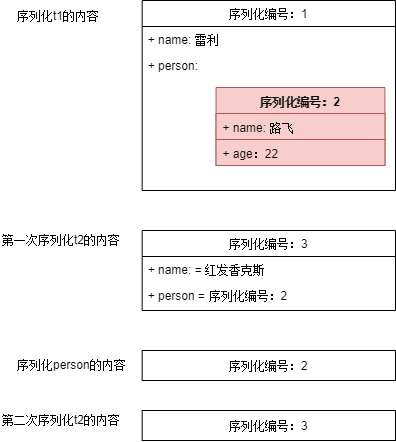

# java 中 IO 流分为几种?BIO,NIO,AIO 有什么区别?

## IO 流分为几种

**Java中的流分为两种，一种是字节流，另一种是字符流，分别由四个抽象类来表示（每种流包括输入和输出两种所以一共四个）:InputStream，OutputStream，Reader，Writer。Java中其他多种多样变化的流均是由它们派生出来的。**

字符流和字节流是根据处理数据的不同来区分的。

**字节流**按照8位传输，字节流是最基本的，所有文件的储存是都是字节（byte）的储存，在磁盘上保留的并不是文件的字符而是先把字符编码成字节，再储存这些字节到磁盘。

- 字节流可用于任何类型的对象，包括二进制对象，而字符流只能处理字符或者字符串；
- 节流提供了处理任何类型的IO操作的功能，但它不能直接处理Unicode字符，而字符流就可以。

读文本的时候用字符流，例如txt文件。读非文本文件的时候用字节流，例如mp3。理论上任何文件都能够用字节流读取，但当读取的是文本数据时，为了能还原成文本你必须再经过一个转换的工序，相对来说字符流就省了这个麻烦，可以有方法直接读取。

**字符流**处理的单元为2个字节的Unicode字符，分别操作字符、字符数组或字符串，而字节流处理单元为1个字节， 操作字节和字节数组。所以字符流是由Java虚拟机将字节转化为2个字节的Unicode字符为单位的字符而成的，所以它对多国语言支持性比较好！

## BIO、NIO、AIO 有什么区别

- BIO：Block IO 同步阻塞式 IO，就是我们平常使用的传统 IO，它的特点是模式简单使用方便，并发处理能力低。
- NIO：Non IO 同步非阻塞 IO，是传统 IO 的升级，客户端和服务器端通过 Channel（通道）通讯，实现了多路复用。
- AIO：Asynchronous IO 是 NIO 的升级，也叫 NIO2，实现了异步非堵塞 IO ，异步 IO 的操作基于事件和回调机制。

> BIO是一个连接一个线程。
> NIO是一个请求一个线程。
> AIO是一个有效请求一个线程。

- BIO：同步并阻塞，服务器实现模式为一个连接一个线程，即客户端有连接请求时服务器端就需要启动一个线程进行处理，如果这个连接不做任何事情会造成不必要的线程开销，当然可以通过线程池机制改善。
- NIO：同步非阻塞，服务器实现模式为一个请求一个线程，即客户端发送的连接请求都会注册到多路复用器上，多路复用器轮询到连接有I/O请求时才启动一个线程进行处理。
- AIO：异步非阻塞，服务器实现模式为一个有效请求一个线程，客户端的I/O请求都是由OS先完成了再通知服务器应用去启动线程进行处理。

适用场景分析

- BIO方式适用于连接数目比较小且固定的架构，这种方式对服务器资源要求比较高，并发局限于应用中，JDK1.4以前的唯一选择，但程序直观简单易理解。
- NIO方式适用于连接数目多且连接比较短（轻操作）的架构，比如聊天服务器，并发局限于应用中，编程比较复杂，JDK1.4开始支持。
- AIO方式使用于连接数目多且连接比较长（重操作）的架构，比如相册服务器，充分调用OS参与并发操作，编程比较复杂，JDK7开始支持。

# 轻量级锁和偏向锁详解

## 问题背景

Synchronized是通过对象内部的一个叫做监视器锁（monitor）来实现的。但是监视器锁本质又是依赖于底层的操作系统的Mutex Lock来实现的。而操作系统实现线程之间的切换这就需要从用户态转换到核心态，这个成本非常高，状态之间的转换需要相对比较长的时间，这就是为什么Synchronized效率低的原因。因此，这种依赖于操作系统Mutex Lock所实现的锁我们称之为“重量级锁”。JDK中对Synchronized做的种种优化，其核心都是为了减少这种重量级锁的使用。JDK1.6以后，为了减少获得锁和释放锁所带来的性能消耗，提高性能，引入了“轻量级锁”和“偏向锁”。

## 锁的状态

锁的状态总共有四种：无锁状态、偏向锁、轻量级锁和重量级锁。随着锁的竞争，锁可以从偏向锁升级到轻量级锁，再升级的重量级锁（但是锁的升级是单向的，也就是说只能从低到高升级，不会出现锁的降级）。JDK 1.6中默认是开启偏向锁和轻量级锁的，我们也可以通过-XX:-UseBiasedLocking来禁用偏向锁。锁的状态保存在对象的头文件中，以32位的JDK为例：


## 轻量级锁

“轻量级”是相对于使用操作系统互斥量来实现的传统锁而言的。但是，首先需要强调一点的是，轻量级锁并不是用来代替重量级锁的，它的本意是在没有多线程竞争的前提下，减少传统的重量级锁使用产生的性能消耗。在解释轻量级锁的执行过程之前，先明白一点，轻量级锁所适应的场景是线程交替执行同步块的情况，如果存在同一时间访问同一锁的情况，就会导致轻量级锁膨胀为重量级锁。

1、**轻量级锁的加锁过程**

（1）在代码进入同步块的时候，如果同步对象锁状态为无锁状态（锁标志位为“01”状态，是否为偏向锁为“0”），虚拟机首先将在当前线程的栈帧中建立一个名为锁记录（Lock Record）的空间，用于存储锁对象目前的Mark Word的拷贝，官方称之为 Displaced Mark Word。这时候线程堆栈与对象头的状态如图2.1所示。


图2.1 轻量级锁CAS操作之前堆栈与对象的状态

（2）拷贝对象头中的Mark Word复制到锁记录中。

（3）拷贝成功后，虚拟机将使用CAS操作尝试将对象的Mark Word更新为指向Lock Record的指针，并将Lock record里的owner指针指向object mark word。如果更新成功，则执行步骤（4），如果这个更新操作失败, 执行步骤（5）。

（4）如果这个更新动作成功了，那么这个线程就拥有了该对象的锁，并且对象Mark Word的锁标志位设置为“00”，即表示此对象处于轻量级锁定状态，这时候线程堆栈与对象头的状态如图2.2所示。


图2.2 轻量级锁CAS操作之后堆栈与对象的状态

（5）如果这个更新操作失败了，虚拟机首先会检查对象的Mark Word是否指向当前线程的栈帧，如果是就说明当前线程已经拥有了这个对象的锁，那就可以直接进入同步块继续执行。否则说明多个线程竞争锁，轻量级锁就要膨胀为重量级锁，锁标志的状态值变为“10”，Mark Word中存储的就是指向重量级锁（互斥量）的指针，后面等待锁的线程也要进入阻塞状态。 而当前线程便尝试使用自旋来获取锁，自旋就是为了不让线程阻塞，而采用循环去获取锁的过程。

**2、轻量级锁的解锁过程：**

（1）通过CAS操作尝试把线程中复制的Displaced Mark Word对象替换当前的Mark Word。

（2）如果替换成功，整个同步过程就完成了。

（3）如果替换失败，说明有其他线程尝试过获取该锁（此时锁已膨胀），那就要在释放锁的同时，唤醒被挂起的线程。

## 偏向锁

引入偏向锁是为了在无多线程竞争的情况下尽量减少不必要的轻量级锁执行路径，因为轻量级锁的获取及释放依赖多次CAS原子指令，而偏向锁只需要在置换ThreadID的时候依赖一次CAS原子指令（由于一旦出现多线程竞争的情况就必须撤销偏向锁，所以偏向锁的撤销操作的性能损耗必须小于节省下来的CAS原子指令的性能消耗）。上面说过，轻量级锁是为了在线程交替执行同步块时提高性能，而偏向锁则是在只有一个线程执行同步块时进一步提高性能。

1、偏向锁获取过程：

（1）访问Mark Word中偏向锁的标识是否设置成1，锁标志位是否为01——确认为可偏向状态。

（2）如果为可偏向状态，则测试线程ID是否指向当前线程，如果是，进入步骤（5），否则进入步骤（3）。

（3）如果线程ID并未指向当前线程，则通过CAS操作竞争锁。如果竞争成功，则将Mark Word中线程ID设置为当前线程ID，然后执行（5）；如果竞争失败，执行（4）。

（4）如果CAS获取偏向锁失败，则表示有竞争。当到达全局安全点（safepoint）时获得偏向锁的线程被挂起，偏向锁升级为轻量级锁，然后被阻塞在安全点的线程继续往下执行同步代码。

（5）执行同步代码。

2、偏向锁的释放：

偏向锁的撤销在上述第四步骤中有提到。偏向锁只有遇到其他线程尝试竞争偏向锁时，持有偏向锁的线程才会释放锁，线程不会主动去释放偏向锁。偏向锁的撤销，需要等待全局安全点（在这个时间点上没有字节码正在执行），它会首先暂停拥有偏向锁的线程，判断锁对象是否处于被锁定状态，撤销偏向锁后恢复到未锁定（标志位为“01”）或轻量级锁（标志位为“00”）的状态。

3、重量级锁、轻量级锁和偏向锁之间转换


## JVM 锁的其他优化

### 1、适应性自旋（Adaptive Spinning）：

从轻量级锁获取的流程中我们知道，当线程在获取轻量级锁的过程中执行CAS操作失败时，是要通过自旋来获取重量级锁的。问题在于，自旋是需要消耗CPU的，如果一直获取不到锁的话，那该线程就一直处在自旋状态，白白浪费CPU资源。解决这个问题最简单的办法就是指定自旋的次数，例如让其循环10次，如果还没获取到锁就进入阻塞状态。但是JDK采用了更聪明的方式——适应性自旋，简单来说就是线程如果自旋成功了，则下次自旋的次数会更多，如果自旋失败了，则自旋的次数就会减少。

### 2、锁粗化（Lock Coarsening）：

锁粗化的概念应该比较好理解，就是将多次连接在一起的加锁、解锁操作合并为一次，将多个连续的锁扩展成一个范围更大的锁。举个例子：

```javascript
package com.paddx.test.string;

public class StringBufferTest {
    StringBuffer stringBuffer = new StringBuffer();

    public void append(){
        stringBuffer.append("a");
        stringBuffer.append("b");
        stringBuffer.append("c");
    }
}
```

这里每次调用stringBuffer.append方法都需要加锁和解锁，如果虚拟机检测到有一系列连串的对同一个对象加锁和解锁操作，就会将其合并成一次范围更大的加锁和解锁操作，即在第一次append方法时进行加锁，最后一次append方法结束后进行解锁。

### 3、锁消除（Lock Elimination）：

锁消除即删除不必要的加锁操作。根据代码逃逸技术，如果判断到一段代码中，堆上的数据不会逃逸出当前线程，那么可以认为这段代码是线程安全的，不必要加锁。看下面这段程序：

```javascript
package com.paddx.test.concurrent;

public class SynchronizedTest02 {

    public static void main(String[] args) {
        SynchronizedTest02 test02 = new SynchronizedTest02();
        //启动预热
        for (int i = 0; i < 10000; i++) {
            i++;
        }
        long start = System.currentTimeMillis();
        for (int i = 0; i < 100000000; i++) {
            test02.append("abc", "def");
        }
        System.out.println("Time=" + (System.currentTimeMillis() - start));
    }

    public void append(String str1, String str2) {
        StringBuffer sb = new StringBuffer();
        sb.append(str1).append(str2);
    }
}
```

虽然StringBuffer的append是一个同步方法，但是这段程序中的StringBuffer属于一个局部变量，并且不会从该方法中逃逸出去，所以其实这过程是线程安全的，可以将锁消除。

## 总结

本文重点介绍了JDK 中采用轻量级锁和偏向锁等对Synchronized的优化，但是这两种锁也不是完全没缺点的，比如竞争比较激烈的时候，不但无法提升效率，反而会降低效率，因为多了一个锁升级的过程，这个时候就需要通过-XX:-UseBiasedLocking来禁用偏向锁。

下面是这几种锁的对比：


# jvm 垃圾回收详解

## 写在前面

### 本节常见面试题

问题答案在文中都有提到

- 如何判断对象是否死亡（两种方法）。
- 简单的介绍一下强引用、软引用、弱引用、虚引用（虚引用与软引用和弱引用的区别、使用软引用能带来的好处）。
- 如何判断一个常量是废弃常量
- 如何判断一个类是无用的类
- 垃圾收集有哪些算法，各自的特点？
- HotSpot 为什么要分为新生代和老年代？
- 常见的垃圾回收器有哪些？
- 介绍一下 CMS,G1 收集器。
- Minor Gc 和 Full GC 有什么不同呢？

### 本文导火索


当需要排查各种内存溢出问题、当垃圾收集成为系统达到更高并发的瓶颈时，我们就需要对这些“自动化”的技术实施必要的监控和调节。

## 1 揭开 jvm 内存分配与回收的神秘面纱

Java 的自动内存管理主要是针对对象内存的回收和对象内存的分配。同时，Java 自动内存管理最核心的功能是 **堆** 内存中对象的分配与回收。

Java 堆是垃圾收集器管理的主要区域，因此也被称作**GC 堆（Garbage Collected Heap）**.从垃圾回收的角度，由于现在收集器基本都采用分代垃圾收集算法，所以 Java 堆还可以细分为：新生代和老年代：再细致一点有：Eden 空间、From Survivor、To Survivor 空间等。**进一步划分的目的是更好地回收内存，或者更快地分配内存。**

**堆空间的基本结构：**


上图所示的 Eden 区、From Survivor0("From") 区、To Survivor1("To") 区都属于新生代，Old Memory 区属于老年代。

大部分情况，对象都会首先在 Eden 区域分配，在一次新生代垃圾回收后，如果对象还存活，则会进入 s0 或者 s1，并且对象的年龄还会加 1(Eden 区->Survivor 区后对象的初始年龄变为 1)，当它的年龄增加到一定程度（默认为大于 15 岁），就会被晋升到老年代中。对象晋升到老年代的年龄阈值，可以通过参数 `-XX:MaxTenuringThreshold` 来设置默认值，这个值会在虚拟机运行过程中进行调整，可以通过`-XX:+PrintTenuringDistribution`来打印出当次 GC 后的 Threshold。

> **🐛 修正（参见：[issue552](https://github.com/Snailclimb/JavaGuide/issues/552)）**：“Hotspot 遍历所有对象时，按照年龄从小到大对其所占用的大小进行累积，当累积的某个年龄大小超过了 survivor 区的一半时，取这个年龄和 MaxTenuringThreshold 中更小的一个值，作为新的晋升年龄阈值”。
>
> **动态年龄计算的代码如下**
>
> ```c
> uint ageTable::compute_tenuring_threshold(size_t survivor_capacity) {
> //survivor_capacity是survivor空间的大小
> size_t desired_survivor_size = (size_t)((((double)survivor_capacity)*TargetSurvivorRatio)/100);
> size_t total = 0;
> uint age = 1;
> while (age < table_size) {
> //sizes数组是每个年龄段对象大小
> total += sizes[age];
> if (total > desired_survivor_size) {
>    break;
> }
> age++;
> }
> uint result = age < MaxTenuringThreshold ? age : MaxTenuringThreshold;
> ...
> }
> ```

经过这次 GC 后，Eden 区和"From"区已经被清空。这个时候，"From"和"To"会交换他们的角色，也就是新的"To"就是上次 GC 前的“From”，新的"From"就是上次 GC 前的"To"。不管怎样，都会保证名为 To 的 Survivor 区域是空的。Minor GC 会一直重复这样的过程，在这个过程中，有可能当次 Minor GC 后，Survivor 的"From"区域空间不够用，有一些还达不到进入老年代条件的实例放不下，则放不下的部分会提前进入老年代。

接下来我们提供一个调试脚本来测试这个过程。

**调试代码参数如下**

```properties
-verbose:gc
-Xmx200M
-Xms200M
-Xmn50M
-XX:+PrintGCDetails
-XX:TargetSurvivorRatio=60
-XX:+PrintTenuringDistribution
-XX:+PrintGCDetails
-XX:+PrintGCDateStamps
-XX:MaxTenuringThreshold=3
-XX:+UseConcMarkSweepGC
-XX:+UseParNewGC
```

**示例代码如下：**

```java
/*
* 本实例用于java GC以后，新生代survivor区域的变化，以及晋升到老年代的时间和方式的测试代码。需要自行分步注释不需要的代码进行反复测试对比
*
* 由于java的main函数以及其他基础服务也会占用一些eden空间，所以要提前空跑一次main函数，来看看这部分占用。
*
* 自定义的代码中，我们使用堆内分配数组和栈内分配数组的方式来分别模拟不可被GC的和可被GC的资源。
*
*
* */
public class JavaGcTest {

    public static void main(String[] args) throws InterruptedException {
        //空跑一次main函数来查看java服务本身占用的空间大小，我这里是占用了3M。所以40-3=37，下面分配三个1M的数组和一个34M的垃圾数组。


        // 为了达到TargetSurvivorRatio（期望占用的Survivor区域的大小）这个比例指定的值, 即5M*60%=3M(Desired survivor size)，
        // 这里用1M的数组的分配来达到Desired survivor size
        //说明: 5M为S区的From或To的大小，60%为TargetSurvivorRatio参数指定,可以更改参数获取不同的效果。
        byte[] byte1m_1 = new byte[1 * 1024 * 1024];
        byte[] byte1m_2 = new byte[1 * 1024 * 1024];
        byte[] byte1m_3 = new byte[1 * 1024 * 1024];

        //使用函数方式来申请空间，函数运行完毕以后，就会变成垃圾等待回收。此时应保证eden的区域占用达到100%。可以通过调整传入值来达到效果。
        makeGarbage(34);

        //再次申请一个数组，因为eden已经满了，所以这里会触发Minor GC
        byte[] byteArr = new byte[10*1024*1024];
        // 这次Minor Gc时, 三个1M的数组因为尚有引用，所以进入From区域（因为是第一次GC）age为1
        // 且由于From区已经占用达到了60%(-XX:TargetSurvivorRatio=60), 所以会重新计算对象晋升的age。
        // 计算方法见上文，计算出age：min(age, MaxTenuringThreshold) = 1，输出中会有Desired survivor size 3145728 bytes, new threshold 1 (max 3)字样
        //新的数组byteArr进入eden区域。


        //再次触发垃圾回收，证明三个1M的数组会因为其第二次回收后age为2，大于上一次计算出的new threshold 1，所以进入老年代。
        //而byteArr因为超过survivor的单个区域，直接进入了老年代。
        makeGarbage(34);
    }
    private static void makeGarbage(int size){
        byte[] byteArrTemp = new byte[size * 1024 * 1024];
    }
}
```

注意:如下输出结果中老年代的信息为 `concurrent mark-sweep generation` 和以前版本略有不同。另外，还列出了某次 GC 后是否重新生成了 threshold，以及各个年龄占用空间的大小。

```sh
2021-07-01T10:41:32.257+0800: [GC (Allocation Failure) 2021-07-01T10:41:32.257+0800: [ParNew
Desired survivor size 3145728 bytes, new threshold 1 (max 3)
- age   1:    3739264 bytes,    3739264 total
: 40345K->3674K(46080K), 0.0014584 secs] 40345K->3674K(199680K), 0.0015063 secs] [Times: user=0.00 sys=0.00, real=0.00 secs]
2021-07-01T10:41:32.259+0800: [GC (Allocation Failure) 2021-07-01T10:41:32.259+0800: [ParNew
Desired survivor size 3145728 bytes, new threshold 3 (max 3)
: 13914K->0K(46080K), 0.0046596 secs] 13914K->13895K(199680K), 0.0046873 secs] [Times: user=0.00 sys=0.00, real=0.00 secs]
Heap
 par new generation   total 46080K, used 35225K [0x05000000, 0x08200000, 0x08200000)
  eden space 40960K,  86% used [0x05000000, 0x072667f0, 0x07800000)
  from space 5120K,   0% used [0x07800000, 0x07800000, 0x07d00000)
  to   space 5120K,   0% used [0x07d00000, 0x07d00000, 0x08200000)
 concurrent mark-sweep generation total 153600K, used 13895K [0x08200000, 0x11800000, 0x11800000)
 Metaspace       used 153K, capacity 2280K, committed 2368K, reserved 4480K
```

### 1.1 对象优先在 eden 区分配

目前主流的垃圾收集器都会采用分代回收算法，因此需要将堆内存分为新生代和老年代，这样我们就可以根据各个年代的特点选择合适的垃圾收集算法。

大多数情况下，对象在新生代中 eden 区分配。当 eden 区没有足够空间进行分配时，虚拟机将发起一次 Minor GC.下面我们来进行实际测试以下。

**测试：**

```java
public class GCTest {
	public static void main(String[] args) {
		byte[] allocation1, allocation2;
		allocation1 = new byte[30900*1024];
		//allocation2 = new byte[900*1024];
	}
}
```

通过以下方式运行：

![img](data:image/png;base64,iVBORw0KGgoAAAANSUhEUgAAAukAAABpCAMAAACwNU3IAAABSlBMVEXy8vKRyff////w8PD7ODjMzMzX19cAAADy8s+s8vKHNQBgrPLy8qzyz4eHz/LyrGDP8vIANYc1h88AAGFgAAA1AGCsYABgAGAAYKzPhzWRydRgADVoyfdRrfeRrYo3AACRybBRLAAgAGKHNTU6kPc1ADUAADXy+P8ALIqHNWB9yfeRkGIgcNSOlm86ADYAUbBoUgD6/P/V8P9RLDbq9/8OKkggADbM3fA5OTp9cDZpjrySm3fE0O2FsdNJeq6Df3BgrKxSq2yFimGepr+1tswvYpyYmJGbi2VkZGQtWmEcg02Ivujn5eZSbWnc5/esYGC4m1vZ799bg7Zxf39XV1cIdz2IrPKayYiHYIc7M2C2wOCHh8+s8qyqqqp0rorPz4cANWBGUVtgNTVgNQAgAACfy+uz7dA1NYdRkPdYQ4mmaxAAkAA1NQCHYABHZeEXAAAL5klEQVR42uydaXvSQBDHQaSpIkWpItQW6gW1gFAvrLYetZ613vW+7/P7v3Vmz2zIQ2hh7RLn/whJZjeza/xlM4mZJZFC/fxZu8d1I6WUINlQegdpO8RJHxu7IUSkB0Skx0RAuiki3RSRHhMR6REi0mMiIj1CRHpMRKRHiEiPiUJI3+mUEnETkd6XiPSRF5Hel4j0kReR3r/sk86WY9sv6MpYvESkDyALpLtyRxqzMT1Nsigi3R2lEyRrItIdEpEeIaukJ7sEeCUdkUNdGYaA9FSK/gODiUh3tStEuuMi0h0Ska5FpLvaFSLdcRHpDskgfbXZvNhsNleJdCLdqa4MnfRm6uvXVKrT3Crpew7uyh6fGDIu0f7BNojLUPOhCel5fLeX2R7Spw57njc3b5Trsla3kUjvn/Rfv5aWVi8GSd+zP89XxndXJ7hh315p8TxvclcU6dKPF0mNdFu0TTo2oUk3++gnvRToSa46gbXAqg8AHA0rpB9LJtvhRJfPHpnuMhLpQS1/WAsl/eKOq1dXV4Okj++ebCvSz7O1kqdJz0QOkBqiTGL8BFSJVvb8gV0RA7Buf2vCJphL7UL3EUkXKuQDjRTg715SbLOyQtEa6fVw0hcbbSg0RaR3a12hbpLeZDJJRxUU6Y8Rj/GjK1shPftN7BStUr6QsUe6bkKTjnzrPpqk6xriZNBXEV6Ws0U6fBrJ8pFp/MyeXPe8hig6PVPHuGYRLqi+sZ1ID0M9jPRUDdTpRXoGV3P7Hux7uBtXYJFRF/08RhcHgJwrPEopYVzDS0QdX90EVnv/CUpgfNQWPIPwVJrIwZrwpJbMv/SYrYAJV/e9EzZs7NAKlkVINwEuX6OLvYxj1Ufup5iA1goeSNUQ8cvvvP9Ug0/eVpxenUkq0iutZPkcbIMA89mTM6zELyK9Wx/Ww+L02jUIXl72JD03iYMgQIKcFDIsTC2KSF6SDshBNVjlo6MaeHMAo7KwauAEVv0WFJrRJj3JJffP2xp/vhdN6FrYcBPj5+iwXTdhjum6j8IPeDbHdB2/SOEBgMjd1pjebinSAW0cy1lRu8E+sxU8E7SI9C5dOL8cRnpk9II45gESzonGBLY16WhCfvcjATkPlZchg1eUFqiB1CNN2qLbw4/0JJfcP29LXDKwSNrkOXM0inTdhCBddVP2kftRpJs1cu8/mWN6oWiLdGD5WDfpYPU8jFuwjp91Ij0MdJP0OxsPgfQdCwsLqWs9SQeo/+QZ2aU8PJboQTp/VIMl5l0pWKQv9FwCb9qiwhvEuBfp2UoeEDdIBzT7JF03YYzpuo8m6WYNKDPjdNzB2h3p4tw8hiyLk37S6wA5ngTl76ySEpEe0LICXZP+bOPqw7u1paWlTgTpe/bzqCORffFRBiZghIJXkvQiDIwQvTzFUkbBfYZI9jrDhFs4YNyJYQFBGMJcSk9yyf3ztti5ZkYvYOqTdN2EQbruYw/SsTPmsxe2aYd0/GrhfedtY0xvt8R32/NgVYtID2gt2U36s2cbd/ohHR8wI1Q8XGVxenUC7w+BREH6Lf6IvYARPL9zlLELrAoL+pLcaItorsi/pSe55P55W9jwbdgomXek0aSbTYBLcCHuN3UfTdKNGgVoBrsNZfKQ4Cb9H6njUqRfRW3cffnypUF6qEz+h/TgL9yTWjqnXJHeBhgl+UnfeFvrwKDeJ+kYNPzPpJcyRPooSZO+cefh3aVrqJW+SC/ARf5/Jp3e8BotKdLvwLOX9MpKs7myQu8yEuludYXeT3dcRLpDItK1iHRXu0KkO640zVbnjoh0n4h0Ip1EpI+4iHSfHCCdDrwSkT46ItIdEpHuk+Okj+p/oLkhQfolpkePHl1ApZQczegPk4PTAwxCus5GjyJdJ4CTokm/sLy8tvblyxd4lbHTCZKe41k1MlWn59EeKdIHnx5AHxULpIsEkEwU6ToBnBRQ+sndTYzpe36wPLYI0ntm9Dt6HR58egD7pOsX6XC7ZwK4E8fUMT0G1A3SH5zy6UFKybiUR5KOR3uUSB98egD7pOO3zjGHZYaxLzLHqzhJg04A5ymHNLabqAdIPwPqXF/GRTfpxpjO8ybGd/O0fpFoYSGj34JsTA9gn3SdUa5T0XnuFVixZZ0AnqUQJqhbtzZBOvCZ0f+mIiufp/WLDQsZ/RZkY3oA+6QfndAZ5cwoSGeNwpeRAL6/uu13P27pzfm0QfrNU7XamRqQDt+1m0HSS/rw6UskT+sXGxYy+i3IwvQA1klH38J9D9JlAjiWE+sB0IOkg5B0kEm6ORdbqSiz8llav9ywkNFvQRamB1BHxdqzl6rMKFeJ49A0LnT0ohPAs09duQdyQ2kBukl6Z3k5jHQj9sPoXGTls7R+uWEho9+CLE0PgEfFDuns7kBllKtU9BJLFgeruCPVCeCYpU7P1X0aS3SRvrDQuXT9wgLKIF1eszPsUOJhFFn5sNQbFjL6LcjO9AB4VLbtbQAcOkhRMkkH1DsLQdL/x+zP4UwPYJ90POvwqkjaDOmXDRHpg04PYJ90EdMQ6AO94UWkO/mGF8kx0klEuoMi0n0i0mMsIt0nIj3GItJ9ItJjLCLdJyI9xkrvjKsS2y8i3SER6X4R6fFVfEkf224R6U4JSY9hnL4ztmM6vDn0+Dj8lhplXBDpsSEdoJb5XOZr04x0mhmASI8N6UcnkOqwn9wB0mlmgE3ODbAzXnMHOzQj8lBIR7LDSaeZAfpMmCbS7Wp4pPMfmRev8hfg+9kByG6RKeg0M0Ak6kS6ZQ0remGZ5zK5HMf0LCNdTBhAMwNEzg1ApFvWUO5IqwJnmVyuSRfp2zQzQGTKNJFuVcOKXhKadDRo0tECopkBIkG3SPrUYe/6uZmISmWoYUkxJF0ml2vSxYQBNDNA1NwAfZOO3Hre3Hxo2Wwl7IfrF1vJMpE+VNJlcrkmXUwYQDMDRM8N0D/px5LJdiusqO5BUb0RNLcbfbi0qJiQThqe+ie9Hkb6bCUMWCIdRaQ7pv5Ih08jWT4yjZ/Zk+uex1Guy5gGg5jJ6aQoasPGW6gM1ur63LzYb+rwpQpsfPa8Y1h9DmuY+yUX2dbgItJJSpuM06szSUV6RUThknQEvQEbk6qo3eAV8QzxkQ4UT/2Yx4pw8qApsB9WHIqIdNIWx3QM0/WYPpOcOq1Il0usxosk6cxa16RjxMLGbUV6YL/ZCpxQwxCRTtoi6RiRh5COqygkFm3RpJc/Y5Ei3dwPmxoK60Q6act3pItALMQli5M+0sGKYNYbGIUg07zIjF7UfugGK8l1rGHuV/6ObUF19mcA5Il00hZJx68WBh63jTEdMPU8r6XuSE3SYQBnd6RiP+GGrYNJ3JGa+6EzIp1It6G0ZSZwEP/nItJJvUhfM74G19SLafZU5t+LSCf90zEdn51vC+hE+t/2zmilYSCIohIa9kGhihCSF33wG/wl//8T3BkzO91mxBFTsrPeQ1pKJu0SOAQSOnNBAT1HNwamNwZMvxFHmG7Fvvsj5VtLAL+D6T/SiemSc+RnmV2T7W3Tq1hrmB6EFs5qn+y6aXbYqu3Ue5neWhz43xnbmBchYArGJqURpsP0/2A6BUDKFADq/OfgdxkUoFMD2HAeHPDB+0oo4Mtruj9zXa1di5f59hvT82avlyOHYybmkeljfzRyVnt0THM4qkRLs4vcaid59VKVa3o1SeAhS39OM6mrHkuxyrcvpifimUy312PLQw6XOfXK0D6Oa/o0lxB37vznnTIo4CriXbPsL2Pq5SWml2KVb29c0+318m8FnQp56pWhfRymU1+0KMmd/2reG3/WqppeDjBM12KVb2+Ybq7H88KWkM2qp14Z2sdhOoW2r1MAvjr/81YGBfABa7UyXQ4wTNdilW9vmP7NepSizxOX8hbuWeQ4AAcHmE5v83rTuHb+L3qHyAdIVU3Xm86N6Snpt6t8e8N0e73M9PQI00FFn/8GmOIGW8N0FzCdCD39Eaa7gOnElCI+YoTpvwGmhwemu4Dp4YHpLmB6eGC6C5geHpjuAqaHB6a7gOnhgekuYHp4YPoBsOnvV8D0CpjeCZ/6nKuJ7OwpigAAAABJRU5ErkJggg==)

添加的参数：`-XX:+PrintGCDetails`


运行结果 (红色字体描述有误，应该是对应于 JDK1.7 的永久代)：


从上图我们可以看出 eden 区内存几乎已经被分配完全（即使程序什么也不做，新生代也会使用 2000 多 k 内存）。假如我们再为 allocation2 分配内存会出现什么情况呢？

```java
allocation2 = new byte[900*1024];
```


**简单解释一下为什么会出现这种情况：** 因为给 allocation2 分配内存的时候 eden 区内存几乎已经被分配完了，我们刚刚讲了当 Eden 区没有足够空间进行分配时，虚拟机将发起一次 Minor GC.GC 期间虚拟机又发现 allocation1 无法存入 Survivor 空间，所以只好通过 **分配担保机制** 把新生代的对象提前转移到老年代中去，老年代上的空间足够存放 allocation1，所以不会出现 Full GC。执行 Minor GC 后，后面分配的对象如果能够存在 eden 区的话，还是会在 eden 区分配内存。可以执行如下代码验证：

```java
public class GCTest {

	public static void main(String[] args) {
		byte[] allocation1, allocation2,allocation3,allocation4,allocation5;
		allocation1 = new byte[32000*1024];
		allocation2 = new byte[1000*1024];
		allocation3 = new byte[1000*1024];
		allocation4 = new byte[1000*1024];
		allocation5 = new byte[1000*1024];
	}
}
```

### 1.2 大对象直接进入老年代

大对象就是需要大量连续内存空间的对象（比如：字符串、数组）。

**为什么要这样呢？**

为了避免为大对象分配内存时由于分配担保机制带来的复制而降低效率。

### 1.3 长期存活的对象将进入老年代

既然虚拟机采用了分代收集的思想来管理内存，那么内存回收时就必须能识别哪些对象应放在新生代，哪些对象应放在老年代中。为了做到这一点，虚拟机给每个对象一个对象年龄（Age）计数器。

如果对象在 Eden 出生并经过第一次 Minor GC 后仍然能够存活，并且能被 Survivor 容纳的话，将被移动到 Survivor 空间中，并将对象年龄设为 1.对象在 Survivor 中每熬过一次 MinorGC,年龄就增加 1 岁，当它的年龄增加到一定程度（默认为 15 岁），就会被晋升到老年代中。对象晋升到老年代的年龄阈值，可以通过参数 `-XX:MaxTenuringThreshold` 来设置。

### 1.4 动态对象年龄判定

大部分情况，对象都会首先在 Eden 区域分配，在一次新生代垃圾回收后，如果对象还存活，则会进入 s0 或者 s1，并且对象的年龄还会加 1(Eden 区->Survivor 区后对象的初始年龄变为 1)，当它的年龄增加到一定程度（默认为 15 岁），就会被晋升到老年代中。对象晋升到老年代的年龄阈值，可以通过参数 `-XX:MaxTenuringThreshold` 来设置。

> 修正（[issue552](https://github.com/Snailclimb/JavaGuide/issues/552)）：“Hotspot 遍历所有对象时，按照年龄从小到大对其所占用的大小进行累积，当累积的某个年龄大小超过了 survivor 区的 50% 时（默认值是 50%，可以通过 `-XX:TargetSurvivorRatio=percent` 来设置，参见 [issue1199](https://github.com/Snailclimb/JavaGuide/issues/1199) ），取这个年龄和 MaxTenuringThreshold 中更小的一个值，作为新的晋升年龄阈值”。
>
> jdk8 官方文档引用 ：https://docs.oracle.com/javase/8/docs/technotes/tools/unix/java.html 。
>
> 
>
> **动态年龄计算的代码如下：**
>
> ```java
> uint ageTable::compute_tenuring_threshold(size_t survivor_capacity) {
> //survivor_capacity是survivor空间的大小
> size_t desired_survivor_size = (size_t)((((double)survivor_capacity)*TargetSurvivorRatio)/100);
> size_t total = 0;
> uint age = 1;
> while (age < table_size) {
> //sizes数组是每个年龄段对象大小
> total += sizes[age];
> if (total > desired_survivor_size) {
> break;
> }
> age++;
> }
> uint result = age < MaxTenuringThreshold ? age : MaxTenuringThreshold;
> ...
> }
> ```
>
> 额外补充说明([issue672](https://github.com/Snailclimb/JavaGuide/issues/672))：**关于默认的晋升年龄是 15，这个说法的来源大部分都是《深入理解 Java 虚拟机》这本书。** 如果你去 Oracle 的官网阅读[相关的虚拟机参数](https://docs.oracle.com/javase/8/docs/technotes/tools/unix/java.html)，你会发现`-XX:MaxTenuringThreshold=threshold`这里有个说明
>
> **Sets the maximum tenuring threshold for use in adaptive GC sizing. The largest value is 15. The default value is 15 for the parallel (throughput) collector, and 6 for the CMS collector.默认晋升年龄并不都是 15，这个是要区分垃圾收集器的，CMS 就是 6.**

### 1.5 主要进行 gc 的区域

周志明先生在《深入理解 Java 虚拟机》第二版中 P92 如是写道：

> *“老年代 GC（Major GC/Full GC），指发生在老年代的 GC……”*

上面的说法已经在《深入理解 Java 虚拟机》第三版中被改正过来了。感谢 R 大的回答：


**总结：**

针对 HotSpot VM 的实现，它里面的 GC 其实准确分类只有两大种：

部分收集 (Partial GC)：

- 新生代收集（Minor GC / Young GC）：只对新生代进行垃圾收集；
- 老年代收集（Major GC / Old GC）：只对老年代进行垃圾收集。需要注意的是 Major GC 在有的语境中也用于指代整堆收集；
- 混合收集（Mixed GC）：对整个新生代和部分老年代进行垃圾收集。

整堆收集 (Full GC)：收集整个 Java 堆和方法区。

### 1.6 空间分配担保

空间分配担保是为了确保在 Minor GC 之前老年代本身还有容纳新生代所有对象的剩余空间。

《深入理解 Java 虚拟机》第三章对于空间分配担保的描述如下：

> JDK 6 Update 24 之前，在发生 Minor GC 之前，虚拟机必须先检查老年代最大可用的连续空间是否大于新生代所有对象总空间，如果这个条件成立，那这一次 Minor GC 可以确保是安全的。如果不成立，则虚拟机会先查看 `-XX:HandlePromotionFailure` 参数的设置值是否允许担保失败(Handle Promotion Failure);如果允许，那会继续检查老年代最大可用的连续空间是否大于历次晋升到老年代对象的平均大小，如果大于，将尝试进行一次 Minor GC，尽管这次 Minor GC 是有风险的;如果小于，或者 `-XX: HandlePromotionFailure` 设置不允许冒险，那这时就要改为进行一次 Full GC。
>
> JDK 6 Update 24 之后的规则变为只要老年代的连续空间大于新生代对象总大小或者历次晋升的平均大小，就会进行 Minor GC，否则将进行 Full GC。

## 2 对象已经死亡？

堆中几乎放着所有的对象实例，对堆垃圾回收前的第一步就是要判断哪些对象已经死亡（即不能再被任何途径使用的对象）。

### 2.1 引用计数法

给对象中添加一个引用计数器，每当有一个地方引用它，计数器就加 1；当引用失效，计数器就减 1；任何时候计数器为 0 的对象就是不可能再被使用的。

**这个方法实现简单，效率高，但是目前主流的虚拟机中并没有选择这个算法来管理内存，其最主要的原因是它很难解决对象之间相互循环引用的问题。** 所谓对象之间的相互引用问题，如下面代码所示：除了对象 objA 和 objB 相互引用着对方之外，这两个对象之间再无任何引用。但是他们因为互相引用对方，导致它们的引用计数器都不为 0，于是引用计数算法无法通知 GC 回收器回收他们。

```java
public class ReferenceCountingGc {
    Object instance = null;
	public static void main(String[] args) {
		ReferenceCountingGc objA = new ReferenceCountingGc();
		ReferenceCountingGc objB = new ReferenceCountingGc();
		objA.instance = objB;
		objB.instance = objA;
		objA = null;
		objB = null;

	}
}
```

###  2.2 可达性分析算法

这个算法的基本思想就是通过一系列的称为 **“GC Roots”** 的对象作为起点，从这些节点开始向下搜索，节点所走过的路径称为引用链，当一个对象到 GC Roots 没有任何引用链相连的话，则证明此对象是不可用的，需要被回收。

下图中的 `Object 6 ~ Object 10` 之间虽有引用关系，但它们到 GC Roots 不可达，因此为需要被回收的对象。


**哪些对象可以作为 GC Roots 呢？**

- 虚拟机栈(栈帧中的本地变量表)中引用的对象
- 本地方法栈(Native 方法)中引用的对象
- 方法区中类静态属性引用的对象
- 方法区中常量引用的对象
- 所有被同步锁持有的对象

**对象可以被回收，就代表一定会被回收吗？**

即使在可达性分析法中不可达的对象，也并非是“非死不可”的，这时候它们暂时处于“缓刑阶段”，要真正宣告一个对象死亡，至少要经历两次标记过程；可达性分析法中不可达的对象被第一次标记并且进行一次筛选，筛选的条件是此对象是否有必要执行 `finalize` 方法。当对象没有覆盖 `finalize` 方法，或 `finalize` 方法已经被虚拟机调用过时，虚拟机将这两种情况视为没有必要执行。

被判定为需要执行的对象将会被放在一个队列中进行第二次标记，除非这个对象与引用链上的任何一个对象建立关联，否则就会被真的回收。

> `Object` 类中的 `finalize` 方法一直被认为是一个糟糕的设计，成为了 Java 语言的负担，影响了 Java 语言的安全和 GC 的性能。JDK9 版本及后续版本中各个类中的 `finalize` 方法会被逐渐弃用移除。忘掉它的存在吧！
>
> 参考：
>
> - [JEP 421: Deprecate Finalization for Removal](https://openjdk.java.net/jeps/421)
> - [是时候忘掉 finalize 方法了](https://mp.weixin.qq.com/s/LW-paZAMD08DP_3-XCUxmg)

### 2.3 再谈引用

无论是通过引用计数法判断对象引用数量，还是通过可达性分析法判断对象的引用链是否可达，判定对象的存活都与“引用”有关。

JDK1.2 之前，Java 中引用的定义很传统：如果 reference 类型的数据存储的数值代表的是另一块内存的起始地址，就称这块内存代表一个引用。

JDK1.2 以后，Java 对引用的概念进行了扩充，将引用分为强引用、软引用、弱引用、虚引用四种（引用强度逐渐减弱）

**1．强引用（StrongReference）**

以前我们使用的大部分引用实际上都是强引用，这是使用最普遍的引用。如果一个对象具有强引用，那就类似于**必不可少的生活用品**，垃圾回收器绝不会回收它。当内存空间不足，Java 虚拟机宁愿抛出 OutOfMemoryError 错误，使程序异常终止，也不会靠随意回收具有强引用的对象来解决内存不足问题。

**2．软引用（SoftReference）**

如果一个对象只具有软引用，那就类似于**可有可无的生活用品**。如果内存空间足够，垃圾回收器就不会回收它，如果内存空间不足了，就会回收这些对象的内存。只要垃圾回收器没有回收它，该对象就可以被程序使用。软引用可用来实现内存敏感的高速缓存。

软引用可以和一个引用队列（ReferenceQueue）联合使用，如果软引用所引用的对象被垃圾回收，JAVA 虚拟机就会把这个软引用加入到与之关联的引用队列中。

**3．弱引用（WeakReference）**

如果一个对象只具有弱引用，那就类似于**可有可无的生活用品**。弱引用与软引用的区别在于：只具有弱引用的对象拥有更短暂的生命周期。在垃圾回收器线程扫描它所管辖的内存区域的过程中，一旦发现了只具有弱引用的对象，不管当前内存空间足够与否，都会回收它的内存。不过，由于垃圾回收器是一个优先级很低的线程， 因此不一定会很快发现那些只具有弱引用的对象。

弱引用可以和一个引用队列（ReferenceQueue）联合使用，如果弱引用所引用的对象被垃圾回收，Java 虚拟机就会把这个弱引用加入到与之关联的引用队列中。

**4．虚引用（PhantomReference）**

"虚引用"顾名思义，就是形同虚设，与其他几种引用都不同，虚引用并不会决定对象的生命周期。如果一个对象仅持有虚引用，那么它就和没有任何引用一样，在任何时候都可能被垃圾回收。

**虚引用主要用来跟踪对象被垃圾回收的活动**。

**虚引用与软引用和弱引用的一个区别在于：** 虚引用必须和引用队列（ReferenceQueue）联合使用。当垃圾回收器准备回收一个对象时，如果发现它还有虚引用，就会在回收对象的内存之前，把这个虚引用加入到与之关联的引用队列中。程序可以通过判断引用队列中是否已经加入了虚引用，来了解被引用的对象是否将要被垃圾回收。程序如果发现某个虚引用已经被加入到引用队列，那么就可以在所引用的对象的内存被回收之前采取必要的行动。

特别注意，在程序设计中一般很少使用弱引用与虚引用，使用软引用的情况较多，这是因为**软引用可以加速 jvm 对垃圾内存的回收速度，可以维护系统的运行安全，防止内存溢出（OutOfMemory）等问题的产生**。

### 2.5 如何判断一个常量是废弃常量？

运行时常量池主要回收的是废弃的常量。那么，我们如何判断一个常量是废弃常量呢？

> **🐛 修正（参见：[issue747](https://github.com/Snailclimb/JavaGuide/issues/747)，[reference](https://blog.csdn.net/q5706503/article/details/84640762)）** ：
>
> 1. **JDK1.7 之前运行时常量池逻辑包含字符串常量池存放在方法区, 此时 hotspot 虚拟机对方法区的实现为永久代**
> 2. **JDK1.7 字符串常量池被从方法区拿到了堆中, 这里没有提到运行时常量池,也就是说字符串常量池被单独拿到堆,运行时常量池剩下的东西还在方法区, 也就是 hotspot 中的永久代** 。
> 3. **JDK1.8 hotspot 移除了永久代用元空间(Metaspace)取而代之, 这时候字符串常量池还在堆, 运行时常量池还在方法区, 只不过方法区的实现从永久代变成了元空间(Metaspace)**

假如在字符串常量池中存在字符串 "abc"，如果当前没有任何 String 对象引用该字符串常量的话，就说明常量 "abc" 就是废弃常量，如果这时发生内存回收的话而且有必要的话，"abc" 就会被系统清理出常量池了。

### 2.6 如何判断一个类是无用的类

方法区主要回收的是无用的类，那么如何判断一个类是无用的类的呢？

判定一个常量是否是“废弃常量”比较简单，而要判定一个类是否是“无用的类”的条件则相对苛刻许多。类需要同时满足下面 3 个条件才能算是 **“无用的类”** ：

- 该类所有的实例都已经被回收，也就是 Java 堆中不存在该类的任何实例。
- 加载该类的 `ClassLoader` 已经被回收。
- 该类对应的 `java.lang.Class` 对象没有在任何地方被引用，无法在任何地方通过反射访问该类的方法。

虚拟机可以对满足上述 3 个条件的无用类进行回收，这里说的仅仅是“可以”，而并不是和对象一样不使用了就会必然被回收。

## 3 垃圾收集算法

### 3.1 标记-清除算法

该算法分为“标记”和“清除”阶段：首先标记出所有不需要回收的对象，在标记完成后统一回收掉所有没有被标记的对象。它是最基础的收集算法，后续的算法都是对其不足进行改进得到。这种垃圾收集算法会带来两个明显的问题：

1. **效率问题**
2. **空间问题（标记清除后会产生大量不连续的碎片）**


### 3.2 标记-复制算法

为了解决效率问题，“标记-复制”收集算法出现了。它可以将内存分为大小相同的两块，每次使用其中的一块。当这一块的内存使用完后，就将还存活的对象复制到另一块去，然后再把使用的空间一次清理掉。这样就使每次的内存回收都是对内存区间的一半进行回收。


### 3.3 标记-整理算法

根据老年代的特点提出的一种标记算法，标记过程仍然与“标记-清除”算法一样，但后续步骤不是直接对可回收对象回收，而是让所有存活的对象向一端移动，然后直接清理掉端边界以外的内存。


### 3.4 分代收集算法

当前虚拟机的垃圾收集都采用分代收集算法，这种算法没有什么新的思想，只是根据对象存活周期的不同将内存分为几块。一般将 java 堆分为新生代和老年代，这样我们就可以根据各个年代的特点选择合适的垃圾收集算法。

**比如在新生代中，每次收集都会有大量对象死去，所以可以选择”标记-复制“算法，只需要付出少量对象的复制成本就可以完成每次垃圾收集。而老年代的对象存活几率是比较高的，而且没有额外的空间对它进行分配担保，所以我们必须选择“标记-清除”或“标记-整理”算法进行垃圾收集。**

**延伸面试问题：** HotSpot 为什么要分为新生代和老年代？

根据上面的对分代收集算法的介绍回答。

## 4 垃圾收集器

**如果说收集算法是内存回收的方法论，那么垃圾收集器就是内存回收的具体实现。**

虽然我们对各个收集器进行比较，但并非要挑选出一个最好的收集器。因为直到现在为止还没有最好的垃圾收集器出现，更加没有万能的垃圾收集器，**我们能做的就是根据具体应用场景选择适合自己的垃圾收集器**。试想一下：如果有一种四海之内、任何场景下都适用的完美收集器存在，那么我们的 HotSpot 虚拟机就不会实现那么多不同的垃圾收集器了。

### 4.1 Serial 收集器

Serial（串行）收集器是最基本、历史最悠久的垃圾收集器了。大家看名字就知道这个收集器是一个单线程收集器了。它的 **“单线程”** 的意义不仅仅意味着它只会使用一条垃圾收集线程去完成垃圾收集工作，更重要的是它在进行垃圾收集工作的时候必须暂停其他所有的工作线程（ **"Stop The World"** ），直到它收集结束。

**新生代采用标记-复制算法，老年代采用标记-整理算法。**


虚拟机的设计者们当然知道 Stop The World 带来的不良用户体验，所以在后续的垃圾收集器设计中停顿时间在不断缩短（仍然还有停顿，寻找最优秀的垃圾收集器的过程仍然在继续）。

但是 Serial 收集器有没有优于其他垃圾收集器的地方呢？当然有，它**简单而高效（与其他收集器的单线程相比）**。Serial 收集器由于没有线程交互的开销，自然可以获得很高的单线程收集效率。Serial 收集器对于运行在 Client 模式下的虚拟机来说是个不错的选择。

### 4.2 ParNew 收集器

**ParNew 收集器其实就是 Serial 收集器的多线程版本，除了使用多线程进行垃圾收集外，其余行为（控制参数、收集算法、回收策略等等）和 Serial 收集器完全一样。**

**新生代采用标记-复制算法，老年代采用标记-整理算法。**


它是许多运行在 Server 模式下的虚拟机的首要选择，除了 Serial 收集器外，只有它能与 CMS 收集器（真正意义上的并发收集器，后面会介绍到）配合工作。

**并行和并发概念补充：**

- **并行（Parallel）** ：指多条垃圾收集线程并行工作，但此时用户线程仍然处于等待状态。
- **并发（Concurrent）**：指用户线程与垃圾收集线程同时执行（但不一定是并行，可能会交替执行），用户程序在继续运行，而垃圾收集器运行在另一个 CPU 上。

### 4.3 Parallel Scavenge 收集器

Parallel Scavenge 收集器也是使用标记-复制算法的多线程收集器，它看上去几乎和 ParNew 都一样。 **那么它有什么特别之处呢？**

```properties
-XX:+UseParallelGC

    使用 Parallel 收集器+ 老年代串行

-XX:+UseParallelOldGC

    使用 Parallel 收集器+ 老年代并行
```

**Parallel Scavenge 收集器关注点是吞吐量（高效率的利用 CPU）。CMS 等垃圾收集器的关注点更多的是用户线程的停顿时间（提高用户体验）。所谓吞吐量就是 CPU 中用于运行用户代码的时间与 CPU 总消耗时间的比值。** Parallel Scavenge 收集器提供了很多参数供用户找到最合适的停顿时间或最大吞吐量，如果对于收集器运作不太了解，手工优化存在困难的时候，使用 Parallel Scavenge 收集器配合自适应调节策略，把内存管理优化交给虚拟机去完成也是一个不错的选择。

**新生代采用标记-复制算法，老年代采用标记-整理算法。**


**这是 JDK1.8 默认收集器**

使用 java -XX:+PrintCommandLineFlags -version 命令查看

```sh
-XX:InitialHeapSize=262921408 -XX:MaxHeapSize=4206742528 -XX:+PrintCommandLineFlags -XX:+UseCompressedClassPointers -XX:+UseCompressedOops -XX:+UseParallelGC
java version "1.8.0_211"
Java(TM) SE Runtime Environment (build 1.8.0_211-b12)
Java HotSpot(TM) 64-Bit Server VM (build 25.211-b12, mixed mode)
```

JDK1.8 默认使用的是 Parallel Scavenge + Parallel Old，如果指定了-XX:+UseParallelGC 参数，则默认指定了-XX:+UseParallelOldGC，可以使用-XX:-UseParallelOldGC 来禁用该功能

### 4.4.Serial Old 收集器

**Serial 收集器的老年代版本**，它同样是一个单线程收集器。它主要有两大用途：一种用途是在 JDK1.5 以及以前的版本中与 Parallel Scavenge 收集器搭配使用，另一种用途是作为 CMS 收集器的后备方案。

### 4.5 Parallel Old 收集器

**Parallel Scavenge 收集器的老年代版本**。使用多线程和“标记-整理”算法。在注重吞吐量以及 CPU 资源的场合，都可以优先考虑 Parallel Scavenge 收集器和 Parallel Old 收集器。

### 4.6 CMS 收集器

**CMS（Concurrent Mark Sweep）收集器是一种以获取最短回收停顿时间为目标的收集器。它非常符合在注重用户体验的应用上使用。**

**CMS（Concurrent Mark Sweep）收集器是 HotSpot 虚拟机第一款真正意义上的并发收集器，它第一次实现了让垃圾收集线程与用户线程（基本上）同时工作。**

从名字中的**Mark Sweep**这两个词可以看出，CMS 收集器是一种 **“标记-清除”算法**实现的，它的运作过程相比于前面几种垃圾收集器来说更加复杂一些。整个过程分为四个步骤：

- **初始标记：** 暂停所有的其他线程，并记录下直接与 root 相连的对象，速度很快 ；
- **并发标记：** 同时开启 GC 和用户线程，用一个闭包结构去记录可达对象。但在这个阶段结束，这个闭包结构并不能保证包含当前所有的可达对象。因为用户线程可能会不断的更新引用域，所以 GC 线程无法保证可达性分析的实时性。所以这个算法里会跟踪记录这些发生引用更新的地方。
- **重新标记：** 重新标记阶段就是为了修正并发标记期间因为用户程序继续运行而导致标记产生变动的那一部分对象的标记记录，这个阶段的停顿时间一般会比初始标记阶段的时间稍长，远远比并发标记阶段时间短
- **并发清除：** 开启用户线程，同时 GC 线程开始对未标记的区域做清扫。


从它的名字就可以看出它是一款优秀的垃圾收集器，主要优点：**并发收集、低停顿**。但是它有下面三个明显的缺点：

- **对 CPU 资源敏感；**
- **无法处理浮动垃圾；**
- **它使用的回收算法-“标记-清除”算法会导致收集结束时会有大量空间碎片产生。**

### 4.7 G1 收集器

**G1 (Garbage-First) 是一款面向服务器的垃圾收集器,主要针对配备多颗处理器及大容量内存的机器. 以极高概率满足 GC 停顿时间要求的同时,还具备高吞吐量性能特征.**

被视为 JDK1.7 中 HotSpot 虚拟机的一个重要进化特征。它具备以下特点：

- **并行与并发**：G1 能充分利用 CPU、多核环境下的硬件优势，使用多个 CPU（CPU 或者 CPU 核心）来缩短 Stop-The-World 停顿时间。部分其他收集器原本需要停顿 Java 线程执行的 GC 动作，G1 收集器仍然可以通过并发的方式让 java 程序继续执行。
- **分代收集**：虽然 G1 可以不需要其他收集器配合就能独立管理整个 GC 堆，但是还是保留了分代的概念。
- **空间整合**：与 CMS 的“标记-清理”算法不同，G1 从整体来看是基于“标记-整理”算法实现的收集器；从局部上来看是基于“标记-复制”算法实现的。
- **可预测的停顿**：这是 G1 相对于 CMS 的另一个大优势，降低停顿时间是 G1 和 CMS 共同的关注点，但 G1 除了追求低停顿外，还能建立可预测的停顿时间模型，能让使用者明确指定在一个长度为 M 毫秒的时间片段内。

G1 收集器的运作大致分为以下几个步骤：

- **初始标记**
- **并发标记**
- **最终标记**
- **筛选回收**

**G1 收集器在后台维护了一个优先列表，每次根据允许的收集时间，优先选择回收价值最大的 Region(这也就是它的名字 Garbage-First 的由来)** 。这种使用 Region 划分内存空间以及有优先级的区域回收方式，保证了 G1 收集器在有限时间内可以尽可能高的收集效率（把内存化整为零）。

### 4.8 ZGC 收集器

与 CMS 中的 ParNew 和 G1 类似，ZGC 也采用标记-复制算法，不过 ZGC 对该算法做了重大改进。

在 ZGC 中出现 Stop The World 的情况会更少！

详情可以看 ： [《新一代垃圾回收器 ZGC 的探索与实践》](https://tech.meituan.com/2020/08/06/new-zgc-practice-in-meituan.html)

## 参考

- 《深入理解 Java 虚拟机：jvm 高级特性与最佳实践（第二版》
- https://my.oschina.net/hosee/blog/644618
- https://docs.oracle.com/javase/specs/jvms/se8/html/index.html

# jvm——自定义类加载器

## 为什么需要自定义类加载器  

网上的大部分自定义类加载器文章，几乎都是贴一段实现代码，然后分析一两句自定义ClassLoader的原理。但是我觉得首先得把为什么需要自定义加载器这个问题搞清楚，因为如果不明白它的作用的情况下，还要去学习它显然是很让人困惑的。

首先介绍自定义类的应用场景：

- 加密：Java代码可以轻易的被反编译，如果你需要把自己的代码进行加密以防止反编译，可以先将编译后的代码用某种加密算法加密，类加密后就不能再用Java的ClassLoader去加载类了，这时就需要自定义ClassLoader在加载类的时候先解密类，然后再加载。

- 从非标准的来源加载代码：如果你的字节码是放在数据库、甚至是在云端，就可以自定义类加载器，从指定的来源加载类。

- 以上两种情况在实际中的综合运用：比如你的应用需要通过网络来传输 Java 类的字节码，为了安全性，这些字节码经过了加密处理。这个时候你就需要自定义类加载器来从某个网络地址上读取加密后的字节代码，接着进行解密和验证，最后定义出在Java虚拟机中运行的类。

## 双亲委派模型

在实现自己的ClassLoader之前，我们先了解一下系统是如何加载类的，那么就不得不介绍双亲委派模型的实现过程。

```java
//双亲委派模型的工作过程源码
protected synchronized Class<?> loadClass(String name, boolean resolve) throws ClassNotFoundException{
    // First, check if the class has already been loaded
    Class c = findLoadedClass(name);
    if (c == null) {
        try {
            if (parent != null) {
                c = parent.loadClass(name, false);
            } else {
                c = findBootstrapClassOrNull(name);
            }
        } 
        catch (ClassNotFoundException e) {
            // ClassNotFoundException thrown if class not found
            // from the non-null parent class loader
            //父类加载器无法完成类加载请求
        }
 
        if (c == null) {
            // If still not found, then invoke findClass in order to find the class
            //子加载器进行类加载 
            c = findClass(name);
        }
    }
 
    if (resolve) {
        //判断是否需要链接过程，参数传入
        resolveClass(c);
    }
 
    return c;
}
```

双亲委派模型的工作过程如下：

- 当前类加载器从自己已经加载的类中查询是否此类已经加载，如果已经加载则直接返回原来已经加载的类。

- 如果没有找到，就去委托父类加载器去加载（如代码c = parent.loadClass(name, false)所示）。父类加载器也会采用同样的策略，查看自己已经加载过的类中是否包含这个类，有就返回，没有就委托父类的父类去加载，一直到启动类加载器。因为如果父加载器为空了，就代表使用启动类加载器作为父加载器去加载。

- 如果启动类加载器加载失败（例如在$JAVA_HOME/jre/lib里未查找到该class），则会抛出一个异常ClassNotFoundException，然后再调用当前加载器的findClass()方法进行加载。 

> 双亲委派模型的好处：

- 主要是为了安全性，避免用户自己编写的类动态替换 Java的一些核心类，比如 String。

- 同时也避免了类的重复加载，因为 jvm中区分不同类，不仅仅是根据类名，相同的 class文件被不同的 ClassLoader加载就是不同的两个类。

## 自定义类加载器

- 从上面源码看出，调用loadClass时会先根据委派模型在父加载器中加载，如果加载失败，则会调用当前加载器的findClass来完成加载。

- 因此我们自定义的类加载器只需要继承ClassLoader，并覆盖findClass方法，下面是一个实际例子，在该例中我们用自定义的类加载器去加载我们事先准备好的class文件。

> 自定义一个People.java类做例子

```java
public class People {
//该类写在记事本里，在用javac命令行编译成class文件，放在d盘根目录下
	private String name;
 
	public People() {}
 
	public People(String name) {
		this.name = name;
	}
 
	public String getName() {
		return name;
	}
 
	public void setName(String name) {
		this.name = name;
	}
 
	public String toString() {
		return "I am a people, my name is " + name;
	}
 
}
```

> 自定义类加载器

自定义一个类加载器，需要继承ClassLoader类，并实现findClass方法。其中defineClass方法可以把二进制流字节组成的文件转换为一个java.lang.Class（只要二进制字节流的内容符合Class文件规范）。

```java
import java.io.ByteArrayOutputStream;
import java.io.File;
import java.io.FileInputStream;
import java.nio.ByteBuffer;
import java.nio.channels.Channels;
import java.nio.channels.FileChannel;
import java.nio.channels.WritableByteChannel;
 
public class MyClassLoader extends ClassLoader
{
    public MyClassLoader()
    {
        
    }
    
    public MyClassLoader(ClassLoader parent)
    {
        super(parent);
    }
    
    protected Class<?> findClass(String name) throws ClassNotFoundException
    {
    	File file = new File("D:/People.class");
        try{
            byte[] bytes = getClassBytes(file);
            //defineClass方法可以把二进制流字节组成的文件转换为一个java.lang.Class
            Class<?> c = this.defineClass(name, bytes, 0, bytes.length);
            return c;
        } 
        catch (Exception e)
        {
            e.printStackTrace();
        }
        
        return super.findClass(name);
    }
    
    private byte[] getClassBytes(File file) throws Exception
    {
        // 这里要读入.class的字节，因此要使用字节流
        FileInputStream fis = new FileInputStream(file);
        FileChannel fc = fis.getChannel();
        ByteArrayOutputStream baos = new ByteArrayOutputStream();
        WritableByteChannel wbc = Channels.newChannel(baos);
        ByteBuffer by = ByteBuffer.allocate(1024);
        
        while (true){
            int i = fc.read(by);
            if (i == 0 || i == -1)
            break;
            by.flip();
            wbc.write(by);
            by.clear();
        }
        fis.close();
        return baos.toByteArray();
    }
}
```

> 在主函数里使用

```java
MyClassLoader mcl = new MyClassLoader(); 
Class<?> clazz = Class.forName("People", true, mcl); 
Object obj = clazz.newInstance();
       
System.out.println(obj);
System.out.println(obj.getClass().getClassLoader());//打印出我们的自定义类加载器
```

> 运行结果


# java序列化，看这篇就够了

## 序列化的含义、意义及使用场景

- **序列化：将对象写入到IO流中**
- **反序列化：从IO流中恢复对象**
- **意义：序列化机制允许将实现序列化的Java对象转换位字节序列，这些字节序列可以保存在磁盘上，或通过网络传输，以达到以后恢复成原来的对象。序列化机制使得对象可以脱离程序的运行而独立存在。**
- **使用场景：所有可在网络上传输的对象都必须是可序列化的，**比如RMI（remote method invoke,即远程方法调用），传入的参数或返回的对象都是可序列化的，否则会出错；**所有需要保存到磁盘的java对象都必须是可序列化的。通常建议：程序创建的每个JavaBean类都实现Serializeable接口。**

## 序列化实现的方式

如果需要将某个对象保存到磁盘上或者通过网络传输，那么这个类应该实现**Serializable**接口或者**Externalizable**接口之一。

### Serializable

#### 普通序列化

Serializable接口是一个标记接口，不用实现任何方法。一旦实现了此接口，该类的对象就是可序列化的。

1. **序列化步骤：**

- **步骤一：创建一个ObjectOutputStream输出流；**

- **步骤二：调用ObjectOutputStream对象的writeObject输出可序列化对象。**

  ```java
  public class Person implements Serializable {
    private String name;
    private int age;
    //我不提供无参构造器
    public Person(String name, int age) {
        this.name = name;
        this.age = age;
    }
  
    @Override
    public String toString() {
        return "Person{" +
                "name='" + name + '\'' +
                ", age=" + age +
                '}';
    }
  }
  
  public class WriteObject {
    public static void main(String[] args) {
        try (//创建一个ObjectOutputStream输出流
             ObjectOutputStream oos = new ObjectOutputStream(new FileOutputStream("object.txt"))) {
            //将对象序列化到文件s
            Person person = new Person("9龙", 23);
            oos.writeObject(person);
        } catch (Exception e) {
            e.printStackTrace();
        }
    }
  }
  ```

1. **反序列化步骤：**

- **步骤一：创建一个ObjectInputStream输入流；**

- **步骤二：调用ObjectInputStream对象的readObject()得到序列化的对象。**

  我们将上面序列化到person.txt的person对象反序列化回来

  ```java
  public class Person implements Serializable {
    private String name;
    private int age;
    //我不提供无参构造器
    public Person(String name, int age) {
        System.out.println("反序列化，你调用我了吗？");
        this.name = name;
        this.age = age;
    }
  
    @Override
    public String toString() {
        return "Person{" +
                "name='" + name + '\'' +
                ", age=" + age +
                '}';
    }
  }
  
  public class ReadObject {
    public static void main(String[] args) {
        try (//创建一个ObjectInputStream输入流
             ObjectInputStream ois = new ObjectInputStream(new FileInputStream("person.txt"))) {
            Person brady = (Person) ois.readObject();
            System.out.println(brady);
        } catch (Exception e) {
            e.printStackTrace();
        }
    }
  }
  //输出结果
  //Person{name='9龙', age=23}
  ```

  **waht???? 输出告诉我们，反序列化并不会调用构造方法。反序列的对象是由JVM自己生成的对象，不通过构造方法生成。**

#### 成员是引用的序列化

**如果一个可序列化的类的成员不是基本类型，也不是String类型，那这个引用类型也必须是可序列化的；否则，会导致此类不能序列化。**

看例子，我们新增一个Teacher类。将Person去掉实现Serializable接口代码。

```java
public class Person{
    //省略相关属性与方法
}
public class Teacher implements Serializable {

    private String name;
    private Person person;

    public Teacher(String name, Person person) {
        this.name = name;
        this.person = person;
    }

     public static void main(String[] args) throws Exception {
        try (ObjectOutputStream oos = new ObjectOutputStream(new FileOutputStream("teacher.txt"))) {
            Person person = new Person("路飞", 20);
            Teacher teacher = new Teacher("雷利", person);
            oos.writeObject(teacher);
        }
    }
}
```


我们看到程序直接报错，因为Person类的对象是不可序列化的，这导致了Teacher的对象不可序列化

#### 同一对象序列化多次的机制

**同一对象序列化多次，会将这个对象序列化多次吗？**答案是**否定**的。

```Java
public class WriteTeacher {
    public static void main(String[] args) throws Exception {
        try (ObjectOutputStream oos = new ObjectOutputStream(new FileOutputStream("teacher.txt"))) {
            Person person = new Person("路飞", 20);
            Teacher t1 = new Teacher("雷利", person);
            Teacher t2 = new Teacher("红发香克斯", person);
            //依次将4个对象写入输入流
            oos.writeObject(t1);
            oos.writeObject(t2);
            oos.writeObject(person);
            oos.writeObject(t2);
        }
    }
}
```

依次将t1、t2、person、t2对象序列化到文件teacher.txt文件中。

**注意：反序列化的顺序与序列化时的顺序一致**。

```java
public class ReadTeacher {
    public static void main(String[] args) {
        try (ObjectInputStream ois = new ObjectInputStream(new FileInputStream("teacher.txt"))) {
            Teacher t1 = (Teacher) ois.readObject();
            Teacher t2 = (Teacher) ois.readObject();
            Person p = (Person) ois.readObject();
            Teacher t3 = (Teacher) ois.readObject();
            System.out.println(t1 == t2);
            System.out.println(t1.getPerson() == p);
            System.out.println(t2.getPerson() == p);
            System.out.println(t2 == t3);
            System.out.println(t1.getPerson() == t2.getPerson());
        } catch (Exception e) {
            e.printStackTrace();
        }
    }
}
//输出结果
//false
//true
//true
//true
//true
```

从输出结果可以看出，**Java序列化同一对象，并不会将此对象序列化多次得到多个对象。**

- **Java序列化算法**

1. **所有保存到磁盘的对象都有一个序列化编码号**

2. **当程序试图序列化一个对象时，会先检查此对象是否已经序列化过，只有此对象从未（在此虚拟机）被序列化过，才会将此对象序列化为字节序列输出。**

3. **如果此对象已经序列化过，则直接输出编号即可。**

   图示上述序列化过程。



#### java序列化算法潜在的问题

由于java序利化算法不会重复序列化同一个对象，只会记录已序列化对象的编号。**如果序列化一个可变对象（对象内的内容可更改）后，更改了对象内容，再次序列化，并不会再次将此对象转换为字节序列，而只是保存序列化编号。**

```java
public class WriteObject {
    public static void main(String[] args) {
        try (ObjectOutputStream oos = new ObjectOutputStream(new FileOutputStream("person.txt"));
             ObjectInputStream ios = new ObjectInputStream(new FileInputStream("person.txt"))) {
            //第一次序列化person
            Person person = new Person("9龙", 23);
            oos.writeObject(person);
            System.out.println(person);

            //修改name
            person.setName("海贼王");
            System.out.println(person);
            //第二次序列化person
            oos.writeObject(person);

            //依次反序列化出p1、p2
            Person p1 = (Person) ios.readObject();
            Person p2 = (Person) ios.readObject();
            System.out.println(p1 == p2);
            System.out.println(p1.getName().equals(p2.getName()));
        } catch (Exception e) {
            e.printStackTrace();
        }
    }
}
//输出结果
//Person{name='9龙', age=23}
//Person{name='海贼王', age=23}
//true
//true
```

#### 可选的自定义序列化

1. 有些时候，我们有这样的需求，某些属性不需要序列化。**使用transient关键字选择不需要序列化的字段。**

   ```java
   public class Person implements Serializable {
      //不需要序列化名字与年龄
      private transient String name;
      private transient int age;
      private int height;
      private transient boolean singlehood;
      public Person(String name, int age) {
          this.name = name;
          this.age = age;
      }
      //省略get,set方法
   }
   
   public class TransientTest {
      public static void main(String[] args) throws Exception {
          try (ObjectOutputStream oos = new ObjectOutputStream(new FileOutputStream("person.txt"));
               ObjectInputStream ios = new ObjectInputStream(new FileInputStream("person.txt"))) {
              Person person = new Person("9龙", 23);
              person.setHeight(185);
              System.out.println(person);
              oos.writeObject(person);
              Person p1 = (Person)ios.readObject();
              System.out.println(p1);
          }
      }
   }
   //输出结果
   //Person{name='9龙', age=23', singlehood=true', height=185cm}
   //Person{name='null', age=0', singlehood=false', height=185cm}
   ```

   从输出我们看到，**使用transient修饰的属性，java序列化时，会忽略掉此字段，所以反序列化出的对象，被transient修饰的属性是默认值。对于引用类型，值是null；基本类型，值是0；boolean类型，值是false。**

2. 使用transient虽然简单，但将此属性完全隔离在了序列化之外。java提供了**可选的自定义序列化。**可以进行控制序列化的方式，或者对序列化数据进行编码加密等。

   ```java
   private void writeObject(java.io.ObjectOutputStream out) throws IOException；
   private void readObject(java.io.ObjectIutputStream in) throws IOException,ClassNotFoundException;
   private void readObjectNoData() throws ObjectStreamException;
   ```

   通过重写writeObject与readObject方法，可以自己选择哪些属性需要序列化， 哪些属性不需要。如果writeObject使用某种规则序列化，则相应的readObject需要相反的规则反序列化，以便能正确反序列化出对象。这里展示对名字进行反转加密。

   ```java
   public class Person implements Serializable {
      private String name;
      private int age;
      //省略构造方法，get及set方法
   
      private void writeObject(ObjectOutputStream out) throws IOException {
          //将名字反转写入二进制流
          out.writeObject(new StringBuffer(this.name).reverse());
          out.writeInt(age);
      }
   
      private void readObject(ObjectInputStream ins) throws IOException,ClassNotFoundException{
          //将读出的字符串反转恢复回来
          this.name = ((StringBuffer)ins.readObject()).reverse().toString();
          this.age = ins.readInt();
      }
   }
   ```

   当序列化流不完整时，readObjectNoData()方法可以用来正确地初始化反序列化的对象。例如，使用不同类接收反序列化对象，或者序列化流被篡改时，系统都会调用readObjectNoData()方法来初始化反序列化的对象。

3. **更彻底的自定义序列化**

   ANY-ACCESS-MODIFIER Object writeReplace() throws ObjectStreamException;
   ANY-ACCESS-MODIFIER Object readResolve() throws ObjectStreamException;

   - **writeReplace：在序列化时，会先调用此方法，再调用writeObject方法。此方法可将任意对象代替目标序列化对象**

     ```java
     public class Person implements Serializable {
       private String name;
       private int age;
       //省略构造方法，get及set方法
     
       private Object writeReplace() throws ObjectStreamException {
           ArrayList<Object> list = new ArrayList<>(2);
           list.add(this.name);
           list.add(this.age);
           return list;
       }
     
        public static void main(String[] args) throws Exception {
           try (ObjectOutputStream oos = new ObjectOutputStream(new FileOutputStream("person.txt"));
                ObjectInputStream ios = new ObjectInputStream(new FileInputStream("person.txt"))) {
               Person person = new Person("9龙", 23);
               oos.writeObject(person);
               ArrayList list = (ArrayList)ios.readObject();
               System.out.println(list);
           }
       }
     }
     //输出结果
     //[9龙, 23]
     ```

   - **readResolve：反序列化时替换反序列化出的对象，反序列化出来的对象被立即丢弃。此方法在readeObject后调用。**

     ```java
     public class Person implements Serializable {
         private String name;
         private int age;
         //省略构造方法，get及set方法
          private Object readResolve() throws ObjectStreamException{
             return new ("brady", 23);
         }
         public static void main(String[] args) throws Exception {
             try (ObjectOutputStream oos = new ObjectOutputStream(new FileOutputStream("person.txt"));
                  ObjectInputStream ios = new ObjectInputStream(new FileInputStream("person.txt"))) {
                 Person person = new Person("9龙", 23);
                 oos.writeObject(person);
                 HashMap map = (HashMap)ios.readObject();
                 System.out.println(map);
             }
         }
     }
     //输出结果
     //{brady=23}
     ```

     **readResolve常用来反序列单例类，保证单例类的唯一性。**

     **注意：readResolve与writeReplace的访问修饰符可以是private、protected、public，如果父类重写了这两个方法，子类都需要根据自身需求重写，这显然不是一个好的设计。通常建议对于final修饰的类重写readResolve方法没有问题；否则，重写readResolve使用private修饰。**

### Externalizable：强制自定义序列化

通过实现Externalizable接口，必须实现writeExternal、readExternal方法。

```java
public interface Externalizable extends java.io.Serializable {
     void writeExternal(ObjectOutput out) throws IOException;
     void readExternal(ObjectInput in) throws IOException, ClassNotFoundException;
}
public class ExPerson implements Externalizable {

    private String name;
    private int age;
    //注意，必须加上pulic 无参构造器
    public ExPerson() {
    }

    public ExPerson(String name, int age) {
        this.name = name;
        this.age = age;
    }

    @Override
    public void writeExternal(ObjectOutput out) throws IOException {
        //将name反转后写入二进制流
        StringBuffer reverse = new StringBuffer(name).reverse();
        System.out.println(reverse.toString());
        out.writeObject(reverse);
        out.writeInt(age);
    }

    @Override
    public void readExternal(ObjectInput in) throws IOException, ClassNotFoundException {
        //将读取的字符串反转后赋值给name实例变量
        this.name = ((StringBuffer) in.readObject()).reverse().toString();
        System.out.println(name);
        this.age = in.readInt();
    }

    public static void main(String[] args) throws IOException, ClassNotFoundException {
        try (ObjectOutputStream oos = new ObjectOutputStream(new FileOutputStream("ExPerson.txt"));
             ObjectInputStream ois = new ObjectInputStream(new FileInputStream("ExPerson.txt"))) {
            oos.writeObject(new ExPerson("brady", 23));
            ExPerson ep = (ExPerson) ois.readObject();
            System.out.println(ep);
        }
    }
}
//输出结果
//ydarb
//brady
//ExPerson{name='brady', age=23}
```

**注意：Externalizable接口不同于Serializable接口，实现此接口必须实现接口中的两个方法实现自定义序列化，这是强制性的；特别之处是必须提供pulic的无参构造器，因为在反序列化的时候需要反射创建对象。**

### 两种序列化对比

| 实现Serializable接口                                         | 实现Externalizable接口   |
| :----------------------------------------------------------- | :----------------------- |
| 系统自动存储必要的信息                                       | 程序员决定存储哪些信息   |
| Java内建支持，易于实现，只需要实现该接口即可，无需任何代码支持 | 必须实现接口内的两个方法 |
| 性能略差                                                     | 性能略好                 |

**虽然Externalizable接口带来了一定的性能提升，但变成复杂度也提高了，所以一般通过实现Serializable接口进行序列化。**

## 序列化版本号serialVersionUID

我们知道，**反序列化必须拥有class文件，但随着项目的升级，class文件也会升级，序列化怎么保证升级前后的兼容性呢？**

java序列化提供了一个private static final long serialVersionUID 的序列化版本号，只有版本号相同，即使更改了序列化属性，对象也可以正确被反序列化回来。

```java
public class Person implements Serializable {
    //序列化版本号
    private static final long serialVersionUID = 1111013L;
    private String name;
    private int age;
    //省略构造方法及get,set
}
```

如果反序列化使用的**class的版本号**与序列化时使用的**不一致**，反序列化会**报InvalidClassException异常。**


**序列化版本号可自由指定，如果不指定，JVM会根据类信息自己计算一个版本号，这样随着class的升级，就无法正确反序列化；不指定版本号另一个明显隐患是，不利于jvm间的移植，可能class文件没有更改，但不同jvm可能计算的规则不一样，这样也会导致无法反序列化。**

什么情况下需要修改serialVersionUID呢？分三种情况。

- 如果只是修改了方法，反序列化不容影响，则无需修改版本号；
- 如果只是修改了静态变量，瞬态变量（transient修饰的变量），反序列化不受影响，无需修改版本号；
- 如果修改了非瞬态变量，则可能导致反序列化失败。**如果新类中实例变量的类型与序列化时类的类型不一致，则会反序列化失败，这时候需要更改serialVersionUID。**如果只是新增了实例变量，则反序列化回来新增的是默认值；如果减少了实例变量，反序列化时会忽略掉减少的实例变量。

## 总结

1. 所有需要网络传输的对象都需要实现序列化接口，通过建议所有的javaBean都实现Serializable接口。
2. 对象的类名、实例变量（包括基本类型，数组，对其他对象的引用）都会被序列化；方法、类变量、transient实例变量都不会被序列化。
3. 如果想让某个变量不被序列化，使用transient修饰。
4. 序列化对象的引用类型成员变量，也必须是可序列化的，否则，会报错。
5. 反序列化时必须有序列化对象的class文件。
6. 当通过文件、网络来读取序列化后的对象时，必须按照实际写入的顺序读取。
7. 单例类序列化，需要重写readResolve()方法；否则会破坏单例原则。
8. 同一对象序列化多次，只有第一次序列化为二进制流，以后都只是保存序列化编号，不会重复序列化。
9. 建议所有可序列化的类加上serialVersionUID 版本号，方便项目升级。

# java实现同步的方式

- **同步方法**，由于java的每个对象都有一个内置锁，当用此关键字修饰方法时，内置锁会保护整个方法。 synchronized关键字也可以修饰静态方法，此时如果调用该静态方法，将会锁住整个类。
- **同步代码块**，同步是一种高开销的操作，因此应该尽量减少同步的内容。通常没有必要同步整个方法，使用synchronized代码块同步关键代码即可。

- **使用特殊域变量(volatile)实现线程同步**
  - volatile关键字为域变量的访问提供了一种免锁机制，
  - 使用volatile修饰域相当于告诉虚拟机该域可能会被其他线程更新，
  - 因此每次使用该域就要重新计算，而不是使用寄存器中的值
  - volatile不会提供任何原子操作，它也不能用来修饰final类型的变量
- **使用重入锁实现线程同步**
- **使用局部变量实现线程同步**，如果使用ThreadLocal管理变量，则每一个使用该变量的线程都获得该变量的副本，副本之间相互独立，这样每一个线程都可以随意修改自己的变量副本，而不会对其他线程产生影响。

- **使用阻塞队列实现线程同步**，如果队列为空，那么消费者就会阻塞，等待队列
- **使用原子变量实现线程同步**
- 使用一些同步工具类，`CountDownLatch`、`Semaphore`、`CyclicBarrier`

# java线程池

## 前言

在Java中，我们可以利用多线程来最大化地压榨CPU多核计算的能力。但是，线程本身是把双刃剑，我们需要知道它的利弊，才能在实际系统中游刃有余地运用。

在进入主题之前，我们先了解一下线程池的基本概念。

> 线程池，本质上是一种对象池，用于管理线程资源。
>  在任务执行前，需要从线程池中拿出线程来执行。
>  在任务执行完成之后，需要把线程放回线程池。
>  通过线程的这种反复利用机制，可以有效地避免直接创建线程所带来的坏处。

我们先来看看线程池带来了哪些好处。

1. 降低资源的消耗。线程本身是一种资源，创建和销毁线程会有CPU开销；创建的线程也会占用一定的内存。
2. 提高任务执行的响应速度。任务执行时，可以不必等到线程创建完之后再执行。
3. 提高线程的可管理性。线程不能无限制地创建，需要进行统一的分配、调优和监控。

接下来，我们看看使用线程池有哪些坏处。

1. 频繁的线程创建和销毁会占用更多的CPU和内存
2. 频繁的线程创建和销毁会对GC产生比较大的压力
3. 线程太多，线程切换带来的开销将不可忽视
4. 线程太少，多核CPU得不到充分利用，是一种浪费

因此，我们有必要对线程池进行比较完整地说明，以便能对线程池进行正确地治理。

## 线程池实现原理


线程池主要处理流程

通过上图，我们看到了线程池的主要处理流程。我们的关注点在于，任务提交之后是怎么执行的。大致如下：

1. 判断核心线程池是否已满，如果不是，则创建线程执行任务
2. 如果核心线程池满了，判断队列是否满了，如果队列没满，将任务放在队列中
3. 如果队列满了，则判断线程池是否已满，如果没满，创建线程执行任务
4. 如果线程池也满了，则按照拒绝策略对任务进行处理

在jdk里面，我们可以将处理流程描述得更清楚一点。来看看`ThreadPoolExecutor`的处理流程。


ThreadPoolExecutor的处理流程

我们将概念做一下映射。

1. `corePool` -> 核心线程池
2. `maximumPool` -> 线程池
3. `BlockQueue` -> 队列
4. `RejectedExecutionHandler` -> 拒绝策略

## 入门级例子

为了更直观地理解线程池，我们通过一个例子来宏观地了解一下线程池用法。

```java
public class ThreadPoolTest {
    public static void main(String[] args) {
        ExecutorService executor = Executors.newFixedThreadPool(5);
        for (int i = 0; i < 10; i++) {
            executor.submit(() -> {
                System.out.println("thread id is: " + Thread.currentThread().getId());
                try {
                    Thread.sleep(1000L);
                } catch (InterruptedException e) {
                    e.printStackTrace();
                }
            });
        }
    }
}
```

在这个例子中，我们首先创建了一个固定长度为5的线程池。然后使用循环的方式往线程池中提交了10个任务，每个任务休眠1秒。在任务休眠之前，将任务所在的线程id进行打印输出。

所以，理论上只会打印5个不同的线程id，且每个线程id会被打印2次。是不是这样的呢？检验真理最好的方式就是运行一下。我们看看执行结果如何。


简单例子的执行结果

## Executors

`Executors`是一个线程池工厂，提供了很多的工厂方法，我们来看看它大概能创建哪些线程池。

```java
// 创建单一线程的线程池
public static ExecutorService newSingleThreadExecutor();
// 创建固定数量的线程池
public static ExecutorService newFixedThreadPool(int nThreads);
// 创建带缓存的线程池
public static ExecutorService newCachedThreadPool();
// 创建定时调度的线程池
public static ScheduledExecutorService newScheduledThreadPool(int corePoolSize);
// 创建流式（fork-join）线程池
public static ExecutorService newWorkStealingPool();
```

### 1. 创建单一线程的线程池

顾名思义，这个线程池只有一个线程。若多个任务被提交到此线程池，那么会被缓存到队列（队列长度为`Integer.MAX_VALUE`）。当线程空闲的时候，按照FIFO的方式进行处理。

### 2. 创建固定数量的线程池

和`创建单一线程的线程池`类似，只是这儿可以并行处理任务的线程数更多一些罢了。若多个任务被提交到此线程池，会有下面的处理过程。

1. 如果线程的数量未达到指定数量，则创建线程来执行任务
2. 如果线程池的数量达到了指定数量，并且有线程是空闲的，则取出空闲线程执行任务
3. 如果没有线程是空闲的，则将任务缓存到队列（队列长度为`Integer.MAX_VALUE`）。当线程空闲的时候，按照FIFO的方式进行处理

### 3. 创建带缓存的线程池

这种方式创建的线程池，核心线程池的长度为0，线程池最大长度为`Integer.MAX_VALUE`。由于本身使用`SynchronousQueue`作为等待队列的缘故，导致往队列里面每插入一个元素，必须等待另一个线程从这个队列删除一个元素。

### 4. 创建定时调度的线程池

和上面3个工厂方法返回的线程池类型有所不同，它返回的是`ScheduledThreadPoolExecutor`类型的线程池。平时我们实现定时调度功能的时候，可能更多的是使用第三方类库，比如：quartz等。但是对于更底层的功能，我们仍然需要了解。

我们写一个例子来看看如何使用。

```java
public class ThreadPoolTest {
    public static void main(String[] args) {
        ScheduledExecutorService executor = Executors.newScheduledThreadPool(2);

        // 定时调度，每个调度任务会至少等待`period`的时间，
        // 如果任务执行的时间超过`period`，则等待的时间为任务执行的时间
        executor.scheduleAtFixedRate(() -> {
            try {
                Thread.sleep(10000);
                System.out.println(System.currentTimeMillis() / 1000);
            } catch (InterruptedException e) {
                e.printStackTrace();
            }
        }, 0, 2, TimeUnit.SECONDS);

        // 定时调度，第二个任务执行的时间 = 第一个任务执行时间 + `delay`
        executor.scheduleWithFixedDelay(() -> {
            try {
                Thread.sleep(5000);
                System.out.println(System.currentTimeMillis() / 1000);
            } catch (InterruptedException e) {
                e.printStackTrace();
            }
        }, 0, 2, TimeUnit.SECONDS);

        // 定时调度，延迟`delay`后执行，且只执行一次
        executor.schedule(() -> System.out.println("5 秒之后执行 schedule"), 5, TimeUnit.SECONDS);
    }
}
```

1. `scheduleAtFixedRate(Runnable command, long initialDelay, long period, TimeUnit unit)`，定时调度，每个调度任务会至少等待`period`的时间，如果任务执行的时间超过`period`，则等待的时间为任务执行的时间
2. `scheduleWithFixedDelay(Runnable command, long initialDelay, long delay, TimeUnit unit)`，定时调度，第二个任务执行的时间 = 第一个任务执行时间 + `delay`
3. `schedule(Runnable command, long delay, TimeUnit unit)`，定时调度，延迟`delay`后执行，且只执行一次

## 手动创建线程池

理论上，我们可以通过`Executors`来创建线程池，这种方式非常简单。但正是因为简单，所以限制了线程池的功能。比如：无长度限制的队列，可能因为任务堆积导致OOM，这是非常严重的bug，应尽可能地避免。怎么避免？归根结底，还是需要我们通过更底层的方式来创建线程池。

抛开定时调度的线程池不管，我们看看`ThreadPoolExecutor`。它提供了好几个构造方法，但是最底层的构造方法却只有一个。那么，我们就从这个构造方法着手分析。

```java
public ThreadPoolExecutor(int corePoolSize,
                          int maximumPoolSize,
                          long keepAliveTime,
                          TimeUnit unit,
                          BlockingQueue<Runnable> workQueue,
                          ThreadFactory threadFactory,
                          RejectedExecutionHandler handler);
```

这个构造方法有7个参数，我们逐一来进行分析。

1. `corePoolSize`，线程池中的核心线程数
2. `maximumPoolSize`，线程池中的最大线程数
3. `keepAliveTime`，空闲时间，当线程池数量超过核心线程数时，多余的空闲线程存活的时间，即：这些线程多久被销毁。
4. `unit`，空闲时间的单位，可以是毫秒、秒、分钟、小时和天，等等
5. `workQueue`，等待队列，线程池中的线程数超过核心线程数时，任务将放在等待队列，它是一个`BlockingQueue`类型的对象
6. `threadFactory`，线程工厂，我们可以使用它来创建一个线程
7. `handler`，拒绝策略，当线程池和等待队列都满了之后，需要通过该对象的回调函数进行回调处理

这些参数里面，基本类型的参数都比较简单，我们不做进一步的分析。我们更关心的是`workQueue`、`threadFactory`和`handler`，接下来我们将进一步分析。

### 1. 等待队列-workQueue

等待队列是`BlockingQueue`类型的，理论上只要是它的子类，我们都可以用来作为等待队列。

同时，jdk内部自带一些阻塞队列，我们来看看大概有哪些。

1. `ArrayBlockingQueue`，队列是有界的，基于数组实现的阻塞队列
2. `LinkedBlockingQueue`，队列可以有界，也可以无界。基于链表实现的阻塞队列
3. `SynchronousQueue`，不存储元素的阻塞队列，每个插入操作必须等到另一个线程调用移除操作，否则插入操作将一直处于阻塞状态。该队列也是`Executors.newCachedThreadPool()`的默认队列
4. `PriorityBlockingQueue`，带优先级的无界阻塞队列

通常情况下，我们需要指定阻塞队列的上界（比如1024）。另外，如果执行的任务很多，我们可能需要将任务进行分类，然后将不同分类的任务放到不同的线程池中执行。

### 2. 线程工厂-threadFactory

`ThreadFactory`是一个接口，只有一个方法。既然是线程工厂，那么我们就可以用它生产一个线程对象。来看看这个接口的定义。

```java
public interface ThreadFactory {

    /**
     * Constructs a new {@code Thread}.  Implementations may also initialize
     * priority, name, daemon status, {@code ThreadGroup}, etc.
     *
     * @param r a runnable to be executed by new thread instance
     * @return constructed thread, or {@code null} if the request to
     *         create a thread is rejected
     */
    Thread newThread(Runnable r);
}
```

`Executors`的实现使用了默认的线程工厂-`DefaultThreadFactory`。它的实现主要用于创建一个线程，线程的名字为`pool-{poolNum}-thread-{threadNum}`。

```java
static class DefaultThreadFactory implements ThreadFactory {
    private static final AtomicInteger poolNumber = new AtomicInteger(1);
    private final ThreadGroup group;
    private final AtomicInteger threadNumber = new AtomicInteger(1);
    private final String namePrefix;

    DefaultThreadFactory() {
        SecurityManager s = System.getSecurityManager();
        group = (s != null) ? s.getThreadGroup() :
                              Thread.currentThread().getThreadGroup();
        namePrefix = "pool-" +
                      poolNumber.getAndIncrement() +
                     "-thread-";
    }

    public Thread newThread(Runnable r) {
        Thread t = new Thread(group, r,
                              namePrefix + threadNumber.getAndIncrement(),
                              0);
        if (t.isDaemon())
            t.setDaemon(false);
        if (t.getPriority() != Thread.NORM_PRIORITY)
            t.setPriority(Thread.NORM_PRIORITY);
        return t;
    }
}
```

很多时候，我们需要自定义线程名字。我们只需要自己实现`ThreadFactory`，用于创建特定场景的线程即可。

### 3. 拒绝策略-handler

所谓拒绝策略，就是当线程池满了、队列也满了的时候，我们对任务采取的措施。或者丢弃、或者执行、或者其他...

jdk自带4种拒绝策略，我们来看看。

1. `CallerRunsPolicy` // 在调用者线程执行
2. `AbortPolicy` // 直接抛出`RejectedExecutionException`异常
3. `DiscardPolicy` // 任务直接丢弃，不做任何处理
4. `DiscardOldestPolicy` // 丢弃队列里最旧的那个任务，再尝试执行当前任务

这四种策略各有优劣，比较常用的是`DiscardPolicy`，但是这种策略有一个弊端就是任务执行的轨迹不会被记录下来。所以，我们往往需要实现自定义的拒绝策略， 通过实现`RejectedExecutionHandler`接口的方式。

## 提交任务的几种方式

往线程池中提交任务，主要有两种方法，`execute()`和`submit()`。

`execute()`用于提交不需要返回结果的任务，我们看一个例子。


```java
public static void main(String[] args) {
    ExecutorService executor = Executors.newFixedThreadPool(2);
    executor.execute(() -> System.out.println("hello"));
}
```

`submit()`用于提交一个需要返回果的任务。该方法返回一个`Future`对象，通过调用这个对象的`get()`方法，我们就能获得返回结果。`get()`方法会一直阻塞，直到返回结果返回。另外，我们也可以使用它的重载方法`get(long timeout, TimeUnit unit)`，这个方法也会阻塞，但是在超时时间内仍然没有返回结果时，将抛出异常`TimeoutException`。

```java
public static void main(String[] args) throws Exception {
    ExecutorService executor = Executors.newFixedThreadPool(2);
    Future<Long> future = executor.submit(() -> {
        System.out.println("task is executed");
        return System.currentTimeMillis();
    });
    System.out.println("task execute time is: " + future.get());
}
```

## 关闭线程池

在线程池使用完成之后，我们需要对线程池中的资源进行释放操作，这就涉及到关闭功能。我们可以调用线程池对象的`shutdown()`和`shutdownNow()`方法来关闭线程池。

这两个方法都是关闭操作，又有什么不同呢？

1. `shutdown()`会将线程池状态置为`SHUTDOWN`，不再接受新的任务，同时会等待线程池中已有的任务执行完成再结束。
2. `shutdownNow()`会将线程池状态置为`SHUTDOWN`，对所有线程执行`interrupt()`操作，清空队列，并将队列中的任务返回回来。

另外，关闭线程池涉及到两个返回boolean的方法，`isShutdown()`和`isTerminated`，分别表示是否关闭和是否终止。

## 如何正确配置线程池的参数

前面我们讲到了手动创建线程池涉及到的几个参数，那么我们要如何设置这些参数才算是正确的应用呢？实际上，需要根据任务的特性来分析。

1. 任务的性质：CPU密集型、IO密集型和混杂型
2. 任务的优先级：高中低
3. 任务执行的时间：长中短
4. 任务的依赖性：是否依赖数据库或者其他系统资源

不同的性质的任务，我们采取的配置将有所不同。在《Java并发编程实践》中有相应的计算公式。

通常来说，如果任务属于CPU密集型，那么我们可以将线程池数量设置成CPU的个数，以减少线程切换带来的开销。如果任务属于IO密集型，我们可以将线程池数量设置得更多一些，比如CPU个数*2。

> PS：我们可以通过`Runtime.getRuntime().availableProcessors()`来获取CPU的个数。

## 线程池监控

如果系统中大量用到了线程池，那么我们有必要对线程池进行监控。利用监控，我们能在问题出现前提前感知到，也可以根据监控信息来定位可能出现的问题。

那么我们可以监控哪些信息？又有哪些方法可用于我们的扩展支持呢？

首先，`ThreadPoolExecutor`自带了一些方法。

1. `long getTaskCount()`，获取已经执行或正在执行的任务数
2. `long getCompletedTaskCount()`，获取已经执行的任务数
3. `int getLargestPoolSize()`，获取线程池曾经创建过的最大线程数，根据这个参数，我们可以知道线程池是否满过
4. `int getPoolSize()`，获取线程池线程数
5. `int getActiveCount()`，获取活跃线程数（正在执行任务的线程数）

其次，`ThreadPoolExecutor`留给我们自行处理的方法有3个，它在`ThreadPoolExecutor`中为空实现（也就是什么都不做）。

1. `protected void beforeExecute(Thread t, Runnable r)` // 任务执行前被调用
2. `protected void afterExecute(Runnable r, Throwable t)` // 任务执行后被调用
3. `protected void terminated()` // 线程池结束后被调用

针对这3个方法，我们写一个例子。

```java
public class ThreadPoolTest {
    public static void main(String[] args) {
        ExecutorService executor = new ThreadPoolExecutor(1, 1, 1, TimeUnit.SECONDS, new ArrayBlockingQueue<>(1)) {
            @Override protected void beforeExecute(Thread t, Runnable r) {
                System.out.println("beforeExecute is called");
            }
            @Override protected void afterExecute(Runnable r, Throwable t) {
                System.out.println("afterExecute is called");
            }
            @Override protected void terminated() {
                System.out.println("terminated is called");
            }
        };

        executor.submit(() -> System.out.println("this is a task"));
        executor.shutdown();
    }
}
```

输出结果如下：

```kotlin
beforeExecute is called
this is a task
afterExecute is called
terminated is called
```

## 一个特殊的问题

任何代码在使用的时候都可能遇到问题，线程池也不例外。楼主在现实的系统中就遇到过很奇葩的问题。我们来看一个例子。

```java
public class ThreadPoolTest {
    public static void main(String[] args) {
        ExecutorService executor = Executors.newFixedThreadPool(5);
        for (int i = 0; i < 5; i++) {
            executor.submit(new DivTask(100, i));
        }
    }

    static class DivTask implements Runnable {
        int a, b;

        public DivTask(int a, int b) {
            this.a = a;
            this.b = b;
        }

        @Override public void run() {
            double result = a / b;
            System.out.println(result);
        }
    }
}
```

该代码执行的结果如下。


我们循环了5次，理论上应该有5个结果被输出。可是最终的执行结果却很让人很意外--只有4次输出。我们进一步分析发现，当第一次循环，除数为0时，理论上应该抛出异常才对，但是这儿却没有，异常被莫名其妙地吞掉了！

这又是为什么呢？

我们进一步看看`submit()`方法，这个方法是一个非阻塞方法，有一个返回对象，返回的是`Future`对象。那么我们就猜测，会不会是因为没有对`Future`对象做处理导致的。

我们将代码微调一下，重新运行，异常信息终于打印出来了。

```java
for (int i = 0; i < 5; i++) {
    Future future= executor.submit(new DivTask(100, i));
    try {
        future.get();
    } catch (Exception e) {
        e.printStackTrace();
    }
}
```

> PS：在使用`submit()`的时候一定要注意它的返回对象`Future`，为了避免任务执行异常被吞掉的问题，我们需要调用`Future.get()`方法。另外，使用`execute()`将不会出现这种问题。

## 总结

通过这篇文章，我们已经对Java线程池有了一个比较全面和深入的理解。根据前人的经验，我们需要注意下面几点：

1. 尽量使用手动的方式创建线程池，避免使用`Executors`工厂类
2. 根据场景，合理设置线程池的各个参数，包括线程池数量、队列、线程工厂和拒绝策略
3. 在调线程池`submit()`方法的时候，一定要尽量避免任务执行异常被吞掉的问题

# AOP 面向切面编程

什么是AOP？

AOP全称`Aspect Oriented Programming`意为面向切面编程，也叫做面向方法编程，是通过预编译方式和运行期动态代理的方式实现不修改源代码的情况下给程序动态统一添加功能的技术。

AOP技术利用一种称为“横切”的技术，剖解开封装对象的内部，将影响多个类的公共行为封装到一个可重用的模块中，并将其命名为`Aspect`切面。所谓的切面，简单来说就是与业务无关，却为业务模块所共同调用的逻辑，将其封装起来便于减少系统的重复代码，降低模块的耦合度，有利用未来的可操作性和可维护性。

利用AOP可以对业务逻辑各个部分进行隔离，从而使业务逻辑各部分之间的耦合度降低，提高程序的可重用性，同时提高开发效率。

AOP的使用场景主要包括日志记录、性能统计、安全控制、事务处理、异常处理等。

例如：日志功能，日志代码往往横向散布在所有对象层次中，而与之对应的对象的核心功能毫无关系。对于其他类型的代码，如安全性、异常处理、透明的持续性等也都是如此，这种散布在各处而且无关的代码被称为横切（cross-cutting）。在OOP设计中，它们会导致大量重复的代码，不利用模块的重用。


例如：银行系统的取款流程和查询余额的流程中都有存在相同的验证流程


AOP与OOP有什么关系呢？

AOP和OOP是面向不同领域的两种思想，OOP面向对象编程主要是针对业务处理过程中的实体的属性和行为的抽象与封装，以获得更加清晰高效地逻辑单元。AOP面向切面编程是针对业务处理过程中的切面进行提取，它所面对的是处理过程中某个步骤或阶段，以获得逻辑过程中各部分之间低耦合性的隔离效果。

AOP可以说是OOP的补充和完善，OOP引入封装、继承、多态等概念建立了一种对象层次结构，用来模拟公共行为的一个集合。当需要为分散的对象引入公共行为的时候，OOP显得无能为力，也就是说，OOP允许定义从上到下的关系，但并不适合定义从左到右的关系。

AOP的本质是什么呢？

AOP是实现**分散关注**的编程方法，将关注封装在切面中。如何分散关注呢？将需求功能从不相关的类中分离出来，同时使多个类共用一个行为，一旦行为发生变化，不必修改多个类，只修改行为即可。

AOP将软件系统划分为两个部分：核心关注点、横切关注点，业务处理的主要流程是核心关注点，与之关系不大的部分是横切关注点。横切关注点的特点是经常发生在核心关注点的多个位置，而且它们功能基本相似。AOP的作用在于分离系统中的各个关注点，将核心关注点和横切关注点分离开来。


AOP只是一个概念并没有设定具体语言的实现，它能克服那些只有单继承特性语言的缺点。实现AOP的技术主要分为两类：一类是采用动态代理技术利用截取消息的方式，对消息进行装饰以取代原有对象行为的执行。另一类是采用静态织入的方式，引入特定语法创建切面，从而使编译器可以在编译期间织入相关的切面代码。

AOP运行原理是什么样的呢？


AOP核心概念有哪些呢？

- 横切关注点

对哪些方法进行拦截，拦截后怎样处理。

- `Aspect` 切面

切面是散落在系统各处通用的业务逻辑代码，如日志模块、权限模块、事务模块等。

切面用来装载切入点`PointCut`和通知`Advice`

切面通常是一个类，可以定义切入点和通知。类是对物体特征的抽象，切面是对横切关注点的抽象。

切面是业务流程运行的某个特定步骤，是应用运行过程中的关注点，关注点通常会横切多个对象，因此也被称为横切关注点。

- `JointPoint` 连接点

连接点是程序执行过程中明确的点，一般是类中方法的调用。连接点是程序在运行过程中能够插入切面的地点，比如方法调用、异常抛出、字段修改等。


- `Advice` 通知

通知是AOP在特定切入点上执行的增强处理，是拦截到连接点之后要执行的代码，通知可以分为前置通知`Before`、后置通知`AfterReturning`、异常通知`AfterThrowing`、最终通知`After`、环绕通知`Around`五类。

- `PointCut` 切入点

切入点是带有通知的连接点，在程序中主要体现为编写切入点表达式。切入点是对连接点进行拦截的定义。切入点用于定义通知应该切入到哪些连接点上，不同的通知需要切入到不同的连接点上，这种精准的匹配是由切入点的正则表达式来定义的。

切入点是可以插入增强处理的连接点，当某个连接点满足执行要求时，该连接点将被连接增强处理，该连接点也就变成了切入点。

切入点是拦截的方法，连接点`JointPoint`拦截后将变成切入点。

- `Proxy` 代理对象

代理对象是AOP创建的对象，包含通知，代理是目标对象的加强。 代理是将通知应用到目标对象之后被动态创建的对象，可以简单理解代理对象的功能等同于目标对象的核心业务逻辑功能加上共有功能。代理对象对于使用者而言是透明的，是程序运行过程中的产物。

- `Weaving` 织入

通过切入点切入，将切面应用到目标对象并导致代理对象创建的过程。将切面应用到目标对象从而创建一个新的代理对象的过程，这个过程可以发生在编译器、类转载期、运行期，不同的发生点有着不同的前提条件。如果发生在编译器就需要有一个支持这种AOP实现的特殊编译器，发生在类转载期就需要有一个支持AOP实现的特殊类转载其，发生在运行期则可以直接通过反射机制与动态代理机制来动态实现。

- `Target` 目标对象

目标对象是指代理的目标对象，是指要织入的对象模块。目标对象是那些即将切入切面的对象，也就是被通知的对象。这些对象中已经只剩下干干净净的核心业务逻辑代码，所有的共有功能等待AOP容器的切入。

目标对象是AOP进行增强处理的对象，也被称为增强的对象。如果AOP是通过运行时代理来实现的，那么这个对象将是一个被代理的对象。


AOP是典型的代理模式的体现，代理模式的特征是代理类与委托类有同样的接口，代理类主要负责为委托类预处理消息、过滤消息、将消息转发给委托类、事后处理消息等。代理类与委托类之间通常会存在关联关系，一个代理类的对象与一个委托类的对象相关联，代理类的对象本身并不真正实现服务，而是通过调用委托类的对象方法来提供特定的服务。

# 为什么spring Boot是一个线程处理一个web请求而不是一个线程处理一次tcp连接？

**Spring本身并不进行Web的处理，无论是TCP连接也好还是请求和响应也好，这些都是在Spring以外的部分完成的，例如Tomcat，默认的SpringBoot将会集成Tomcat。**

就以Tomcat来说，一个Tomcat也就是一个服务器，服务器将会包含一个或多个Service，这也就是在Tomcat中运行的各个web服务，而组成web服务的组件，分别为Connector和Container，在Tomcat启动Service的时候就会初始化它们。

其中Connector的作用，顾名思义，用来处理网络的各类链接，对于Http服务，那当然是TCP连接了。

Connector的连接建立之后，是能够传输数据的，这些数据将会通过Servlet接口的具体实现来进行处理。Servlet中，可以得到输入流和输出流，如果使用HttpServlet，那么你可以直接得到Request和输出Response。

那么Spring在做什么呢？

**SpringWeb定义了一个DispatcherServlet，这个东西会接收Request，并且根据用户的配置，转到Spring中的Controller进行处理。**

**DispatcherServlet不在乎这个Request的连接，甚至不在乎这个Request是谁提供的**，**只要有一个Web服务器，或者说web容器提供符合要求的Request，Spring的Web模块就能使用它，并且把它分发到自己容器内的Controller中。**

**通常来说，Request里面包含了InputStream和OutputStream，利用他们就足以完成响应了。**

这些被Spring分发的Request，他们的连接也当然是被web容器管理的，这样的话，是不是一个请求使用一个线程，这个由web的容器决定而不是Spring。

那么Web容器会不会一个Tcp连接一个线程呢？绝对不会，因为这种模式存在性能上的瓶颈。

**早期的Http是只能请求完毕后关闭tcp，下次重新连接的，那是Http1.0，而现在使用的是Http1.1，也就是同一个Tcp连接能够发送多个request，不需要请求完毕就关掉，这样就不用反复的进行TCP的连接，更加的方便快捷。**

如果线程太多的话，那么系统将会花费更多的时间来切换它们，可以设想一种情况：如果线程可以无限制的多，那么会不会CPU只能在那里来回切换线程，而不能具体执行线程的代码呢？

（以下是简介，并不代表Tomcat也是这样做的）

当下Java里面的NIO是更优的做法：

使用[主线程](https://www.zhihu.com/search?q=主线程&search_source=Entity&hybrid_search_source=Entity&hybrid_search_extra={"sourceType"%3A"answer"%2C"sourceId"%3A2245846786})来接收链接，收到新的连接后就存到什么地方，例如存到ArrayList里面，然后把Socket注册到Selector上面。

然后利用NIO的Selector，获取到达服务器的数据，封装为Request塞给Servlet处理。

也就是主线程只需要不断地封装request，接收链接即可，不管多少个链接，这一个主线程就完全足够了。

**如果每一个连接都有一个线程，假设有100000个链接，这些链接可以来自很多不同的用户，那么就有同等数量的线程出现，即使这些用户仅仅是打开了网页（实际上打开网页一般会有4-5个[TCP连接](https://www.zhihu.com/search?q=TCP连接&search_source=Entity&hybrid_search_source=Entity&hybrid_search_extra={"sourceType"%3A"answer"%2C"sourceId"%3A2245846786})）而没有进行任何操作。而使用上述的NIO，只需要一个。**

**自己设计的服务器当然可以不考虑这些，但是现在的类似于Tomcat的web容器，是需要考虑这种超级多的连接的，因为会有企业使用这种开源的web容器，所以对性能有更加严苛的要求，这也是我认为不应该使用“一个TCP连接一个线程”的原因。**

Spring Boot中线程的维护是由servlet容器或Netty负责，所以题主应该问的是servlet容器的线程模型。而Spring Boot是一个自动配置的框架。目前Spring Boot对web开发目前有两种解决方案：1. 传统的web框架基于Spring MVC + Tomcat，2. Spring 5新增的web-reactive框架基于Spring Webflux + Netty。这两个框架都支持大家熟用的注释，比如@Controller。[技术栈](https://www.zhihu.com/search?q=技术栈&search_source=Entity&hybrid_search_source=Entity&hybrid_search_extra={"sourceType"%3A"answer"%2C"sourceId"%3A2268721516})可以看官网图，


先不谈web-reactive，通过分析Spring MVC和Tomcat的交互，来浅析一下Spring与servlet容器交互的原理——Spring MVC基于Java EE的Servlet API，Servlet API定义了Servlet容器和具体的[servlet](https://www.zhihu.com/search?q=servlet&search_source=Entity&hybrid_search_source=Entity&hybrid_search_extra={"sourceType"%3A"answer"%2C"sourceId"%3A2268721516})代码交互的约定，Spring MVC通过注册一个名为DispatcherServlet的servlet到servlet容器中处理请求，并把实际工作交给Spring提供的组件bean执行。

了解了Spring和servlet容器的交互之后再回到问题。

首先题主可能对连接和请求的概念混淆了，这里强调一下连接（TCP）是传输层的，请求（HTTP）是应用层的。在像 HTTP 这样的Client-Server协议中，会话分为三个阶段：

1. 客户端建立一条 TCP 连接（如果传输层不是 TCP，也可以是其他适合的连接）。
2. 客户端发送请求并等待应答。
3. 服务器处理请求并送回应答，回应包括一个状态码和对应的数据。

从 HTTP/1.1 开始，连接在完成第三阶段后不再关闭，客户端可以再次发起新的请求。这意味着第二步和第三步可以连续进行数次。

其次真的是一个线程处理一个HTTP请求吗？我觉得这个说法也不准确。

Tomcat支持三种运行模式（BIO, NIO, APR），大致流程均是：

当客户端向服务器建立TCP连接，发送请求，服务器操作系统将该连接放入accept队列，Tomcat在accept队列中接收连接；在连接中获取请求的数据，生成request；调用servlet容器处理请求；返回response，完成一次HTTP会话。在Tomcat 8.0前默认使用BIO，Tomcat在accept队列中接受TCP连接并获得HTTP Request，从线程池中取出空闲的线程来处理请求，如果无空闲线程则阻塞。Tomcat 8.0起默认启用NIO模式，在从accept获得request之后，注册到nio.Selector中后不阻塞继续获取连接，Tomcat遍历找到selector中可用的request，再从线程池中取出空闲的线程来处理请求。Tomcat相关的配置参数有： 

1. acceptCount，当accept队列中连接的个数达到acceptCount时，队列满，进来的请求一律被拒绝。
2. maxConnections，当Tomcat接收的[连接数](https://www.zhihu.com/search?q=连接数&search_source=Entity&hybrid_search_source=Entity&hybrid_search_extra={"sourceType"%3A"answer"%2C"sourceId"%3A2268721516})达到maxConnections时，accept队列中的线程会一直阻塞着。
3. maxThreads，[线程池](https://www.zhihu.com/search?q=线程池&search_source=Entity&hybrid_search_source=Entity&hybrid_search_extra={"sourceType"%3A"answer"%2C"sourceId"%3A2268721516})线程的最大数量。

所以无论是BIO，还是NIO，当请求数量大于acceptCount，接收的连接数大于maxConnection时，Tomcat都不会分配线程服务。

# Netty和Tomcat的区别、性能对比

## Netty和Tomcat有什么区别？ 

Netty和Tomcat最大的区别就在于通信协议，Tomcat是基于Http协议的，他的实质是一个基于http协议的web容器，但是Netty不一样，他能通过编程自定义各种协议，因为netty能够通过codec自己来编码/解码字节流，完成类似redis访问的功能，这就是netty和tomcat最大的不同。

有人说netty的性能就一定比tomcat性能高，其实不然，tomcat从6.x开始就支持了nio模式，并且后续还有arp模式——一种通过jni调用apache网络库的模式，相比于旧的bio模式，并发性能得到了很大提高，特别是arp模式，而netty是否比tomcat性能更高，则要取决于netty程序作者的技术实力了。 
为什么Netty受欢迎？

netty是一款收到大公司青睐的框架，在我看来，netty能够受到青睐的原因有三： 

- 并发高 
- 传输快 
- 封装好 

## Netty为什么并发高 ？

Netty是一款基于NIO（Nonblocking I/O，非阻塞IO）开发的网络通信框架，对比于BIO（Blocking I/O，阻塞IO），他的并发性能得到了很大提高。

NIO 2.0里终于有AIO了，Linux上用AIO，Windows上用IOCP，都支持了概念上的最后一种IOasynchronous I/O

1. 就IO而言：概念上有5中模型：blocking I/O，nonblocking I/O，I/O multiplexing (select and poll)，signal driven I/O (SIGIO)，asynchronous I/O (the POSIX aio_functions)。 
2. 然后呢 不同的操作系统对上述模型支持不同: unix支持io多路复用，不同系统叫法不同 :freebsd里面叫 kqueue；linux 是epoll。而windows: 2000的时候就诞生了IOCP支持最后一种异步I/O 
3. java是一种跨平台语言，为了支持异步IO,诞生了nio,Java1.4引入的NIO 1.0是基于I/O复用的。在各个平台上会选择不同的复用方式。Linux用的epoll，BSD上用kqueue，Windows上应该是重叠I/O（肯定不是IOCP）

但是nio直接使用比较难用，所以有了mina，netty这些针对网络io部分（tcp/udp-传输层）的封装（nio也有非网络io部分），为了使nio更易用。 
http是应用层的协议。 
servlet3.0则是另外一种东西，不是对协议的封装，javaee6众多规范中的一个，但凡javaee6的实现（或者像tomcat这种web容器部分的实现），都会支持servlet3.0，servlet理论上可以支持多种应用层协议（不单单只是http），而servlet3.0以后提供的异步特性与javase提供的nio或aio无直接关系，就是使用bio一样可以实现servlet3.0中提供的异步特性。 
异步只是一种概念，异步与否要看，上层使用的异步，而支持的下层完全可能是阻塞的。

- tomcat就是针对http层的，所以我建议http还是选择tomcat(或者其他成熟的http-server)，并不是说netty不好，而是你的选择问题。
- netty是一个网络组件，tcp,udp,http都可以弄，但是官方文档都是些hello wolrd级别的。如果你非常了解http结构，完全可以基于netty搞出一个比tomcat牛的http server。如果做tcp开发，netty不二之选！

现在高并发分布式网站架构一般采用nginx（前端负载均衡）+ Netty/Tomcat（HTTP）

Netty是基于Java NIO开发的，而Tomcat是Apache下的针对HTTP的服务器项目，前者更像一个中间件框架，后者更像一个工具

虽然tomcat 和 netty 都是使用了nio，但是测试下来：**springboot的tomcat和netty性能初步对比**，发现Netty性能为有点小优势，其中一点就是Netty是使用零拷贝
