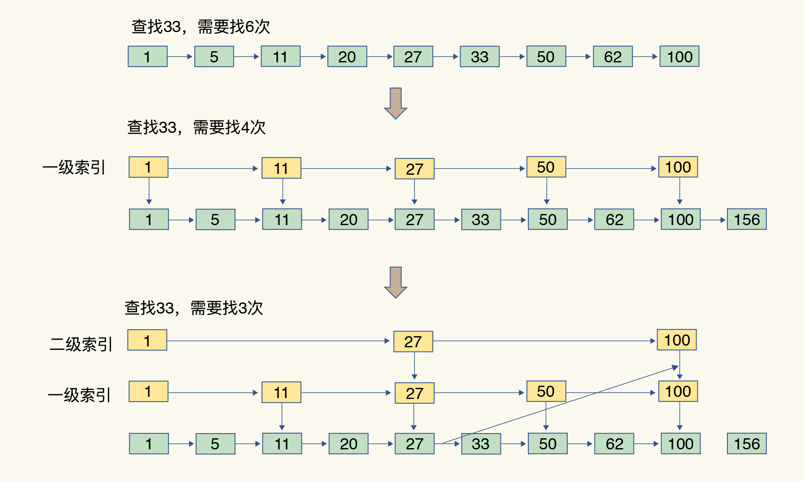
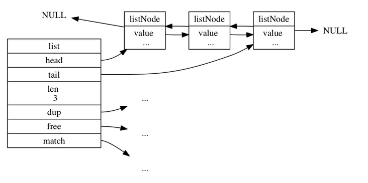
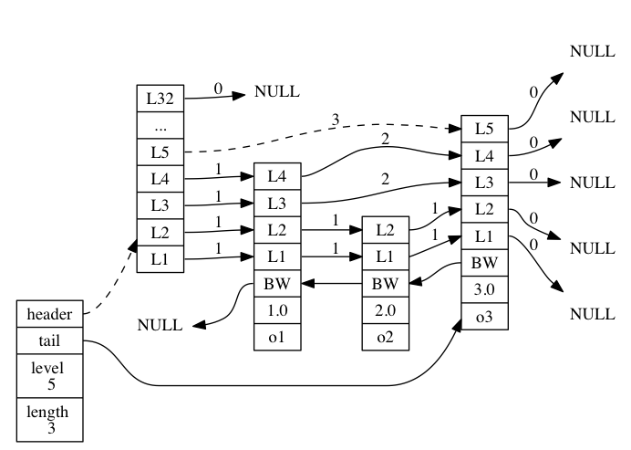

# Redis字符串优化

https://blog.csdn.net/sinat_36171694/article/details/100545857

# Redis为什么快呢？查询为何会变慢呢？

在实际开发，Redis使用会频繁，那么在使用过程中我们该如何正确抉择数据类型呢？哪些场景下适用哪些数据类型。而且在面试中也很常会被面试官问到Redis数据结构方面的问题：

Redis为什么快呢？
为什么查询操作会变慢了？
Redis Hash rehash过程
为什么使用哈希表作为Redis的索引
当我们分析理解了Redis数据结构，可以为了我们在使用Redis的时候，正确抉择数据类型使用，提升系统性能。

Redis底层数据结构
Redis 是一个内存键值key-value 数据库，且键值对数据保存在内存中，因此Redis基于内存的数据操作，其效率高，速度快；

其中，Key是String类型，Redis 支持的 value 类型包括了 String、List 、 Hash 、 Set 、 Sorted Set 、BitMap等。Redis 能够之所以能够广泛地适用众多的业务场景，基于其多样化类型的value。

而Redis的Value的数据类型是基于为Redis自定义的对象系统redisObject实现的，

```c
typedef struct redisObject{
    //类型
    unsigned type:4;
    //编码
    unsigned encoding:4;
    //指向底层实现数据结构的指针
    void *ptr;
    // .....
} 
```

redisObject除了记录实际数据，还需要额外的内存空间记录数据长度、空间使用等元数据信息，其中包含了 8 字节的元数据和一个 8 字节指针，指针指向具体数据类型的实际数据所在位置：


其中，指针指向的就是基于Redis的底层数据结构存储数据的位置，Redis的底层数据结构：SDS，双向链表、跳表，哈希表，压缩列表、整数集合实现的。

那么Redis底层数据结构是怎么实现的呢？

Redis底层数据结构实现
我们先来看看Redis比较简单的**SDS,双向链表，整数集合**。

## SDS、双向链表和整数集合

**SDS**，使用len字段记录已使用的字节数，将获取字符串长度复杂度降低为O(1)，而且SDS是惰性释放空间的，你free了空间，系统把数据记录下来下次想用时候可直接使用。不用新申请空间。


**整数集合**，在内存中分配一块地址连续的空间，数据元素会挨着存放，不需要额外指针带来空间开销，其特点为内存紧凑节省内存空间，查询复杂度为O(1)效率高，其他操作复杂度为O(N)；

**双向链表**， 在内存上可以为非连续、非顺序空间，通过额外的指针开销前驱/后驱指针串联元素之间的顺序。

其特点为节插入/更新数据复杂度为O(1)效率高，查询复杂度为O(N)；

## Hash哈希表

哈希表，其实类似是一个数组，数组的每个元素称为一个哈希桶，每个哈希桶中保存了键值对数据，且哈希桶中的元素使用dictEntry结构


因此，哈希桶元素保存的并不是键值对值本身，而是指向具体值的指针，**所以在保存每个键值对的时候会额外空间开销，至少有增加24个字节，**特别是Value为String的键值对，每一个键值对就需要额外开销24个字节空间。当保存数据小，额外开销比数据还大时，这时为了节省空间，考虑换数据结构。

那来看看全局哈希表全图：


虽然哈希表操作很快，但Redis数据变大后，就会出现一个潜在的风险：哈希表的冲突问题和 rehash开销问题，这可以解释为什么哈希表操作变慢了？

当往哈希表中写入更多数据时，哈希冲突是不可避免的问题 ， Redis 解决哈希冲突的方式，就是链式哈希，同一个哈希桶中的多个元素用一个链表来保存，它们之间依次用指针连接，如图所示：


当哈希冲突也会越来越多，这就会导致某些哈希冲突链过长，进而导致这个链上的元素查找耗时长，效率降低。

为了解决哈希冲突带了的链过长的问题，进行rehash操作，增加现有的哈希桶数量，分散单桶元素数量。那么rehash过程怎么样执行的呢？

Rehash，为了使rehash 操作更高效，使用两个全局哈希表：哈希表 1 和哈希表 2，具体如下：

- 将哈希表 2 分配更大的空间，
- 把哈希表 1 中的数据重新映射并拷贝到哈希表 2 中；
- 释放哈希表 1 的空间

但由于表1和表2在重新映射复制时数据大，如果一次性把哈希表 1 中的数据都迁移完，会造成 Redis 线程阻塞，无法服务其他请求。

为了避免这个问题，保证Redis能正常处理客户端请求，Redis采用了渐进式rehash。

每处理一个请求时，从哈希表 1 中依次将索引位置上的所有 entries 拷贝到哈希表 2 中，把一次性大量拷贝的开销，分摊到了多次处理请求的过程中，避免了耗时操作，保证了数据的快速访问。


在理解完Hash哈希表相关知识点后，看看不常见的压缩列表和跳表。

## 压缩列表与跳表

压缩列表，在数组基础上，在压缩列表在表头有三个字段 zlbytes、zltail 和 zllen，分别表示列表长度、列表尾的偏移量和列表中的 entry 个数；压缩列表在表尾还有一个 zlend，表示列表结束。


优点：内存紧凑节省内存空间，内存中分配一块地址连续的空间，数据元素会挨着存放，不需要额外指针带来空间开销；查找定位第一个元素和最后一个元素，可以通过表头三个字段的长度直接定位，复杂度是 O(1)。

跳表 ，在链表的基础上，增加了多级索引，通过索引位置的几个跳转，实现数据的快速定位，如下图所示：

比如查询33



特点：当数据量很大时，跳表的查找复杂度为O(logN)。

## 总结

综上所述，可以得知底层数据结构的时间复杂度：

| 数据结构类型 | 时间复杂度 |
| ------------ | ---------- |
| 哈希表       | O(1)       |
| 整数数组     | O(N)       |
| 双向链表     | O(N)       |
| 压缩列表     | O(N)       |
| 跳表         | O(logN)    |

Redis自定义的对象系统类型即为Redis的Value的数据类型，Redis的数据类型是基于底层数据结构实现的，那数据类型有哪些呢？

Redis数据类型
String、List、Hash、Sorted Set、Set比较常见的类型，其与底层数据结构对应关系如下：

| 数据类型   | 数据结构            |
| ---------- | ------------------- |
| String     | SDS(简单动态字符串) |
| List       | 双向链表 压缩列表   |
| Hash       | 压缩列表 哈希表     |
| Sorted Set | 压缩列表 跳表       |
| Set        | 哈希表 整数数组     |

数据类型对应特点跟其实现的底层数据结构差不多，性质也是一样的,且

- String，基于SDS实现，适用于简单key-value存储、setnx key value实现分布式锁、计数器(原子性)、分布式全局唯一ID。

- List， 按照元素进入List的顺序进行排序的，遵循FIFO(先进先出)规则，一般使用在 排序统计以及简单的消息队列。

- Hash， 是字符串key和字符串value之间的映射，十分适合用来表示一个对象信息 ，特点添加和删除操作复杂度都是O(1)。

- Set，是String 类型元素的无序集合，集合成员是唯一的，这就意味着集合中不能出现重复的数据。 基于哈希表实现的，所以添加，删除，查找的复杂度都是 O(1)。

- Sorted Set， 是Set的类型的升级， 不同的是每个元素都会关联一个 double 类型的分数，通过分数排序，可以范围查询。

那我们再来看看这些数据类型，Redis Geo、HyperLogLog、BitMap？

- Redis Geo， 将地球看作为近似为球体，基于GeoHash 将二维的经纬度转换成字符串，来实现位置的划分跟指定距离的查询。特点一般使用在跟位置有关的应用。

- HyperLogLog， 是一种概率数据结构，它使用概率算法来统计集合的近似基数 ， 错误率大概在0.81%。 当集合元素数量非常多时，它计算基数所需的空间总是固定的，而且还很小，适合使用做 UV 统计。

- BitMap ，用一个比特位来映射某个元素的状态， 只有 0 和 1 两种状态，非常典型的二值状态，且其本身是用 String 类型作为底层数据结构实现的一种统计二值状态的数据类型 ，优势大量节省内存空间，可是使用在二值统计场景。

在理解上述知识后，我们接下来讨论一下根据哪些策略选择相对应的应用场景下的Redis数据类型？

## 选择合适的Redis数据类型策略

在实际开发应用中，Redis可以适用于众多的业务场景，但我们需要怎么选择数据类型存储呢？

主要依据就是时间/空间复杂度，在实际的开发中可以考虑以下几个点：

- 数据量，数据本身大小
- 集合类型统计模式
- 支持单点查询/范围查询
- 特殊使用场景

> 数据量，数据本身大小

当数据量比较大，数据本身比较小，使用**String**就会使用额外的空间大大增加，因为使用哈希表保存键值对，使用dictEntry结构保存，会导致保存每个键值对时额外保存dictEntry的三个指针的开销，这样就会导致数据本身小于额外空间开销，最终会导致存储空间数据大小远大于原本数据存储大小。

可以使用基于整数数组和压缩列表实现了 List、Hash 和 Sorted Set ，因为整数数组和压缩列表在内存中都是分配一块地址连续的空间，然后把集合中的元素一个接一个地放在这块空间内，非常紧凑，不用再通过额外的指针把元素串接起来，这就避免了额外指针带来的空间开销。而且采用集合类型时，一个 key 就对应一个集合的数据，能保存的数据多了很多，但也只用了一个 dictEntry，这样就节省了内存。

> 集合类型统计模式

Redis集合类型统计模式常见的有：

- 聚合统计（ 交集、差集、并集统计 ）： 对多个集合进行聚合计算时，可以选择Set；
- 排序统计（要求集合类型能对元素保序）： Redis中List 和 Sorted Set是有序集合，List是按照元素进入 List 的顺序进行排序的，Sorted Set 可以根据元素的权重来排序；
- 二值状态统计（ 集合元素的取值就只有 0 和 1 两种 ）：Bitmap 本身是用 String 类型作为底层数据结构实现的一种统计二值状态的数据类型 ， Bitmap通过 BITOP 按位 与、或、异或的操作后使用 BITCOUNT 统计 1 的个数。
- 基数统计（ 统计一个集合中不重复的元素的个数 ）：HyperLogLog 是一种用于统计基数的数据集合类型 ，统计结果是有一定误差的，标准误算率是 0.81% 。需要精确统计结果的话，用 Set 或 Hash 类型。


Set类型，适用统计用户/好友/关注/粉丝/感兴趣的人集合聚合操作，比如

- 统计手机APP每天的新增用户数
- 两个用户的共同好友

Redis中List 和 Sorted Set是有序集合，使用应对集合元素排序需求 ，比如

- 最新评论列表
- 排行榜
- Bitmap二值状态统计，适用数据量大，且可以使用二值状态表示的统计，比如：

签到打卡，当天用户签到数

- 用户周活跃
- 用户在线状态

HyperLogLog 是一种用于统计基数的数据集合类型， 统计一个集合中不重复的元素个数 ，比如

- 统计网页的 UV ， 一个用户一天内的多次访问只能算作一次

> 支持单点查询/范围查询

Redis中List 和 Sorted Set是有序集合支持范围查询，但是Hash是不支持范围查询的

> 特殊使用场景

消息队列，使用Redis作为消息队列的实现，要消息的基本要求消息保序、处理重复的消息和保证消息可靠性，方案有如下：

- 基于 List 的消息队列解决方案
- 基于 Streams 的消息队列解决方案

|              | 基于List                 | 基于Strems                         |
| ------------ | ------------------------ | ---------------------------------- |
| 消息保序     | 使用`LPUSH/RPOP`         | 使用`XADD/XREAD`                   |
| 阻塞读取     | 使用`BRPOP`              | 使用`XREAD block`                  |
| 重复消息处理 | 生产者自行实现全局唯一ID | Streams自动生成全局唯一ID          |
| 消息可靠性   | 使用`BRPOPLPUSH`         | 使用`PENDING` List自动留存消息     |
| 适用场景     | 消息总量小               | 消息总量大，需要消费组形式读取数据 |

基于位置 LBS 服务，使用Redis的特定GEO数据类型实现，GEO 可以记录经纬度形式的地理位置信息，被广泛地应用在 LBS 服务中。 比如:打车软件是怎么基于位置提供服务的。

> 总结

Redis之所以那么快，是因为其基于内存的数据操作和使用Hash哈希表作为索引，其效率高，速度快，而且得益于其底层数据多样化使得其可以适用于众多场景，不同场景中选择合适的数据类型可以提升其查询性能。

# bigkey

## 1、bigkey带来的问题

1. 如果是集群模式下，无法做到负载均衡，导致请求倾斜到某个实例上，而这个实例的QPS会比较大，内存占用也较多；对于Redis单线程模型又容易出现CPU瓶颈，当内存出现瓶颈时，只能进行纵向库容，使用更牛逼的服务器。
2. 涉及到大key的操作，尤其是使用hgetall、lrange 0 -1、get、hmget 等操作时，网卡可能会成为瓶颈，也会到导致堵塞其它操作，qps 就有可能出现突降或者突升的情况，趋势上看起来十分不平滑，严重时会导致应用程序连不上，实例或者集群在某些时间段内不可用的状态。
3. 假如这个key需要进行删除操作，如果直接进行DEL 操作，被操作的实例会被Block住，导致无法响应应用的请求，而这个Block的时间会随着key的变大而变长。

## 2、bigkey是如何产生的

一般来说，bigkey是由于程序员的程序设计不当，或对数据规模预料不清楚造成的：
1、社交类：粉丝列表，如果某些明显或大V，一定是bigkey
2、统计类：如果按天存储某项功能或网站的用户集合，除非没几个人用，否则必定是bigkey
3、缓存类：作为数据库数据的冗余存储，这种是redis的最常用场景，但有2点要注意：
1）是不是有必要把所有数据都缓存
2）有没有相关关联的数据
举个例子，该同学把某明星一个专辑下的所有视频信息都缓存成了一个巨大的json，这个json达到了6MB。

## 3、查找bigKey的方法

1. 在redis实例上执行bgsave，然后我们对dump出来的rdb文件进行分析，找到其中的大KEY
2. 有个不太推荐的命令，debug object xxx 可以看到这个key在内存中序列化后的大小，当然我们可以通过SCAN+debug object xxx 得到当前实例所有key的大小。
3. redis-cli 原生自带 –bigkeys 功能，可以找到某个实例 5种数据类型(String、hash、list、set、zset)的最大key。

## 4、直接删除bigkey的风险

[DEL命令](https://link.juejin.im/?target=http%3A%2F%2Fredis.io%2Fcommands%2Fdel)在删除单个集合类型的Key时，命令的时间复杂度是O(M)，其中M是集合类型Key包含的元素个数。

> DEL keyTime complexity: O(N) where N is the number of keys that will be removed. When a key to remove holds a value other than a string, the individual complexity for this key is O(M) where M is the number of elements in the list, set, sorted set or hash. Removing a single key that holds a string value is O(1).

生产环境中遇到过多次因业务删除大Key，导致Redis阻塞，出现故障切换和应用程序雪崩的故障。测试删除集合类型大Key耗时，一般每秒可清理100w~数百w个元素; 如果数千w个元素的大Key时，会导致Redis阻塞上10秒可能导致集群判断Redis已经故障，出现故障切换；或应用程序出现雪崩的情况。

> 说明：Redis是单线程处理。单个耗时过大命令，导致阻塞其他命令，容易引起应用程序雪崩或Redis集群发生故障切换。所以避免在生产环境中使用耗时过大命令。

Redis删除大的集合键的耗时, 测试估算，可参考；和硬件环境、Redis版本和负载等因素有关

| Key类型    | Item数量 | 耗时    |
| :--------- | :------- | :------ |
| Hash       | ~100万   | ~1000ms |
| List       | ~100万   | ~1000ms |
| Set        | ~100万   | ~1000ms |
| Sorted Set | ~100万   | ~1000ms |

## 5、如何优雅地删除各类大Key

从Redis2.8版本开始支持[SCAN](https://link.juejin.im/?target=http%3A%2F%2Fredis.io%2Fcommands%2Fscan)命令，通过m次时间复杂度为O(1)的方式，遍历包含n个元素的大key.这样避免单个O(n)的大命令，导致Redis阻塞。 这里删除大key操作的思想也是如此。

先给键改名。

## 5.1 Delete Large Hash Key

通过[hscan命令](https://link.juejin.im/?target=http%3A%2F%2Fredis.io%2Fcommands%2Fhscan)，每次获取500个字段，再用[hdel命令](https://link.juejin.im/?target=http%3A%2F%2Fredis.io%2Fcommands%2Fhdel)，每次删除1个字段。Python代码：

```python
def del_large_hash():
  r = redis.StrictRedis(host='redis-host1', port=6379)
    large_hash_key ="xxx" 
    cursor = '0'
    while cursor != 0:
        cursor, data = r.hscan(large_hash_key, cursor=cursor, count=500)
        for item in data.items():
                r.hdel(large_hash_key, item[0])
```

## 5.2 Delete Large Set Key

删除大set键，使用[sscan命令](https://link.juejin.im/?target=http%3A%2F%2Fredis.io%2Fcommands%2Fsscan)，每次扫描集合中500个元素，再用[srem命令](https://link.juejin.im/?target=http%3A%2F%2Fredis.io%2Fcommands%2Fsrem)每次删除一个键Python代码：

```python
def del_large_set():
  r = redis.StrictRedis(host='redis-host1', port=6379)
  large_set_key = 'xxx'   
  cursor = '0'
  while cursor != 0:
    cursor, data = r.sscan(large_set_key, cursor=cursor, count=500)
    for item in data:
      r.srem(large_size_key, item)
```

## 5.3 Delete Large List Key

删除大的List键，未使用scan命令； 通过[ltrim命令](https://link.juejin.im/?target=http%3A%2F%2Fredis.io%2Fcommands%2Fltrim)每次删除少量元素。Python代码：

```python
def del_large_list():
  r = redis.StrictRedis(host='redis-host1', port=6379)
  large_list_key = 'xxx'  
  while r.llen(large_list_key)>0:
      r.ltrim(large_list_key, 0, -101) 
```

## 5.4 Delete Large Sorted set key

删除大的有序集合键，和List类似，使用sortedset自带的[zremrangebyrank命令](https://link.juejin.im/?target=http%3A%2F%2Fredis.io%2Fcommands%2Fzremrangebyrank),每次删除top 100个元素。Python代码：

```python
def del_large_sortedset():
  r = redis.StrictRedis(host='large_sortedset_key', port=6379)
  large_sortedset_key='xxx'
  while r.zcard(large_sortedset_key)>0:
    r.zremrangebyrank(large_sortedset_key,0,99)
```

## 5.5 后台删除之lazyfree机制

为了解决redis使用del命令删除大体积的key，或者使用flushdb、flushall删除数据库时，造成redis阻塞的情况，在redis 4.0引入了lazyfree机制，可将删除操作放在后台，让后台子线程(bio)执行，避免主线程阻塞。

lazy free的使用分为2类：第一类是与DEL命令对应的主动删除，第二类是过期key删除、maxmemory key驱逐淘汰删除。

#### 主动删除

UNLINK命令是与DEL一样删除key功能的lazy free实现。唯一不同时，UNLINK在删除集合类键时，如果集合键的元素个数大于64个(详细后文），会把真正的内存释放操作，给单独的bio来操作。

```sql
127.0.0.1:7000> UNLINK mylist
(integer) 1
FLUSHALL/FLUSHDB ASYNC
127.0.0.1:7000> flushall async //异步清理实例数据
```

注意：DEL命令，还是阻塞的删除操作。

##### FLUSHALL/FLUSHDB ASYNC

通过对FLUSHALL/FLUSHDB添加ASYNC异步清理选项，redis在清理整个实例或DB时，操作都是异步的。

```none
127.0.0.1:7000> DBSIZE
(integer) 1812295
127.0.0.1:7000> flushall //同步清理实例数据，180万个key耗时1020毫秒
OK
(1.02s)
127.0.0.1:7000> DBSIZE
(integer) 1812637
127.0.0.1:7000> flushall async //异步清理实例数据，180万个key耗时约9毫秒
OK
127.0.0.1:7000> SLOWLOG get
 1) 1) (integer) 2996109
 2) (integer) 1505465989
 3) (integer) 9274 //指令运行耗时9.2毫秒
 4) 1) "flushall" 
 2) "async"
 5) "127.0.0.1:20110"
 6) ""
```

#### 被动删除

lazy free应用于被动删除中，目前有4种场景，每种场景对应一个配置参数； 默认都是关闭。

```sql
lazyfree-lazy-eviction no
lazyfree-lazy-expire no
lazyfree-lazy-server-del no
slave-lazy-flush no
```

##### **lazyfree-lazy-eviction**

针对redis内存使用达到maxmeory，并设置有淘汰策略时；在被动淘汰键时，是否采用lazy free机制；

因为此场景开启lazy free, 可能使用淘汰键的内存释放不及时，导致redis内存超用，超过maxmemory的限制。此场景使用时，请结合业务测试。

##### **lazyfree-lazy-expire**

针对设置有TTL的键，达到过期后，被redis清理删除时是否采用lazy free机制；

此场景建议开启，因TTL本身是自适应调整的速度。

##### **lazyfree-lazy-server-del**

针对有些指令在处理已存在的键时，会带有一个隐式的DEL键的操作。如rename命令，当目标键已存在,redis会先删除目标键，如果这些目标键是一个big key,那就会引入阻塞删除的性能问题。 此参数设置就是解决这类问题，建议可开启。

##### **slave-lazy-flush**

针对slave进行全量数据同步，slave在加载master的RDB文件前，会运行flushall来清理自己的数据场景，

参数设置决定是否采用异常flush机制。如果内存变动不大，建议可开启。可减少全量同步耗时，从而减少主库因输出缓冲区爆涨引起的内存使用增长。

##### **expire及evict优化**

redis在空闲时会进入activeExpireCycle循环删除过期key，每次循环都会率先计算一个执行时间，在循环中并不会遍历整个数据库，而是随机挑选一部分key查看是否到期，所以有时时间不会被耗尽（采取异步删除时更会加快清理过期key），剩余的时间就可以交给freeMemoryIfNeeded来执行。

## 6、键值设计

### key名设计

#### 可读性和可管理性(建议)

以业务名(或数据库名)为前缀(防止key冲突)，用冒号分隔，比如业务名:表名:id

```bash
set trade:order:1//业务名:表名:id
```

#### 简洁性(建议)

保证语义的情况下,减低key长度,key过长也占用内存空间

```css
user:{uid}:friends:messages:{mid} 简化为 u:{uid}:fr:m:{mid}
```

#### 不要包含特殊字符(强制)

反例：包含空格、换行、单双引号以及其他转义字符

### value设计

#### 拒绝bigkey

在Redis中，一个字符串最大512MB，一个二级数据结构（例如hash、list、set、zset）可以存储大约40亿个(2^32-1)个元素，但实际中如果下面两种情况，我就会认为它是bigkey。

##### 1.字符串类型：

它的big体现在单个value值很大，一般认为超过10KB就是bigkey。

##### 2.非字符串类型:(hash,list,set,zset等)

哈希、列表、集合、有序集合，它们的big体现在元素个数太多。
一般来说hash、list、set、zset元素个数不要超过5000。
反例：一个包含200万个元素的list。

##### 3.bigkey的删除

非字符串的bigkey，不要使用del删除，使用hscan、sscan、zscan方式渐进式删除，同时要注意防止bigkey过期时间自动删除问题(例如一个200万的zset设置1小时过期，会触发del操作，如果没有使用Redis 4.0的过期异步删除(lazyfree-lazy-expire yes)，就会存在阻塞Redis的可能性）

## 7、优化bigkey

### 优化bigkey

#### 1.一个字拆,大拆小

hash结构 比如一个big hash中有100万的数据可以通过key的名称做定义将100万的数据进行拆分成200个key,每个key中存放5000个数据
list结构也是同样操作,一个list的key存放5000个集合,拆开来存

#### 2.避开危险操作

如果必须使用bigkey的话,那操作的时候避开hgetall、lrange、smembers、zrange、sinter等全数据查询的命令,有遍历的需求可以使用hscan、sscan、zscan代替(例如有时候仅仅需要hmget，而不是hgetall)，删除也是一样，尽量使用优雅的方式来处理。

#### 3.合理使用数据类型(推荐)

例如：实体类型(要合理控制和使用数据结构，但也要注意节省内存和性能之间的平衡)
正例:

```sql
hmset user:1 name tom age 19 favor football
```

反例:

```sql
set user:1:name tom
set user:1:age 19
set user:1:favor football
```

#### 4.控制key的生命周期，redis不是垃圾桶(推荐)

建议使用expire设置过期时间(条件允许可以打散过期时间，防止集中过期)。

### 命令使用

#### 1.O(N)命令关注N的数量

例如hgetall、lrange、smembers、zrange、sinter等并非不能使用，但是需要明确N的值。有遍历的需求可以使用hscan、sscan、zscan代替。

#### 2.禁用命令

禁止线上使用keys、flushall、flushdb等，通过redis的rename机制禁掉命令，或者使用scan的方式渐进式处理。

#### 3.合理使用select

redis自带的多数据库较弱，使用数字进行区分，很多客户端支持较差，同时多业务用多数据库实际还是单线程处理，会有干扰。

#### 4.使用批量操作提高效率

```undefined
原生命令：例如mget、mset。
非原生命令：可以使用pipeline提高效率。
```

但要注意控制一次批量操作的元素个数(例如500以内，实际也和元素字节数有关)。
注意两者不同：

```undefined
原生命令是原子操作，pipeline是非原子操作。
pipeline可以打包不同的命令，原生命令做不到
pipeline需要客户端和服务端同时支持。
```

#### 5.Redis事务功能较弱，不建议过多使用，可以用lua替代

# 如何快速定位 Redis 热 key

https://www.infoq.cn/article/3L3zAQ4H8xpNoM2glSyi

# Redis数据结构底层实现

## 前言

Redis 有五种基本数据类型，可是大家知道这五种数据类型的底层是咋实现吗？接下就带大家了解一下 String、List、Hash、Set、Sorted Set 底层是如何实现的，在这之前，先来看下下面的基本数据结构，分别有简单动态字符串(SDS)、链表、字典、跳跃表、整数集合以及压缩列表，它们是Redis数据结构的基本组成部分。

## 五种数据结构底层实现

**1. String**

- 如果一个字符串对象保存的是整数值， 并且这个整数值可以用 long 类型来表示， 那么字符串对象会将整数值保存在字符串对象结构的 ptr 属性里面（将 void* 转换成 long ）， 并将字符串对象的编码设置为 int 。
- 如果字符串对象保存的是一个字符串值， 并且这个字符串值的长度大于 39 字节， 那么字符串对象将使用一个简单动态字符串（SDS）来保存这个字符串值， 并将对象的编码设置为 raw。
- 如果字符串对象保存的是一个字符串值， 并且这个字符串值的长度小于等于 39 字节， 那么字符串对象将使用 embstr 编码的方式来保存这个字符串值。

**2. List**

- 列表对象的编码可以是 ziplist 或者 linkedlist 。
- 列表对象保存的所有字符串元素的长度都小于 64 字节并且保存的元素数量小于 512 个，使用 ziplist 编码；否则使用 linkedlist；

**3. Hash**

- 哈希对象的编码可以是 ziplist 或者 hashtable 。
- 哈希对象保存的所有键值对的键和值的字符串长度都小于 64 字节并且保存的键值对数量小于 512 个，使用ziplist 编码；否则使用hashtable；

**4. Set**

- 集合对象的编码可以是 intset 或者 hashtable 。
- 集合对象保存的所有元素都是整数值并且保存的元素数量不超过 512 个，使用intset 编码；否则使用hashtable；

**5. Sorted Set**

- 有序集合的编码可以是 ziplist 或者 skiplist
- 有序集合保存的元素数量小于 128 个并且保存的所有元素成员的长度都小于 64 字节。使用 ziplist 编码；否则使用skiplist；

接下来分别说说这些底层数据结构。

## 一、简单动态字符串（SDS）

Redis 自己构建了一种名为简单动态字符串（simple dynamic string，SDS）的抽象类型， 并将 SDS 用作 Redis 的默认字符串表示。如：

```sh
 set msg "hello world"  
```

key 和 value 底层都是用 SDS 来实现的。
SDS 的结构：

```cpp
struct sdshdr {

    // 记录 buf 数组中已使用字节的数量
    // 等于 SDS 所保存字符串的长度
    int len;

    // 记录 buf 数组中未使用字节的数量
    int free;

    // 字节数组，用于保存字符串
    char buf[];

};
```

- free 属性的值为 0 ， 表示这个 SDS 没有分配任何未使用空间。
- len 属性的值为 5 ， 表示这个 SDS 保存了一个五字节长的字符串。
- buf 属性是一个 char 类型的数组， 数组的前五个字节分别保存了 'R' 、 'e' 、 'd' 、 'i' 、 's' 五个字符， 而最后一个字节则保存了空字符 '\0' 。

SDS 与 C 语言字符串比较相近，但拥有更过的优势：

```markdown
1. SDS 获取字符串长度时间复杂度O(1)：因为 SDS 通过 len 字段来存储长度，使用时直接读取就可以；C 语言要想获取字符串长度需要遍历整个字符串，时间复杂度O(N)。
2. SDS 能杜绝缓冲区的溢出：因为当 SDS API 要对 SDS 进行修改时，会先检查 SDS 的空间是否足够，如果不够的话 SDS 会自动扩容，So，不会造成缓冲区溢出。而 C 语言则不剧本这个功能。
3. SDS 能减少修改字符串时带来的内存重分配次数：  
    - 空间预分配：当SDS 扩容时不只是会增加需要的空间大小，还会额外的分配一些未使用的空间。分配的规则是：如果分配后SDS的长度小于 1MB，那么会分配等于分配后SDS 的大小的未使用空间，简单说就是，SDS 动态分配后是 16KB，那么就会多分配 16KB 的未使用空间；如果 小于 1MB，那么久分配 1MB 的未使用空间。  
    - 惰性空间释放： 惰性空间释放用于优化 SDS 的字符串缩短操作：当 SDS 的 API 需要缩短 SDS 保存的字符串时，并不会立即内存重分配来回收多出来的字节，而是用 free 来记录未使用空间。
```

## 二、链表

 链表提供了高效的节点重排能力，以及顺序性的节点访问方式，并且可以通过增删节点来灵活地调整链表的长度。链表在 Redis 中的应用非常广泛，比如 List 的底层实现之一链表，当一个 List 包含了数量比较多的元素，又或者列表中包含的元素都是比较长的字符串时，Redis 就会使用链表作为 List 的底层实现。**除了用作 List 的底层实现之外，发布与订阅、慢查询、监视器等动能也用到了链表**， Redis 服务器本身还使用链表来保存多个客户端的状态信息，以及使用链表来构建客户端输出缓冲区。
 每个链表节点使用一个 adlist.h/listNode 结构来表示：

```cpp
typedef struct listNode {

    // 前置节点
    struct listNode *prev;

    // 后置节点
    struct listNode *next;

    // 节点的值
    void *value;

} listNode;
```

多个 listNode 可以通过 prev 和 next 指针组成双端链表， 如下图所示。

虽然仅仅使用多个 listNode 结构就可以组成链表， 但使用 adlist.h/list 来持有链表的话， 操作起来会更方便：

```objectivec
typedef struct list {

    // 表头节点
    listNode *head;

    // 表尾节点
    listNode *tail;

    // 链表所包含的节点数量
    unsigned long len;

    // 节点值复制函数
    void *(*dup)(void *ptr);

    // 节点值释放函数
    void (*free)(void *ptr);

    // 节点值对比函数
    int (*match)(void *ptr, void *key);

} list;
```

list 结构为链表提供了表头指针 head 、表尾指针 tail ， 以及链表长度计数器 len ， 而 dup 、 free 和 match 成员则是用于实现多态链表所需的类型特定函数：

- dup 函数用于复制链表节点所保存的值；
- free 函数用于释放链表节点所保存的值；
- match 函数则用于对比链表节点所保存的值和另一个输入值是否相等。
  下图是由一个 list 结构和三个 listNode 结构组成的链表：
  
  **Redis 的链表实现的特性可以总结如下：**
- 双端： 链表节点带有 prev 和 next 指针， 获取某个节点的前置节点和后置节点的复杂度都是 O(1) 。
- 无环： 表头节点的 prev 指针和表尾节点的 next 指针都指向 NULL ， 对链表的访问以 NULL 为终点。
- 带表头指针和表尾指针： 通过 list 结构的 head 指针和 tail 指针， 程序获取链表的表头节点和表尾节点的复杂度为 O(1) 。
- 带链表长度计数器： 程序使用 list 结构的 len 属性来对 list 持有的链表节点进行计数， 程序获取链表中节点数量的复杂度为 O(1) 。
- 多态： 链表节点使用 void* 指针来保存节点值， 并且可以通过 list 结构的 dup 、 free 、 match 三个属性为节点值设置类型特定函数， 所以链表可以用于保存各种不同类型的值。

## 三、字典

字典， 又称符号表（symbol table）、关联数组（associative array）或者映射（map）， 是一种用于保存键值对（key-value pair）的抽象数据结构。其中 Key 是唯一的。类似 Java 的 Map。
字典在 Redis 中主要被应用与：

- Redis 数据库底层就是用字典实现的，对数据库的增、删、改、查操作都是构建在对字典的操作之上，比如：

  ```gams
  > set msg "hello world"
  OK
  ```

  这个就是创建一个 key 为 "msg"，value 为 "hello world" 的键值对，保存在代表数据库的字典中。

- 字典还是哈希键的底层实现之一： 当一个哈希键包含的键值对比较多， 又或者键值对中的元素都是比较长的字符串时， Redis 就会使用字典作为哈希键的底层实现。

Redis 的字典使用哈希表作为底层实现， 一个哈希表里面可以有多个哈希表节点， 而每个哈希表节点就保存了字典中的一个键值对。
接下来的三个小节将分别介绍 Redis 的哈希表、哈希表节点、以及字典的实现。

### 哈希表

Redis 字典所使用的哈希表由 dict.h/dictht 结构定义：

```arduino
typedef struct dictht {

    // 哈希表数组
    dictEntry **table;

    // 哈希表大小
    unsigned long size;

    // 哈希表大小掩码，用于计算索引值
    // 总是等于 size - 1
    unsigned long sizemask;

    // 该哈希表已有节点的数量
    unsigned long used;

} dictht;
```

table 属性是一个数组， 数组中的每个元素都是一个指向 dict.h/dictEntry 结构的指针， 每个 dictEntry 结构保存着一个键值对。

size 属性记录了哈希表的大小， 也即是 table 数组的大小， 而 used 属性则记录了哈希表目前已有节点（键值对）的数量。

sizemask 属性的值总是等于 size - 1 ， 这个属性和哈希值一起决定一个键应该被放到 table 数组的哪个索引上面。

下图 展示了一个大小为 4 的空哈希表 （没有包含任何键值对）。


#### 哈希节点

哈希表节点使用 dictEntry 结构表示， 每个 dictEntry 结构都保存着一个键值对：

```cpp
typedef struct dictEntry {

    // 键
    void *key;

    // 值
    union {
        void *val;
        uint64_t u64;
        int64_t s64;
    } v;

    // 指向下个哈希表节点，形成链表
    struct dictEntry *next;

} dictEntry;
```

key 属性保存着键值对中的键， 而 v 属性则保存着键值对中的值， 其中键值对的值可以是一个指针， 或者是一个 uint64_t 整数， 又或者是一个 int64_t 整数。

next 属性是指向另一个哈希表节点的指针， 这个指针可以将多个哈希值相同的键值对连接在一次， 以此来解决键冲突（collision）的问题。

举个例子， 下图就展示了如何通过 next 指针， 将两个索引值相同的键 k1 和 k0 连接在一起。


##### 字典

Redis 中的字典由 dict.h/dict 结构表示：

```awk
typedef struct dict {

    // 类型特定函数
    dictType *type;

    // 私有数据
    void *privdata;

    // 哈希表
    dictht ht[2];

    // rehash 索引
    // 当 rehash 不在进行时，值为 -1
    int rehashidx; /* rehashing not in progress if rehashidx == -1 */

} dict;
```

type 属性和 privdata 属性是针对不同类型的键值对， 为创建多态字典而设置的：

- type 属性是一个指向 dictType 结构的指针， 每个 dictType 结构保存了一簇用于操作特定类型键值对的函数， Redis 会为用途不同的字典设置不同的类型特定函数。
- 而 privdata 属性则保存了需要传给那些类型特定函数的可选参数。

ht 属性是一个包含两个项的数组， 数组中的每个项都是一个 dictht 哈希表， 一般情况下， 字典只使用 ht[0] 哈希表， ht[1] 哈希表只会在对 ht[0] 哈希表进行 rehash 时使用。

除了 ht[1] 之外， 另一个和 rehash 有关的属性就是 rehashidx ： 它记录了 rehash 目前的进度， 如果目前没有在进行 rehash ， 那么它的值为 -1 。

下图 展示了一个普通状态下（没有进行 rehash）的字典：


#### 哈希算法

当将一个新的键值对插入到字典中，需要计算索引值，Redis 计算索引值的方法是：

```ini
# 使用字典设置的哈希函数，计算键 key 的哈希值
hash = dict->type->hashFunction(key);

# 使用哈希表的 sizemask 属性和哈希值，计算出索引值
# 根据情况不同， ht[x] 可以是 ht[0] 或者 ht[1]
index = hash & dict->ht[x].sizemask;
```

类似 Java 的HashMap，计算 key 的 hash 值，然后 hash & (len - 1), 而 Redis 的 sizemask 就是 size - 1。

#### 哈希冲突怎么办

当出现 Hash 冲突时，Redis 使用的是 链地址法 来解决冲突，链地址法就是将冲突的节点构成一个链表放在该索引位置上，Redis 采用的是头插法。解决hash冲突的还有三种方法，分别是：开放定址法（线性探测再散列，二次探测再散列，伪随机探测再散列）、再哈希法以及建立一个公共溢出区，以后会单独介绍一些解决hash冲突的四种方法。

#### rehash

随着不断的操作，hash表中的键值对可能会增多或减少，为了让哈希表的负载因子保持在一个范围内，需要对 hash表进行扩容或收缩，收缩和扩容的过程就叫 rehash。rehash 过程如下：

1. 为字典的 ht[1] 哈希表分配空间， 这个哈希表的空间大小取决于要执行的操作， 以及 ht[0] 当前包含的键值对数量 （也即是 ht[0].used 属性的值）(ht 是字典中的 hash 表，上文有介绍)：
   - 如果执行的是扩展操作， 那么 ht[1] 的大小为第一个大于等于 ht[0].used * 2 的 2^n （2 的 n 次方幂）；
   - 如果执行的是收缩操作， 那么 ht[1] 的大小为第一个大于等于 ht[0].used 的 2^n 。
2. 将保存在 ht[0] 中的所有键值对 rehash 到 ht[1] 上面： rehash 指的是重新计算键的哈希值和索引值， 然后将键值对放置到 ht[1] 哈希表的指定位置上。
3. 当 ht[0] 包含的所有键值对都迁移到了 ht[1] 之后 （ht[0] 变为空表）， 释放 ht[0] ， 将 ht[1] 设置为 ht[0] ， 并在 ht[1] 新创建一个空白哈希表， 为下一次 rehash 做准备

**当以下条件中的任意一个被满足时， 程序会自动开始对哈希表执行扩展操作：**

服务器目前没有在执行 BGSAVE 命令或者 BGREWRITEAOF 命令， 并且哈希表的负载因子大于等于 1 ；
服务器目前正在执行 BGSAVE 命令或者 BGREWRITEAOF 命令， 并且哈希表的负载因子大于等于 5 ；
其中哈希表的负载因子可以通过公式：

```apache
# 负载因子 = 哈希表已保存节点数量 / 哈希表大小  
load_factor = ht[0].used / ht[0].size
```

计算得出。

比如说， 对于一个大小为 4 ， 包含 4 个键值对的哈希表来说， 这个哈希表的负载因子为：

load_factor = 4 / 4 = 1
又比如说， 对于一个大小为 512 ， 包含 256 个键值对的哈希表来说， 这个哈希表的负载因子为：

load_factor = 256 / 512 = 0.5
根据 BGSAVE 命令或 BGREWRITEAOF 命令是否正在执行， 服务器执行扩展操作所需的负载因子并不相同， 这是因为在执行 BGSAVE 命令或 BGREWRITEAOF 命令的过程中， Redis 需要创建当前服务器进程的子进程， 而大多数操作系统都采用写时复制（copy-on-write）技术来优化子进程的使用效率， 所以在子进程存在期间， 服务器会提高执行扩展操作所需的负载因子， 从而尽可能地避免在子进程存在期间进行哈希表扩展操作， 这可以避免不必要的内存写入操作， 最大限度地节约内存。

另一方面， 当哈希表的负载因子小于 0.1 时， 程序自动开始对哈希表执行收缩操作。

#### 渐进式 rehash

rehash 时会将 ht[0] 所有的键值对迁移到 ht[1] 中，但这个动作不是一次性的，而是分多次、渐进式地完成。这样的所得原因时：当数据量大的时候一次性迁移会造成服务器在一段时间内定制服务。为了避免发生这样的事就出现了 **渐进式rehash**。
以下是哈希表渐进式 rehash 的详细步骤：
\1) 为 ht[1] 分配空间， 让字典同时持有 ht[0] 和 ht[1] 两个哈希表。
\2) 在字典中维持一个索引计数器变量 rehashidx ， 并将它的值设置为 0 ， 表示 rehash 工作正式开始。
\3) 在 rehash 进行期间， 每次对字典执行添加、删除、查找或者更新操作时， 程序除了执行指定的操作以外， 还会顺带将 ht[0] 哈希表在 rehashidx 索引上的所有键值对 rehash 到 ht[1] ， 当 rehash 工作完成之后， 程序将 rehashidx 属性的值增一。
\4) 随着字典操作的不断执行， 最终在某个时间点上， ht[0] 的所有键值对都会被 rehash 至 ht[1] ， 这时程序将 rehashidx 属性的值设为 -1 ， 表示 rehash 操作已完成。

渐进式 rehash 的好处在于它采取分而治之的方式， 将 rehash 键值对所需的计算工作均滩到对字典的每个添加、删除、查找和更新操作上， 从而避免了集中式 rehash 而带来的庞大计算量。在 rehash 期间，字典的删改查操作都是同时作用在 ht[0] 以及 ht[1] 上的。如查找一个键，会现在 ht[0] 查找，找不到就去 ht[1] 查找，注意的是增加操作，新增的键值对只会保存到 ht[1]上，不会保存到 ht[0] 上，这一措施保证了 ht[0] 的键值只减不增，随着 rehash 操作 ht[0] 最终会变成空表。

**Redis 的字典实现的特性可以总结如下：**

- 字典被广泛用于实现 Redis 的各种功能， 其中包括数据库和哈希键。
- Redis 中的字典使用哈希表作为底层实现， 每个字典带有两个哈希表， 一个用于平时使用， 另一个仅在进行 rehash 时使用。
- 当字典被用作数据库的底层实现， 或者哈希键的底层实现时， Redis 使用 MurmurHash2 算法来计算键的哈希值。
- 哈希表使用链地址法来解决键冲突， 被分配到同一个索引上的多个键值对会连接成一个单向链表。
- 在对哈希表进行扩展或者收缩操作时， 程序需要将现有哈希表包含的所有键值对 rehash 到新哈希表里面， 并且这个 rehash 过程并不是一次性地完成的， 而是渐进式地完成的。

## 四、跳跃表

 跳跃表（skiplist）是一种有序数据结构， 它通过在每个节点中维持多个指向其他节点的指针， 从而达到快速访问节点的目的。
跳跃表支持平均 O(\log N) 最坏 O(N) 复杂度的节点查找， 还可以通过顺序性操作来批量处理节点。

 在大部分情况下， 跳跃表的效率可以和平衡树相媲美， 并且因为跳跃表的实现比平衡树要来得更为简单， 所以有不少程序都使用跳跃表来代替平衡树。

 Redis 使用跳跃表作为有序集合键的底层实现之一： 如果一个有序集合包含的元素数量比较多，又或者有序集合中元素的成员（member）是比较长的字符串时，Redis 就会使用跳跃表来作为有序集合键的底层实现。

 Redis 只在两个地方用到了跳跃表， 一个是实现有序集合键， 另一个是在集群节点中用作内部数据结构， 除此之外， 跳跃表在 Redis 里面没有其他用途。

Redis 的跳跃表由 redis.h/zskiplistNode 和 redis.h/zskiplist 两个结构定义， 其中 zskiplistNode 结构用于表示跳跃表节点， 而 zskiplist 结构则用于保存跳跃表节点的相关信息， 比如节点的数量， 以及指向表头节点和表尾节点的指针， 等等。

上图展示了一个跳跃表示例， 位于图片最左边的是 zskiplist 结构， 该结构包含以下属性：

- header ：指向跳跃表的表头节点。
- tail ：指向跳跃表的表尾节点。
- level ：记录目前跳跃表内，层数最大的那个节点的层数（表头节点的层数不计算在内）。
- length ：记录跳跃表的长度，也即是，跳跃表目前包含节点的数量（表头节点不计算在内）。

位于 zskiplist 结构右方的是四个 zskiplistNode 结构， 该结构包含以下属性：

- 层（level）：节点中用 L1 、 L2 、 L3 等字样标记节点的各个层， L1 代表第一层， L2 代表第二层，以此类推。每个层都带有两个属性：前进指针和跨度。前进指针用于访问位于表尾方向的其他节点，而跨度则记录了前进指针所指向节点和当前节点的距离。在上面的图片中，连线上带有数字的箭头就代表前进指针，而那个数字就是跨度。当程序从表头向表尾进行遍历时，访问会沿着层的前进指针进行。
- 后退（backward）指针：节点中用 BW 字样标记节点的后退指针，它指向位于当前节点的前一个节点。后退指针在程序从表尾向表头遍历时使用。
- 分值（score）：各个节点中的 1.0 、 2.0 和 3.0 是节点所保存的分值。在跳跃表中，节点按各自所保存的分值从小到大排列。
- 成员对象（obj）：各个节点中的 o1 、 o2 和 o3 是节点所保存的成员对象。

注意表头节点和其他节点的构造是一样的： 表头节点也有后退指针、分值和成员对象， 不过表头节点的这些属性都不会被用到， 所以图中省略了这些部分， 只显示了表头节点的各个层。

本节接下来的内容将对 zskiplistNode 和 zskiplist 两个结构进行更详细的介绍。

1. 跳跃表节点

跳跃表节点的实现由 redis.h/zskiplistNode 结构定义：

```cpp
typedef struct zskiplistNode {

    // 后退指针
    struct zskiplistNode *backward;

    // 分值
    double score;

    // 成员对象
    robj *obj;

    // 层
    struct zskiplistLevel {

        // 前进指针
        struct zskiplistNode *forward;

        // 跨度
        unsigned int span;

    } level[];

} zskiplistNode;
```

**层**
跳跃表节点的 level 数组可以包含多个元素， 每个元素都包含一个指向其他节点的指针， 程序可以通过这些层来加快访问其他节点的速度， 一般来说， 层的数量越多， 访问其他节点的速度就越快。

每次创建一个新跳跃表节点的时候， 程序都根据幂次定律 （power law，越大的数出现的概率越小） 随机生成一个介于 1 和 32 之间的值作为 level 数组的大小， 这个大小就是层的“高度”。

下图分别展示了三个高度为 1 层、 3 层和 5 层的节点， 因为 C 语言的数组索引总是从 0 开始的， 所以节点的第一层是 level[0] ， 而第二层是 level[1] ，以此类推。


**跨度**
层的跨度（level[i].span 属性）用于记录两个节点之间的距离：

两个节点之间的跨度越大， 它们相距得就越远。
指向 NULL 的所有前进指针的跨度都为 0 ， 因为它们没有连向任何节点。
初看上去， 很容易以为跨度和遍历操作有关， 但实际上并不是这样 —— 遍历操作只使用前进指针就可以完成了， 跨度实际上是用来计算排位（rank）的： 在查找某个节点的过程中， 将沿途访问过的所有层的跨度累计起来， 得到的结果就是目标节点在跳跃表中的排位。

举个例子， 下图用虚线标记了在跳跃表中查找分值为 3.0 、 成员对象为 o3 的节点时， 沿途经历的层： 查找的过程只经过了一个层， 并且层的跨度为 3 ， 所以目标节点在跳跃表中的排位为 3 。


**后退指针**
节点的后退指针（backward 属性）用于从表尾向表头方向访问节点： 跟可以一次跳过多个节点的前进指针不同， 因为每个节点只有一个后退指针， 所以每次只能后退至前一个节点。

下图用虚线展示了如果从表尾向表头遍历跳跃表中的所有节点： 程序首先通过跳跃表的 tail 指针访问表尾节点， 然后通过后退指针访问倒数第二个节点， 之后再沿着后退指针访问倒数第三个节点， 再之后遇到指向 NULL 的后退指针， 于是访问结束。


**分值和成员**

节点的分值（score 属性）是一个 double 类型的浮点数， 跳跃表中的所有节点都按分值从小到大来排序。

节点的成员对象（obj 属性）是一个指针， 它指向一个字符串对象， 而字符串对象则保存着一个 SDS 值。

在同一个跳跃表中， 各个节点保存的成员对象必须是唯一的， 但是多个节点保存的分值却可以是相同的： 分值相同的节点将按照成员对象在字典序中的大小来进行排序， 成员对象较小的节点会排在前面（靠近表头的方向）， 而成员对象较大的节点则会排在后面（靠近表尾的方向）。

举个例子， 在下图所示的跳跃表中， 三个跳跃表节点都保存了相同的分值 10086.0 ， 但保存成员对象 o1 的节点却排在保存成员对象 o2 和 o3 的节点之前， 而保存成员对象 o2 的节点又排在保存成员对象 o3 的节点之前， 由此可见， o1 、 o2 、 o3 三个成员对象在字典中的排序为 o1 <= o2 <= o3 。


1. 跳跃表
   虽然仅靠多个跳跃表节点就可以组成一个跳跃表， 如下图所示。
   
   但通过使用一个 zskiplist 结构来持有这些节点， 程序可以更方便地对整个跳跃表进行处理， 比如快速访问跳跃表的表头节点和表尾节点， 又或者快速地获取跳跃表节点的数量（也即是跳跃表的长度）等信息， 如下图所示。
   
   zskiplist 结构的定义如下：

```cpp
typedef struct zskiplist {

    // 表头节点和表尾节点
    struct zskiplistNode *header, *tail;

    // 表中节点的数量
    unsigned long length;

    // 表中层数最大的节点的层数
    int level;

} zskiplist;
```

header 和 tail 指针分别指向跳跃表的表头和表尾节点， 通过这两个指针， 程序定位表头节点和表尾节点的复杂度为 O(1) 。

通过使用 length 属性来记录节点的数量， 程序可以在 O(1) 复杂度内返回跳跃表的长度。

level 属性则用于在 O(1) 复杂度内获取跳跃表中层高最大的那个节点的层数量， 注意表头节点的层高并不计算在内。

关于跳跃表的总结：

- 跳跃表是有序集合的底层实现之一， 除此之外它在 Redis 中没有其他应用。
- Redis 的跳跃表实现由 zskiplist 和 zskiplistNode 两个结构组成， 其中 zskiplist 用于保存跳跃表信息（比如表头节点、表尾节点、长度）， 而 zskiplistNode 则用于表示跳跃表节点。
- 每个跳跃表节点的层高都是 1 至 32 之间的随机数。
- 在同一个跳跃表中， 多个节点可以包含相同的分值， 但每个节点的成员对象必须是唯一的。
- 跳跃表中的节点按照分值大小进行排序， 当分值相同时， 节点按照成员对象的大小进行排序。

## 五、整数集合

整数集合（intset）是集合键的底层实现之一： 当一个集合只包含整数值元素， 并且这个集合的元素数量不多时， Redis 就会使用整数集合作为集合键的底层实现。

举个例子， 如果我们创建一个只包含五个元素的集合键， 并且集合中的所有元素都是整数值， 那么这个集合键的底层实现就会是整数集合：

```sh
redis> SADD numbers 1 3 5 7 9
(integer) 5

redis> OBJECT ENCODING numbers
"intset"
```

整数集合（intset）是 Redis 用于保存整数值的集合抽象数据结构， 它可以保存类型为 int16_t 、 int32_t 或者 int64_t 的整数值， 并且保证集合中不会出现重复元素。

每个 intset.h/intset 结构表示一个整数集合：

```cpp
typedef struct intset {

    // 编码方式
    uint32_t encoding;

    // 集合包含的元素数量
    uint32_t length;

    // 保存元素的数组
    int8_t contents[];

} intset;
```

contents 数组是整数集合的底层实现： 整数集合的每个元素都是 contents 数组的一个数组项（item）， 各个项在数组中按值的大小从小到大有序地排列， 并且数组中不包含任何重复项。

length 属性记录了整数集合包含的元素数量， 也即是 contents 数组的长度。

虽然 intset 结构将 contents 属性声明为 int8_t 类型的数组， 但实际上 contents 数组并不保存任何 int8_t 类型的值 —— contents 数组的真正类型取决于 encoding 属性的值：如果 encoding 属性的值为 INTSET_ENC_INT16 ， 那么 contents 就是一个 int16_t 类型的数组， 数组里的每个项都是一个 int16_t 类型的整数值 （最小值为 -32,768 ，最大值为 32,767 ）。
下图是一个包含五个int16_t类型整数值的整数集合。


每当我们要将一个新元素添加到整数集合里面， 并且新元素的类型比整数集合现有所有元素的类型都要长时， 整数集合需要先进行升级（upgrade）， 然后才能将新元素添加到整数集合里面。

升级整数集合并添加新元素共分为三步进行：

- 根据新元素的类型， 扩展整数集合底层数组的空间大小， 并为新元素分配空间。
- 将底层数组现有的所有元素都转换成与新元素相同的类型， 并将类型转换后的元素放置到正确的位上， 而且在放置元素的过程中， 需要继续维持底层数组的有序性质不变。
- 将新元素添加到底层数组里面。

整数集合不支持降级操作， 一旦对数组进行了升级， 编码就会一直保持升级后的状态。

关于整数集合的总结：

- 整数集合是集合键的底层实现之一。
- 整数集合的底层实现为数组， 这个数组以有序、无重复的方式保存集合元素， 在有需要时， 程序会根据新添加元素的类型， 改变这个数组的类型。
- 升级操作为整数集合带来了操作上的灵活性， 并且尽可能地节约了内存。
- 整数集合只支持升级操作， 不支持降级操作。

## 六、压缩列表

压缩列表（ziplist）是列表键和哈希键的底层实现之一。

当一个列表键只包含少量列表项， 并且每个列表项要么就是小整数值， 要么就是长度比较短的字符串， 那么 Redis 就会使用压缩列表来做列表键的底层实现。

比如说， 执行以下命令将创建一个压缩列表实现的列表键：

```sh
redis> RPUSH lst 1 3 5 10086 "hello" "world"
(integer) 6

redis> OBJECT ENCODING lst
"ziplist"
```

因为列表键里面包含的都是 1 、 3 、 5 、 10086 这样的小整数值， 以及 "hello" 、 "world" 这样的短字符串。

另外， 当一个哈希键只包含少量键值对， 并且每个键值对的键和值要么就是小整数值， 要么就是长度比较短的字符串， 那么 Redis 就会使用压缩列表来做哈希键的底层实现。

举个例子， 执行以下命令将创建一个压缩列表实现的哈希键：

```pf
redis> HMSET profile "name" "Jack" "age" 28 "job" "Programmer"
OK

redis> OBJECT ENCODING profile
"ziplist"
```

因为哈希键里面包含的所有键和值都是小整数值或者短字符串。
**压缩列表的构成:**
压缩列表是 Redis 为了节约内存而开发的， 由一系列特殊编码的连续内存块组成的顺序型（sequential）数据结构。

一个压缩列表可以包含任意多个节点（entry）， 每个节点可以保存一个字节数组或者一个整数值。

下图展示了压缩列表的各个组成部分。

下表则记录了各个组成部分的类型、长度、以及用途。表 7-1 则记录了各个组成部分的类型、长度、以及用途。

|  属性   |   类型   |  长度  |                             用途                             |
| :-----: | :------: | :----: | :----------------------------------------------------------: |
| zlbytes | uint32_t | 4 字节 | 记录整个压缩列表占用的内存字节数：在对压缩列表进行内存重分配， 或者计算 zlend 的位置时使用。 |
|         |          |        |                                                              |
| zltail  | uint32_t | 4 字节 | 记录压缩列表表尾节点距离压缩列表的起始地址有多少字节： 通过这个偏移量，程序无须遍历整个压缩列表就可以确定表尾节点的地址。 |
|  zllen  | uint16_t | 2 字节 | 记录了压缩列表包含的节点数量： 当这个属性的值小于 UINT16_MAX （65535）时， 这个属性的值就是压缩列表包含节点的数量； 当这个值等于 UINT16_MAX 时， 节点的真实数量需要遍历整个压缩列表才能计算得出。 |
| entryX  | 列表节点 |  不定  |   压缩列表包含的各个节点，节点的长度由节点保存的内容决定。   |
|  zlend  | uint8_t  | 1 字节 |    特殊值 0xFF （十进制 255 ），用于标记压缩列表的末端。     |

**压缩列表节点的构成:**
每个压缩列表节点都由 previous_entry_length 、 encoding 、 content 三个部分组成， 如下图所示。


- 节点的 previous_entry_length 属性以字节为单位， 记录了压缩列表中前一个节点的长度。
- 节点的 encoding 属性记录了节点的 content 属性所保存数据的类型以及长度：
- 节点的 content 属性负责保存节点的值， 节点值可以是一个字节数组或者整数， 值的类型和长度由节点的 encoding 属性决定。
  关于压缩列表的总结：
- 压缩列表是一种为节约内存而开发的顺序型数据结构。
- 压缩列表被用作列表键和哈希键的底层实现之一。
- 压缩列表可以包含多个节点，每个节点可以保存一个字节数组或者整数值。
- 添加新节点到压缩列表， 或者从压缩列表中删除节点， 可能会引发连锁更新操作， 但这种操作出现的几率并不高。