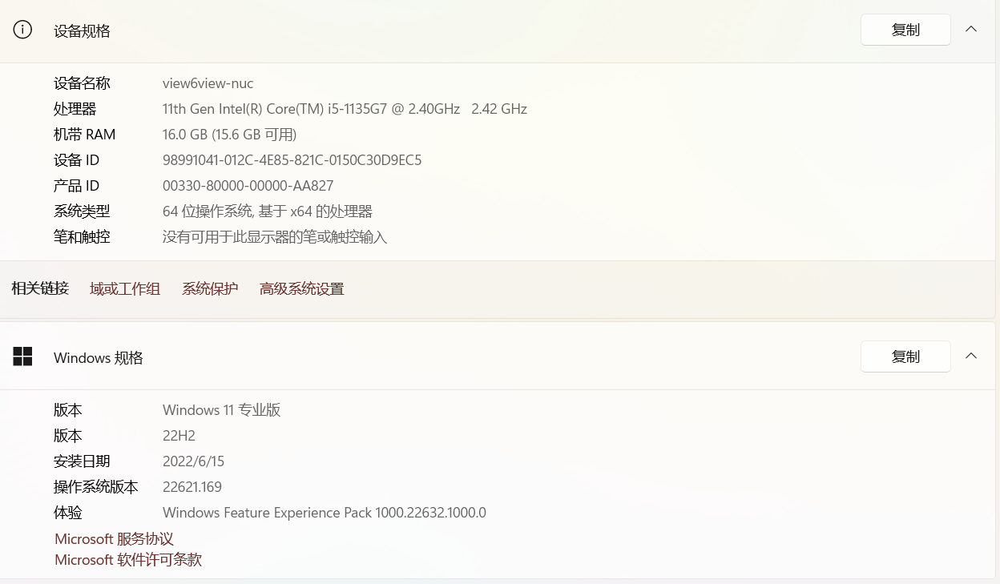
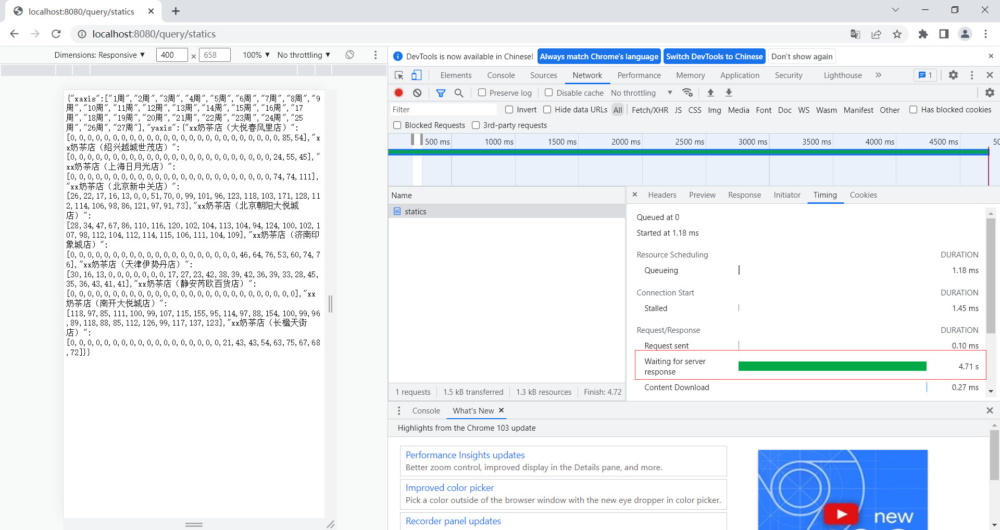
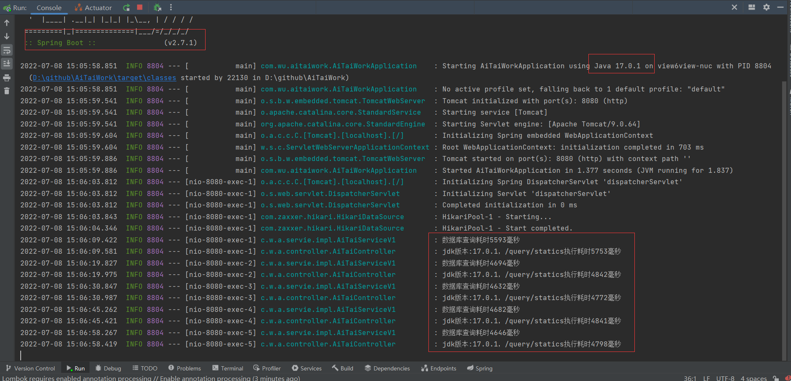
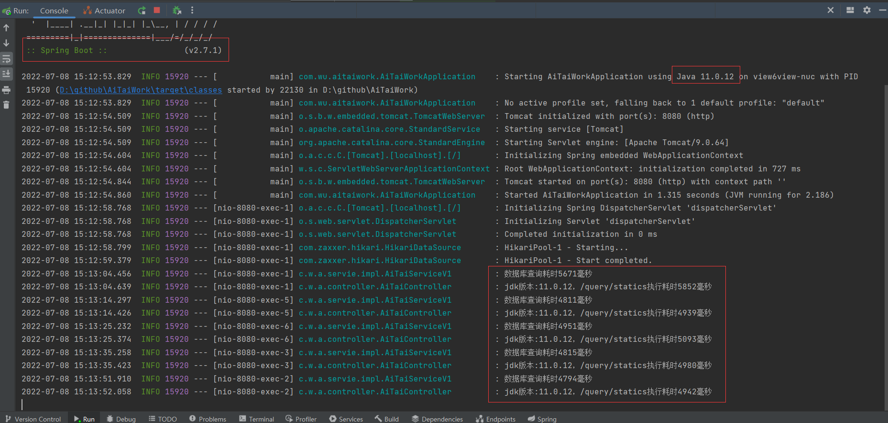
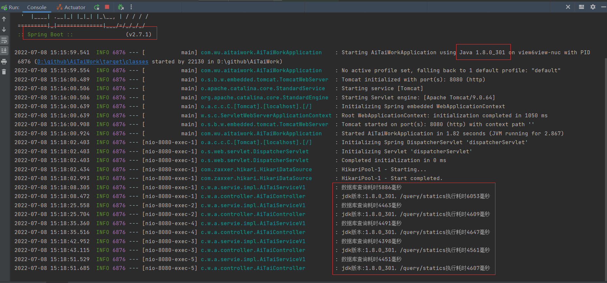
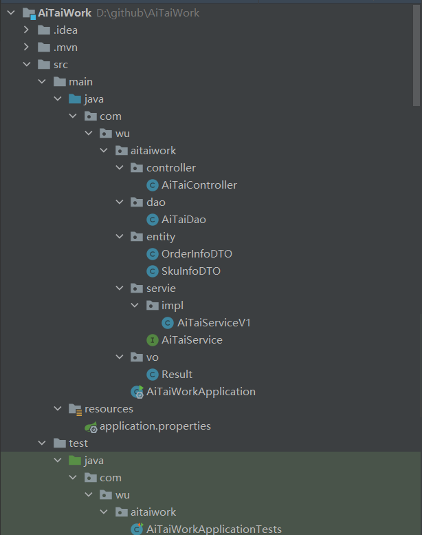

# 题目要求

- order_info.sql 包含订单信息；
2. sku_info.sql   包含订单sku信息；
3. 编写（--获取每周每个奶茶店的小时峰值sku数量--）接口；
4. 接口耗时不超过：10s；

建表sql：

```sql
SET NAMES utf8mb4;
SET FOREIGN_KEY_CHECKS = 0;

-- ----------------------------
-- Table structure for order_info
-- ----------------------------
DROP TABLE IF EXISTS `order_info`;
CREATE TABLE `order_info`  (
  `id` int(11) NOT NULL AUTO_INCREMENT,
  `order_no` varchar(200) CHARACTER SET utf8 COLLATE utf8_unicode_ci NOT NULL COMMENT '订单号',
  `order_amount` decimal(10, 2) NULL DEFAULT NULL COMMENT '订单金额',
  `shop_name` varchar(255) CHARACTER SET utf8 COLLATE utf8_unicode_ci NULL DEFAULT NULL COMMENT '店铺名称',
  `order_time` datetime(0) NULL DEFAULT NULL COMMENT '下单时间',
  PRIMARY KEY (`id`) USING BTREE
) ENGINE = InnoDB AUTO_INCREMENT = 161429 CHARACTER SET = utf8 COLLATE = utf8_unicode_ci ROW_FORMAT = Dynamic;

SET NAMES utf8mb4;
SET FOREIGN_KEY_CHECKS = 0;

-- ----------------------------
-- Table structure for sku_info
-- ----------------------------
DROP TABLE IF EXISTS `sku_info`;
CREATE TABLE `sku_info`  (
  `id` int(11) NOT NULL AUTO_INCREMENT,
  `order_no` varchar(200) CHARACTER SET utf8 COLLATE utf8_unicode_ci NOT NULL COMMENT '订单号',
  `sku_no` varchar(200) CHARACTER SET utf8 COLLATE utf8_unicode_ci NOT NULL COMMENT 'sku',
  `number` int(10) NULL DEFAULT NULL COMMENT '数量',
  PRIMARY KEY (`id`) USING BTREE
) ENGINE = InnoDB AUTO_INCREMENT = 228882 CHARACTER SET = utf8 COLLATE = utf8_unicode_ci ROW_FORMAT = Dynamic;
```

# 测试结果

## 说明

- 本项目根据JDK版本的不同进行了三次测试，测试版本分别为JDK17、JDK11、JDK8
- 本项目测试使用的云数据库，如果改用本地库性能可能会更好
- 测试环境为自己开发环境下的windows电脑配置，没有在服务器上进行测试（如果在服务器上可能网络带宽等因素，测试结果可能会更差一些），本地电脑配置如图



- 浏览器截图



- 返回结果json格式化

```json
{
    "xaxis": [
        "1周",
        "2周",
        "3周",
        "4周",
        "5周",
        "6周",
        "7周",
        "8周",
        "9周",
        "10周",
        "11周",
        "12周",
        "13周",
        "14周",
        "15周",
        "16周",
        "17周",
        "18周",
        "19周",
        "20周",
        "21周",
        "22周",
        "23周",
        "24周",
        "25周",
        "26周",
        "27周"
    ],
    "yaxis": {
        "xx奶茶店（大悦春风里店）": [
            0,
            0,
            0,
            0,
            0,
            0,
            0,
            0,
            0,
            0,
            0,
            0,
            0,
            0,
            0,
            0,
            0,
            0,
            0,
            0,
            0,
            0,
            0,
            0,
            0,
            85,
            54
        ],
        "xx奶茶店（绍兴越城世茂店）": [
            0,
            0,
            0,
            0,
            0,
            0,
            0,
            0,
            0,
            0,
            0,
            0,
            0,
            0,
            0,
            0,
            0,
            0,
            0,
            0,
            0,
            0,
            0,
            0,
            24,
            55,
            45
        ],
        "xx奶茶店（上海日月光店）": [
            0,
            0,
            0,
            0,
            0,
            0,
            0,
            0,
            0,
            0,
            0,
            0,
            0,
            0,
            0,
            0,
            0,
            0,
            0,
            0,
            0,
            0,
            0,
            0,
            74,
            74,
            111
        ],
        "xx奶茶店（北京新中关店）": [
            26,
            22,
            17,
            16,
            13,
            0,
            0,
            51,
            70,
            0,
            99,
            101,
            96,
            123,
            118,
            103,
            171,
            128,
            112,
            114,
            106,
            98,
            86,
            121,
            97,
            91,
            73
        ],
        "xx奶茶店（北京朝阳大悦城店）": [
            28,
            34,
            47,
            67,
            86,
            110,
            116,
            120,
            102,
            104,
            113,
            104,
            94,
            124,
            100,
            102,
            107,
            98,
            112,
            104,
            112,
            114,
            115,
            106,
            111,
            104,
            109
        ],
        "xx奶茶店（济南印象城店）": [
            0,
            0,
            0,
            0,
            0,
            0,
            0,
            0,
            0,
            0,
            0,
            0,
            0,
            0,
            0,
            0,
            0,
            0,
            0,
            0,
            46,
            64,
            76,
            53,
            60,
            74,
            76
        ],
        "xx奶茶店（天津伊势丹店）": [
            30,
            16,
            13,
            0,
            0,
            0,
            0,
            0,
            0,
            0,
            17,
            27,
            23,
            42,
            38,
            39,
            42,
            36,
            39,
            33,
            28,
            45,
            35,
            36,
            43,
            41,
            41
        ],
        "xx奶茶店（静安芮欧百货店）": [
            0,
            0,
            0,
            0,
            0,
            0,
            0,
            0,
            0,
            0,
            0,
            0,
            0,
            0,
            0,
            0,
            0,
            0,
            0,
            0,
            0,
            0,
            0,
            0,
            0,
            0,
            0
        ],
        "xx奶茶店（南开大悦城店）": [
            118,
            97,
            85,
            111,
            100,
            99,
            107,
            115,
            155,
            95,
            114,
            97,
            88,
            154,
            100,
            99,
            96,
            89,
            118,
            88,
            85,
            112,
            126,
            99,
            117,
            137,
            123
        ],
        "xx奶茶店（长楹天街店）": [
            0,
            0,
            0,
            0,
            0,
            0,
            0,
            0,
            0,
            0,
            0,
            0,
            0,
            0,
            0,
            0,
            0,
            0,
            21,
            43,
            43,
            54,
            63,
            75,
            67,
            68,
            72
        ]
    }
}
```

## JDK17测试结果

多次测试结果如图，接口的响应时间在5秒左右，其中数据查询差不多就4.7s，后台数据处理时间只花了200ms左右



## JDK11测试结果

测试结果和JDK17差距很小，主要耗时操作还是在数据库查询上



## JDK8测试结果

和其它版本JDK测试性能差距也很小，耗时操作还是在数据库查询之上



## 测试结果分析

通过对三种发行版JDK的测试，后台对于40w条数据的处理，并最终返回结果，执行耗时机会都在200ms之内，所以接口的性能瓶颈还是在数据库查询之上，可以考虑使用更高效的数据查询方法，能够将接口的性能提升到ms级别

# 设计实现

## 项目结构

技术栈为：

- Java（测试支持版本8、11、17）
- SpringBoot（2.6+）
- MySQL（8.0+）
- Maven（3.7+）

- 额外依赖库（joda-time、org.apache.commons.commons-lang3）

项目结构图：



## 核心逻辑实现

### step1 从数据库查询数据

自定义数据库映射对象，通过jdbctemplate从数据库中查询出来所需要的数据

```sql
@Repository
public class AiTaiDao {
    @Autowired
    private JdbcTemplate jdbcTemplate;

    private static String orderInfoSql = "select order_no, shop_name, order_time from order_info;";

    private static String skuInfoSql = "select order_no, number from sku_info;";

    public List<OrderInfoDTO> batchOrderInfoDTO() {
        return jdbcTemplate.query(orderInfoSql, new BeanPropertyRowMapper<OrderInfoDTO>(OrderInfoDTO.class));
    }

    public List<SkuInfoDTO> batchSkuInfoDTO() {
        return jdbcTemplate.query(skuInfoSql, new BeanPropertyRowMapper<SkuInfoDTO>(SkuInfoDTO.class));
    }
}
```

### step2 数据预处理阶段

- 这里Triple类封装同时返回三个对象`Map<String, Integer>, long[], Map<String, List<OrderInfoDTO>>`
- 传入参数为：
  - 线程池
  - 从数据库查询出来的orderInfo列表
  - 从数据库查询出来的skuInfo列表
- 执行流程
  - 定义计数器值为2
  - **线程池执行**：对skuInfo列表进行处理，转换为**Map<String, Integer>（订单号，订单号对应的number总和）**，执行完成则计数器-1
  - **主线程执行**：对orderInfo列表进行处理，按照下单时间升序排列
  - **线程池执行**：通过上一步排好序的orderInfo列表，得到最早时间和最晚时间，通过这两个时间，封装为**week时期数组long[]**（数组的每个元素对应每周周一的零点时间），执行完成则计数器-1
  - **主线程执行**：通过之前排好序的orderInfo列表，按照店铺名字分组，得到**分组好之后数据对象`Map<String, List<OrderInfoDTO>>`**
  - **主线程等待计数器**
  - **返回上面三个得到的预处理对象**：`Map<String, Integer>, long[], Map<String, List<OrderInfoDTO>>`

```java
/**
 * 数据预处理阶段
 *
 * @param executorService 线程池
 * @param orderInfoDTOS   订单信息List
 * @param skuInfoDTOS     sku信息List
 * @return 三个对象，分别是：Map(订单号、数量)、week时期数组、Map（店铺名字、订单集合（有序））
 * @throws ExecutionException
 * @throws InterruptedException
 */
private Triple<Map<String, Integer>, long[], Map<String, List<OrderInfoDTO>>> prepare(ExecutorService executorService, List<OrderInfoDTO> orderInfoDTOS, List<SkuInfoDTO> skuInfoDTOS) throws ExecutionException, InterruptedException {
    // 定义计数器
    CountDownLatch isFinish = new CountDownLatch(2);
    // 转化为skuInfo为Map集合(订单号，数量)（子线程）
    Future<Map<String, Integer>> mapFuture = executorService.submit(new Callable<Map<String, Integer>>() {
        @Override
        public Map<String, Integer> call() throws Exception {
            Map<String, Integer> collect;
            try {
                collect = skuInfoDTOS.stream().collect(Collectors.toMap(SkuInfoDTO::getOrderNo, SkuInfoDTO::getNumber, Integer::sum));
            } catch (Exception e) {
                throw new RuntimeException(e);
            } finally {
                isFinish.countDown();
            }
            return collect;
        }
    });

    // 排序（主线程）
    Collections.sort(orderInfoDTOS);

    // 计算周数(子线程)
    Future<long[]> dateListFuture = executorService.submit(new Callable<long[]>() {
        @Override
        public long[] call() throws Exception {
            Date firstTime = orderInfoDTOS.get(0).getOrderTime();
            Date endTime = orderInfoDTOS.get(orderInfoDTOS.size() - 1).getOrderTime();
            long[] dates = null;
            try {
                dates = calcWeek(firstTime, endTime);
            } catch (Exception e) {
                throw new RuntimeException(e);
            } finally {
                isFinish.countDown();
            }
            return dates;
        }
    });

    // 按照店铺名分类（主线程）
    Map<String, List<OrderInfoDTO>> groupByShopName = orderInfoDTOS.stream().collect(Collectors.groupingBy(OrderInfoDTO::getShopName));

    // 等待线程执行完成
    isFinish.await();

    return Triple.of(mapFuture.get(), dateListFuture.get(), groupByShopName);
}
```

### step3 数据封装阶段

- 得到数据预处理阶段的三个返回对象
- 定义计数器值为ordersGroupByName的长度
- 创建异步数组用于接收异步返回结果：`List<Future<Pair<String, List<Integer>>>> futureTasks = new ArrayList<>(ordersGroupByName.size());`
- 遍历ordersGroupByName数组，将每个元素加入到线程池处理（通过预处理的数据，可以得到每个店铺对应每周的峰值sku），每个线程执行完成后计数器-1，将线程返回结果添加到`futureTasks`
- 主线程封装`xAxis`
- 主线程等待计数器
- 主线程封装异步返回结果，封装为`yAxis`
- 将`xAxis`和`yAxis`封装为返回结果

```java
@Override
public Result getStatistics() {
    // .....

    // 获取数据的返回结果
    Map<String, Integer> skuMap = prepare.getLeft();
    long[] dates = prepare.getMiddle();
    Map<String, List<OrderInfoDTO>> ordersGroupByName = prepare.getRight();

    // 设置标志用于判断线程是否执行完成
    CountDownLatch isFinish = new CountDownLatch(ordersGroupByName.size());
    // 异步返回结果List
    List<Future<Pair<String, List<Integer>>>> futureTasks = new ArrayList<>(ordersGroupByName.size());

    // 使用线程池完成数据统计操作
    ordersGroupByName.forEach((k, v) -> {
        Future<Pair<String, List<Integer>>> submit = executorService.submit(new Callable<Pair<String, List<Integer>>>() {
            @Override
            public Pair<String, List<Integer>> call() throws Exception {
                List<Integer> res = null;
                try {
                    res = new ArrayList<>(dates.length - 1);
                    int idx = 0;
                    List<OrderInfoDTO> orderInfoDTOList = v;
                    for (int i = 0; i < dates.length - 1; i++) {
                        long weekBeginTime = dates[i];
                        long weekEndTime = dates[i + 1];
                        // 当前一周内的小时峰值
                        int curWeekMax = 0;
                        while (idx < orderInfoDTOList.size()) {
                            OrderInfoDTO beginOrderInfoDTO = orderInfoDTOList.get(idx);
                            long beginTime = beginOrderInfoDTO.getOrderTime().getTime();
                            // 判断订单时间是否在[begin,end)范围内
                            if (beginTime >= weekBeginTime && beginTime < weekEndTime) {
                                // 当前一小时内的峰值
                                int curHourMax = skuMap.getOrDefault(beginOrderInfoDTO.getOrderNo(), 0);
                                int endIdx = idx + 1;
                                while (endIdx < orderInfoDTOList.size()) {
                                    OrderInfoDTO endOrderInfoDTO = orderInfoDTOList.get(endIdx);
                                    long endTime = endOrderInfoDTO.getOrderTime().getTime();
                                    // 超过一小时的范围，跳出循环
                                    if (endTime - beginTime > 3600000l) break;
                                    curHourMax += skuMap.getOrDefault(endOrderInfoDTO.getOrderNo(), 0);
                                    endIdx++;
                                }
                                curWeekMax = Math.max(curWeekMax, curHourMax);
                                idx++;
                            } else {
                                break;
                            }
                        }
                        res.add(curWeekMax);
                    }
                } catch (Exception e) {
                    throw new RuntimeException(e);
                } finally {
                    isFinish.countDown();
                }
                return Pair.of(k, res);
            }
        });
        // 加入到异步返回结果List
        futureTasks.add(submit);
    });

    // 封装xAxis
    List<String> xAxis = packXAxis(dates.length - 1);

    // 等待线程执行完毕
    try {
        isFinish.await();
    } catch (InterruptedException e) {
        throw new RuntimeException(e);
    }
    
    executorService.shutdown();

    // 封装yAxis
    Map<String, List<Integer>> yAxis = new ConcurrentHashMap<>(futureTasks.size());
    futureTasks.forEach(pairFuture -> {
        try {
            Pair<String, List<Integer>> pair = pairFuture.get();
            yAxis.put(pair.getKey(), pair.getValue());
        } catch (InterruptedException e) {
            throw new RuntimeException(e);
        } catch (ExecutionException e) {
            throw new RuntimeException(e);
        }
    });

    return new Result(xAxis, yAxis);
}
```

