# 操作系统常见面试题

转载自掘金社区：https://juejin.cn/post/7014301927408140296

# 内存屏障中的读写屏

Java Volatile的底层实现原理就是内存屏障:

https://blog.csdn.net/m0_46672151/article/details/123180122

GC，三色标记法与读写屏障：

https://cloud.tencent.com/developer/article/1764009

# CPU上下文切换

我们都知道，Linux 是一个多任务操作系统，它支持远大于 CPU 数量的任务同时运行。当然，这些任务实际上并不是真的在同时运行，而是因为系统在很短的时间内，将 CPU 轮流分配给它们，造成多任务同时运行的错觉。

而在每个任务运行前，CPU 都需要知道任务从哪里加载、又从哪里开始运行，也就是说，需要系统事先帮它设置好**CPU 寄存器和程序计数器**

## 什么是 CPU 上下文

CPU 寄存器和程序计数器就是 CPU 上下文，因为它们都是 CPU 在运行任何任务前，必须的依赖环境。

- CPU 寄存器是 CPU 内置的容量小、但速度极快的内存。
- 程序计数器则是用来存储 CPU 正在执行的指令位置、或者即将执行的下一条指令位置。

## 什么是 CPU 上下文切换

就是先把前一个任务的 CPU 上下文（也就是 CPU 寄存器和程序计数器）保存起来，然后加载新任务的上下文到这些寄存器和程序计数器，最后再跳转到程序计数器所指的新位置，运行新任务。

而这些保存下来的上下文，会存储在系统内核中，并在任务重新调度执行时再次加载进来。这样就能保证任务原来的状态不受影响，让任务看起来还是连续运行。

## CPU 上下文切换的类型

根据任务的不同，可以分为以下三种类型 - 进程上下文切换 - 线程上下文切换 - 中断上下文切换

## 进程上下文切换

Linux 按照特权等级，把进程的运行空间分为内核空间和用户空间，分别对应着下图中， CPU 特权等级的 Ring 0 和 Ring 3。

- 内核空间（Ring 0）具有最高权限，可以直接访问所有资源；
- 用户空间（Ring 3）只能访问受限资源，不能直接访问内存等硬件设备，必须通过系统调用陷入到内核中，才能访问这些特权资源。


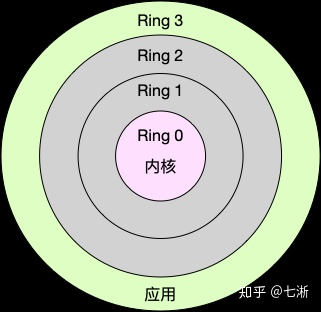


进程既可以在用户空间运行，又可以在内核空间中运行。进程在用户空间运行时，被称为进程的用户态，而陷入内核空间的时候，被称为进程的内核态。

## 系统调用

从用户态到内核态的转变，需要通过**系统调用**来完成。比如，当我们查看文件内容时，就需要多次系统调用来完成：首先调用 open() 打开文件，然后调用 read() 读取文件内容，并调用 write() 将内容写到标准输出，最后再调用 close() 关闭文件。

在这个过程中就发生了 CPU 上下文切换，整个过程是这样的：
1、保存 CPU 寄存器里原来用户态的指令位
2、为了执行内核态代码，CPU 寄存器需要更新为内核态指令的新位置。
3、跳转到内核态运行内核任务。
4、当系统调用结束后，CPU 寄存器需要恢复原来保存的用户态，然后再切换到用户空间，继续运行进程。

所以，**一次系统调用的过程，其实是发生了两次 CPU 上下文切换**。（用户态-内核态-用户态）

不过，需要注意的是，**系统调用过程中，并不会涉及到虚拟内存等进程用户态的资源，也不会切换进程**。这跟我们通常所说的进程上下文切换是不一样的：**进程上下文切换，是指从一个进程切换到另一个进程运行；而系统调用过程中一直是同一个进程在运行。**

所以，**系统调用过程通常称为特权模式切换，而不是上下文切换。系统调用属于同进程内的 CPU 上下文切换**。但实际上，系统调用过程中，CPU 的上下文切换还是无法避免的。

## 进程上下文切换跟系统调用又有什么区别呢

首先，**进程是由内核来管理和调度的，进程的切换只能发生在内核态**。所以，进程的上下文不仅包括了虚拟内存、栈、全局变量等用户空间的资源，还包括了内核堆栈、寄存器等内核空间的状态。

因此，**进程的上下文切换就比系统调用时多了一步：在保存内核态资源（当前进程的内核状态和 CPU 寄存器）之前，需要先把该进程的用户态资源（虚拟内存、栈等）保存下来；而加载了下一进程的内核态后，还需要刷新进程的虚拟内存和用户栈**。

如下图所示，保存上下文和恢复上下文的过程并不是“免费”的，需要内核在 CPU 上运行才能完成。


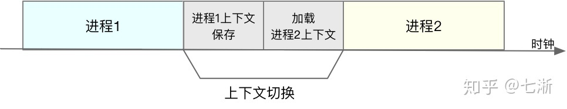


## 进程上下文切换潜在的性能问题

根据 Tsuna 的测试报告，每次上下文切换都需要几十纳秒到数微秒的 CPU 时间。这个时间还是相当可观的，特别是在进程上下文切换次数较多的情况下，很容易导致 CPU 将大量时间耗费在寄存器、内核栈以及虚拟内存等资源的保存和恢复上，进而大大缩短了真正运行进程的时间。这也正是导致平均负载升高的一个重要因素。

另外，我们知道， Linux 通过 TLB（Translation Lookaside Buffer）来管理虚拟内存到物理内存的映射关系。当虚拟内存更新后，TLB 也需要刷新，内存的访问也会随之变慢。特别是在多处理器系统上，缓存是被多个处理器共享的，刷新缓存不仅会影响当前处理器的进程，还会影响共享缓存的其他处理器的进程。

## 发生进程上下文切换的场景

1. 为了保证所有进程可以得到公平调度，CPU 时间被划分为一段段的时间片，这些时间片再被轮流分配给各个进程。这样，当某个进程的时间片耗尽了，就会被系统挂起，切换到其它正在等待 CPU 的进程运行。
2. 进程在系统资源不足（比如内存不足）时，要等到资源满足后才可以运行，这个时候进程也会被挂起，并由系统调度其他进程运行。
3. 当进程通过睡眠函数 sleep 这样的方法将自己主动挂起时，自然也会重新调度。
4. 当有优先级更高的进程运行时，为了保证高优先级进程的运行，当前进程会被挂起，由高优先级进程来运行
5. 发生硬件中断时，CPU 上的进程会被中断挂起，转而执行内核中的中断服务程序。

## 线程上下文切换

线程与进程最大的区别在于：**线程是调度的基本单位，而进程则是资源拥有的基本单位**。说白了，所谓内核中的任务调度，实际上的调度对象是线程；而进程只是给线程提供了虚拟内存、全局变量等资源。

所以，对于线程和进程，我们可以这么理解： - 当进程只有一个线程时，可以认为进程就等于线程。 - 当进程拥有多个线程时，这些线程会共享相同的虚拟内存和全局变量等资源。这些资源在上下文切换时是不需要修改的。 - 另外，线程也有自己的私有数据，比如栈和寄存器等，这些在上下文切换时也是需要保存的。

## 发生线程上下文切换的场景

1. 前后两个线程属于不同进程。此时，因为资源不共享，所以切换过程就跟进程上下文切换是一样。
2. 前后两个线程属于同一个进程。此时，因为虚拟内存是共享的，所以在切换时，虚拟内存这些资源就保持不动，只需要切换线程的私有数据、寄存器等不共享的数据

## 中断上下文切换

为了快速响应硬件的事件，**中断处理会打断进程的正常调度和执行，转而调用中断处理程序，响应设备事件**。而在打断其他进程时，就需要将进程当前的状态保存下来，这样在中断结束后，进程仍然可以从原来的状态恢复运行。

**跟进程上下文不同，中断上下文切换并不涉及到进程的用户态**。所以，即便中断过程打断了一个正处在用户态的进程，也不需要保存和恢复这个进程的虚拟内存、全局变量等用户态资源。中断上下文，其实只包括内核态中断服务程序执行所必需的状态，包括 CPU 寄存器、内核堆栈、硬件中断参数等。

**对同一个 CPU 来说，中断处理比进程拥有更高的优先级**，所以中断上下文切换并不会与进程上下文切换同时发生。同样道理，由于中断会打断正常进程的调度和执行，所以大部分中断处理程序都短小精悍，以便尽可能快的执行结束。

另外，跟进程上下文切换一样，中断上下文切换也需要消耗 CPU，切换次数过多也会耗费大量的 CPU，甚至严重降低系统的整体性能。所以，当你发现中断次数过多时，就需要注意去排查它是否会给你的系统带来严重的性能问题。

# linux堆(heap)和栈(stack)有什么区别?

简单的可以理解为：
heap：是由malloc之类函数分配的空间所在地。地址是由低向高增长的。
stack：是自动分配变量，以及函数调用的时候所使用的一些空间。地址是由高向低减少的。

## 预备知识—程序的内存分配

一个由c/C++编译的程序占用的内存分为以下几个部分

- 栈区（stack）— 由编译器自动分配释放 ，存放函数的参数值，局部变量的值等。其操作方式类似于数据结构中的栈。
- 堆区（heap） — 一般由程序员分配释放， 若程序员不释放，程序结束时可能由OS回收 。注意它与数据结构中的堆是两回事，分配方式倒是类似于链表。
- 全局区（静态区）（static）—，全局变量和静态变量的存储是放在一块的，初始化的全局变量和静态变量在一块区域， 未初始化的全局变量和未初始化的静态变量在相邻的另一块区域。 - 程序结束后有系统释放
- 文字常量区 —常量字符串就是放在这里的。 程序结束后由系统释放
- 程序代码区—存放函数体的二进制代码。

## 例子程序

这是一个前辈写的，非常详细

```cpp
//main.cpp
int a = 0; 全局初始化区
char *p1; 全局未初始化区
main()
{
int b; 栈
char s[] = "abc"; 栈
char *p2; 栈
char *p3 = "123456"; 123456在常量区，p3在栈上。
static int c =0； 全局（静态）初始化区
p1 = (char *)malloc(10);
p2 = (char *)malloc(20);
分配得来得10和20字节的区域就在堆区。
strcpy(p1, "123456"); 123456放在常量区，编译器可能会将它与p3所指向的"123456"优化成一个地方。
}
```

## 堆和栈的理论知识

### 申请方式

> stack

由系统自动分配。 例如，声明在函数中一个局部变量 int b; 系统自动在栈中为b开辟空间

> heap

需要程序员自己申请，并指明大小，在c中malloc函数如

```cpp
p1 = (char *)malloc(10);
```

在C++中用new运算符如

```cpp
p2 = (char *)malloc(10);
```

但是注意p1、p2本身是在栈中的。

### 申请后系统的响应

- 栈：只要栈的剩余空间大于所申请空间，系统将为程序提供内存，否则将报异常提示栈溢出。
- 堆：首先应该知道操作系统有一个记录空闲内存地址的链表，当系统收到程序的申请时，会遍历该链表，寻找第一个空间大于所申请空间的堆结点，然后将该结点从空闲结点链表中删除，并将该结点的空间分配给程序，另外，对于大多数系统，会在这块内存空间中的首地址处记录本次分配的大小，这样，代码中的delete语句才能正确的释放本内存空间。另外，由于找到的堆结点的大小不一定正好等于申请的大小，系统会自动的将多余的那部分重新放入空闲链表中。

### 申请大小的限制

- 栈：在Windows下,栈是向低地址扩展的数据结构，是一块连续的内存的区域。这句话的意思是栈顶的地址和栈的最大容量是系统预先规定好的，在 WINDOWS下，栈的大小是2M（也有的说是1M，总之是一个编译时就确定的常数），如果申请的空间超过栈的剩余空间时，将提示overflow。因此，能从栈获得的空间较小。

- 堆：堆是向高地址扩展的数据结构，是不连续的内存区域。这是由于系统是用链表来存储的空闲内存地址的，自然是不连续的，而链表的遍历方向是由低地址向高地址。堆的大小受限于计算机系统中有效的虚拟内存。由此可见，堆获得的空间比较灵活，也比较大。

### 申请效率的比较

- 栈由系统自动分配，速度较快。但程序员是无法控制的

- 堆是由new分配的内存，一般速度比较慢，而且容易产生内存碎片,不过用起来最方便

- 另外，在WINDOWS下，最好的方式是用VirtualAlloc分配内存，他不是在堆，也不是在栈是直接在进程的地址空间中保留一快内存，虽然用起来最不方便。但是速度， 也最灵活

### 堆和栈中的存储内容

- 栈： 在函数调用时，第一个进栈的是主函数中后的下一条指令（函数调用语句的下一条可执行语句）的地址，然后是函数的各个参数，在大多数的C编译器中，参数是由右往左入栈的，然后是函数中的局部变量。注意静态变量是不入栈的。
- 当本次函数调用结束后，局部变量先出栈，然后是参数，最后栈顶指针指向最开始存的地址，也就是主函数中的下一条指令，程序由该点继续运行。
- 堆：一般是在堆的头部用一个字节存放堆的大小。堆中的具体内容有程序员安排。

### 存取效率的比较

```cpp
char s1[] = "aaaaaaaaaaaaaaa";
char *s2 = "bbbbbbbbbbbbbbbbb";
```

aaaaaaaaaaa是在运行时刻赋值的；
而bbbbbbbbbbb是在编译时就确定的；
但是，在以后的存取中，在栈上的数组比指针所指向的字符串(例如堆)快。
比如：

```cpp
#include
void main()
{
char a = 1;
char c[] = "1234567890";
char *p ="1234567890";
a = c[1];
a = p[1];
return;
}
```

对应的汇编代码

```
10: a = c[1];
00401067 8A 4D F1 mov cl,byte ptr [ebp-0Fh]
0040106A 88 4D FC mov byte ptr [ebp-4],cl
11: a = p[1];
0040106D 8B 55 EC mov edx,dword ptr [ebp-14h]
00401070 8A 42 01 mov al,byte ptr [edx+1]
00401073 88 45 FC mov byte ptr [ebp-4],al
```

第一种在读取时直接就把字符串中的元素读到寄存器cl中，而第二种则要先把指edx中，在根据edx读取字符，显然慢了。

## 小结

堆和栈的区别可以用如下的比喻来看出：

- 使用栈就象我们去饭馆里吃饭，只管点菜（发出申请）、付钱、和吃（使用），吃饱了就走，不必理会切菜、洗菜等准备工作和洗碗、刷锅等扫尾工作，他的好处是快捷，但是自由度小。
- 使用堆就象是自己动手做喜欢吃的菜肴，比较麻烦，但是比较符合自己的口味，而且自由度大。

堆和栈的区别主要分：

- 操作系统方面的堆和栈，如上面说的那些，不多说了。
- 还有就是数据结构方面的堆和栈，这些都是不同的概念。这里的堆实际上指的就是（满足堆性质的）优先队列的一种数据结构，第1个元素有最高的优先权；栈实际上就是满足先进后出的性质的数学或数据结构。
- 虽然堆栈，堆栈的说法是连起来叫，但是他们还是有很大区别的，连着叫只是由于历史的原因针值读.

# 【linux】图文并茂|彻底搞懂零拷贝（Zero-Copy）技术

## 1.前言

Linux系统中一切皆文件，仔细想一下Linux系统的很多活动无外乎**读操作**和**写操作**，零拷贝就是为了提高读写性能而出现的。

## **2. 数据拷贝基础过程**

在Linux系统内部缓存和内存容量都是有限的，更多的数据都是存储在磁盘中。对于Web服务器来说，经常需要从磁盘中读取数据到内存，然后再通过网卡传输给用户：

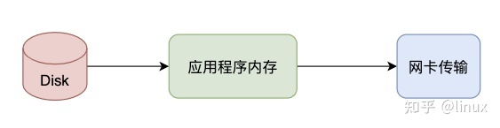

上述数据流转只是大框，接下来看看几种模式。

### **2.1 仅CPU方式**

- 当应用程序需要读取磁盘数据时，调用read()从用户态陷入内核态，read()这个系统调用最终由CPU来完成；
- CPU向磁盘发起I/O请求，磁盘收到之后开始准备数据；
- 磁盘将数据放到磁盘缓冲区之后，向CPU发起I/O中断，报告CPU数据已经Ready了；
- CPU收到磁盘控制器的I/O中断之后，开始拷贝数据，完成之后read()返回，再从内核态切换到用户态；

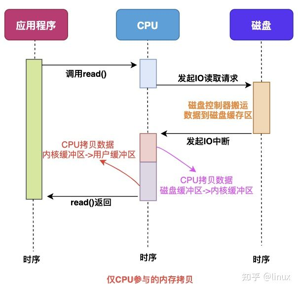

### **2.2 CPU&DMA方式**

CPU的时间宝贵，让它做杂活就是浪费资源。

直接内存访问（Direct Memory Access），是一种硬件设备绕开CPU独立直接访问内存的机制。所以DMA在一定程度上解放了CPU，把之前CPU的杂活让硬件直接自己做了，提高了CPU效率。

目前支持DMA的硬件包括：网卡、声卡、显卡、磁盘控制器等。

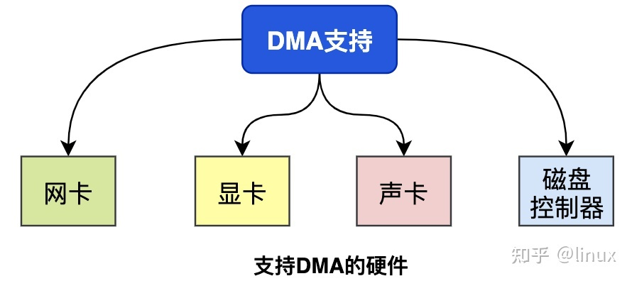

有了DMA的参与之后的流程发生了一些变化：

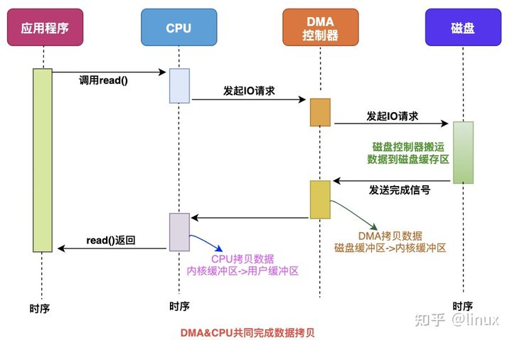

最主要的变化是，CPU不再和磁盘直接交互，而是DMA和磁盘交互并且将数据从磁盘缓冲区拷贝到内核缓冲区，之后的过程类似。

> “【**敲黑板**】无论从仅CPU方式和DMA&CPU方式，都存在多次冗余数据拷贝和内核态&用户态的切换。
> ”

我们继续思考Web服务器读取本地磁盘文件数据再通过网络传输给用户的详细过程。

## **3.普通模式数据交互**

一次完成的数据交互包括几个部分：系统调用syscall、CPU、DMA、网卡、磁盘等。

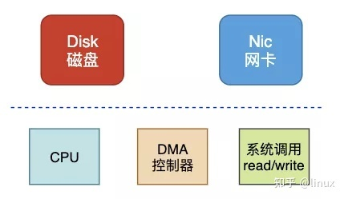

系统调用syscall是应用程序和内核交互的桥梁，每次进行调用/返回就会产生两次切换：

- 调用syscall 从用户态切换到内核态
- syscall返回 从内核态切换到用户态

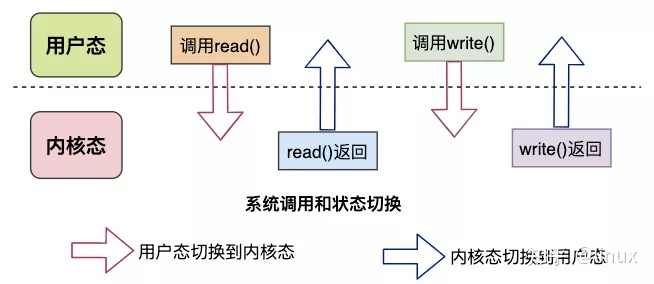

来看下完整的数据拷贝过程简图：

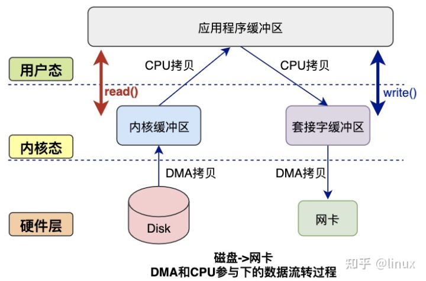

读数据过程：

- 应用程序要读取磁盘数据，调用read()函数从而实现用户态切换内核态，这是第1次状态切换；
- DMA控制器将数据从磁盘拷贝到内核缓冲区，这是第1次DMA拷贝；
- CPU将数据从内核缓冲区复制到用户缓冲区，这是第1次CPU拷贝；
- CPU完成拷贝之后，read()函数返回实现用户态切换用户态，这是第2次状态切换；

写数据过程：

- 应用程序要向网卡写数据，调用write()函数实现用户态切换内核态，这是第1次切换；
- CPU将用户缓冲区数据拷贝到内核缓冲区，这是第1次CPU拷贝；
- DMA控制器将数据从内核缓冲区复制到socket缓冲区，这是第1次DMA拷贝；
- 完成拷贝之后，write()函数返回实现内核态切换用户态，这是第2次切换；

综上所述：

- 读过程涉及2次空间切换、1次DMA拷贝、1次CPU拷贝；
- 写过程涉及2次空间切换、1次DMA拷贝、1次CPU拷贝；

可见传统模式下，涉及多次空间切换和数据冗余拷贝，效率并不高，接下来就该零拷贝技术出场了。

## **4. 零拷贝技术**

### **4.1 出现原因**

我们可以看到，如果应用程序不对数据做修改，从内核缓冲区到用户缓冲区，再从用户缓冲区到内核缓冲区。两次数据拷贝都需要CPU的参与，并且涉及用户态与内核态的多次切换，加重了CPU负担。

我们需要降低冗余数据拷贝、解放CPU，这也就是零拷贝Zero-Copy技术。

### **4.2 解决思路**

目前来看，零拷贝技术的几个实现手段包括：mmap+write、sendfile、sendfile+DMA收集、splice等。

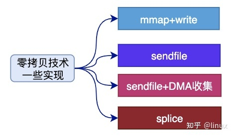

### **4.2.1 mmap方式**

mmap是Linux提供的一种内存映射文件的机制，它实现了将内核中读缓冲区地址与用户空间缓冲区地址进行映射，从而实现内核缓冲区与用户缓冲区的共享。

这样就减少了一次用户态和内核态的CPU拷贝，但是在内核空间内仍然有一次CPU拷贝。

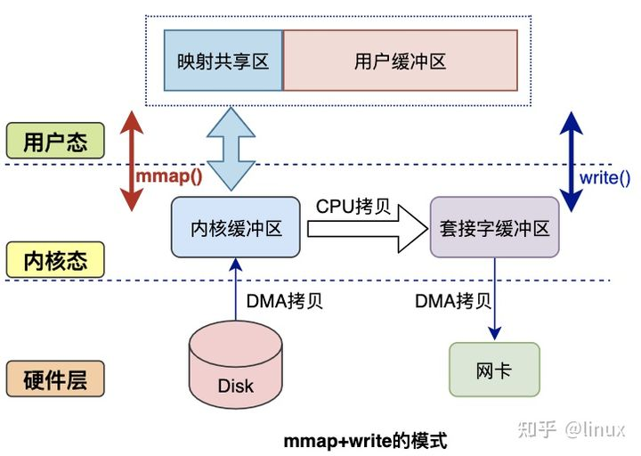

mmap对大文件传输有一定优势，但是小文件可能出现碎片，并且在多个进程同时操作文件时可能产生引发coredump的signal。

### **4.2.2 sendfile方式**

mmap+write方式有一定改进，但是由系统调用引起的状态切换并没有减少。

sendfile系统调用是在 Linux 内核2.1版本中被引入，它建立了两个文件之间的传输通道。

sendfile方式只使用一个函数就可以完成之前的read+write 和 mmap+write的功能，这样就少了2次状态切换，由于数据不经过用户缓冲区，因此该数据无法被修改。

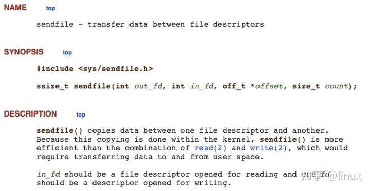

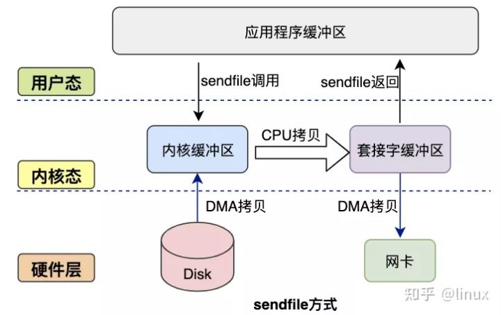

从图中可以看到，应用程序只需要调用sendfile函数即可完成，只有2次状态切换、1次CPU拷贝、2次DMA拷贝。

但是sendfile在内核缓冲区和socket缓冲区仍然存在一次CPU拷贝，或许这个还可以优化。

### **4.2.3 sendfile+DMA收集**

Linux 2.4 内核对 sendfile 系统调用进行优化，但是需要硬件DMA控制器的配合。

升级后的sendfile将内核空间缓冲区中对应的数据描述信息（文件描述符、地址偏移量等信息）记录到socket缓冲区中。

DMA控制器根据socket缓冲区中的地址和偏移量将数据从内核缓冲区拷贝到网卡中，从而省去了内核空间中仅剩1次CPU拷贝。

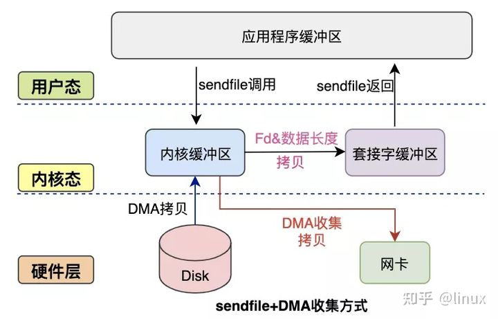

这种方式有2次状态切换、0次CPU拷贝、2次DMA拷贝，但是仍然无法对数据进行修改，并且需要硬件层面DMA的支持，并且sendfile只能将文件数据拷贝到socket描述符上，有一定的局限性。

### **4.2.4 splice方式**

splice系统调用是Linux 在 2.6 版本引入的，其不需要硬件支持，并且不再限定于socket上，实现两个普通文件之间的数据零拷贝。

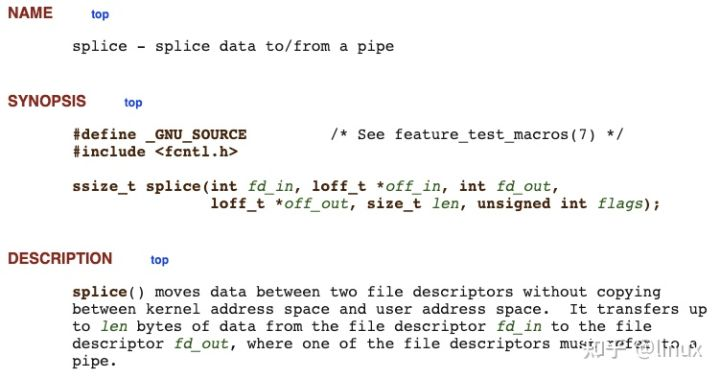

splice 系统调用可以在内核缓冲区和socket缓冲区之间建立管道来传输数据，避免了两者之间的 CPU 拷贝操作。

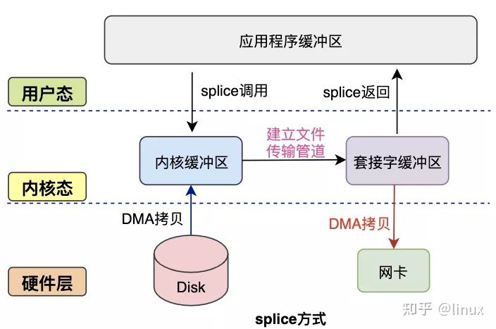

splice也有一些局限，它的两个文件描述符参数中有一个必须是管道设备。

## **5.本文小结**

本文通过介绍数据交互的基本过程、传统模式的缺点，进而介绍了零拷贝的一些实现方法。

零拷贝技术是非常底层且重要的读写优化，对于服务并发能力的提升有很大帮助。
