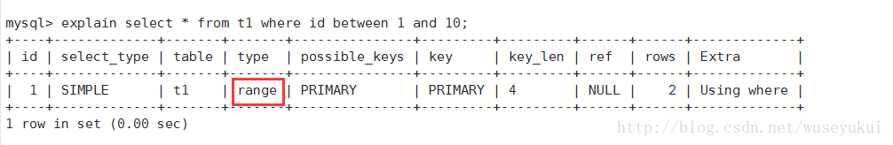
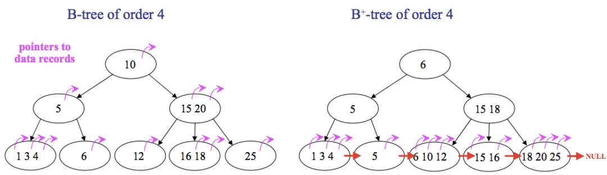

# 执行计划

## explain执行计划包含的信息


其中最重要的字段为：id、type、key、rows、Extra

## 各字段详解

### id

select查询的序列号，包含一组数字，表示查询中执行select子句或操作表的顺序 
三种情况： 
1、id相同：执行顺序由上至下 


2、id不同：如果是子查询，id的序号会递增，id值越大优先级越高，越先被执行 


3、id相同又不同（两种情况同时存在）：id如果相同，可以认为是一组，从上往下顺序执行；在所有组中，id值越大，优先级越高，越先执行 


### select_type

查询的类型，主要是用于区分普通查询、联合查询、子查询等复杂的查询

1、SIMPLE：简单的select查询，查询中不包含子查询或者union 
2、PRIMARY：查询中包含任何复杂的子部分，最外层查询则被标记为primary 
3、SUBQUERY：在select 或 where列表中包含了子查询 
4、DERIVED：在from列表中包含的子查询被标记为derived（衍生），mysql或递归执行这些子查询，把结果放在零时表里 
5、UNION：若第二个select出现在union之后，则被标记为union；若union包含在from子句的子查询中，外层select将被标记为derived 
6、UNION RESULT：从union表获取结果的select 


### type

访问类型，sql查询优化中一个很重要的指标，结果值从好到坏依次是：

system > const > eq_ref > ref > fulltext > ref_or_null > index_merge > unique_subquery > index_subquery > range > index > ALL

一般来说，好的sql查询至少达到range级别，最好能达到ref

1、system：表只有一行记录（等于系统表），这是const类型的特例，平时不会出现，可以忽略不计

2、const：表示通过索引一次就找到了，const用于比较primary key 或者 unique索引。因为只需匹配一行数据，所有很快。如果将主键置于where列表中，mysql就能将该查询转换为一个const 


3、eq_ref：唯一性索引扫描，对于每个索引键，表中只有一条记录与之匹配。常见于主键 或 唯一索引扫描。 

注意：ALL全表扫描的表记录最少的表如t1表

4、ref：非唯一性索引扫描，返回匹配某个单独值的所有行。本质是也是一种索引访问，它返回所有匹配某个单独值的行，然而他可能会找到多个符合条件的行，所以它应该属于查找和扫描的混合体 


5、range：只检索给定范围的行，使用一个索引来选择行。key列显示使用了那个索引。一般就是在where语句中出现了bettween、<、>、in等的查询。这种索引列上的范围扫描比全索引扫描要好。只需要开始于某个点，结束于另一个点，不用扫描全部索引 


6、index：Full Index Scan，index与ALL区别为index类型只遍历索引树。这通常为ALL块，应为索引文件通常比数据文件小。（Index与ALL虽然都是读全表，但index是从索引中读取，而ALL是从硬盘读取） 


7、ALL：Full Table Scan，遍历全表以找到匹配的行 


### possible_keys

查询涉及到的字段上存在索引，则该索引将被列出，但不一定被查询实际使用

### key

实际使用的索引，如果为NULL，则没有使用索引。 
查询中如果使用了覆盖索引，则该索引仅出现在key列表中 


### key_len

表示索引中使用的字节数，查询中使用的索引的长度（最大可能长度），并非实际使用长度，理论上长度越短越好。key_len是根据表定义计算而得的，不是通过表内检索出的

### ref

显示索引的那一列被使用了，如果可能，是一个常量const。

### rows

根据表统计信息及索引选用情况，大致估算出找到所需的记录所需要读取的行数

### Extra

不适合在其他字段中显示，但是十分重要的额外信息

1、Using filesort ： 
mysql对数据使用一个外部的索引排序，而不是按照表内的索引进行排序读取。也就是说mysql无法利用索引完成的排序操作成为“文件排序” 

由于索引是先按email排序、再按address排序，所以查询时如果直接按address排序，索引就不能满足要求了，mysql内部必须再实现一次“文件排序”

2、Using temporary： 
使用临时表保存中间结果，也就是说mysql在对查询结果排序时使用了临时表，常见于order by 和 group by 


3、Using index： 
表示相应的select操作中使用了覆盖索引（Covering Index），避免了访问表的数据行，效率高 
如果同时出现Using where，表明索引被用来执行索引键值的查找（参考上图） 
如果没用同时出现Using where，表明索引用来读取数据而非执行查找动作 

覆盖索引（Covering Index）：也叫索引覆盖。就是select列表中的字段，只用从索引中就能获取，不必根据索引再次读取数据文件，换句话说查询列要被所建的索引覆盖。 
注意： 
a、如需使用覆盖索引，select列表中的字段只取出需要的列，不要使用select * 
b、如果将所有字段都建索引会导致索引文件过大，反而降低crud性能

4、Using where ： 
使用了where过滤

5、Using join buffer ： 
使用了链接缓存

6、Impossible WHERE： 
where子句的值总是false，不能用来获取任何元祖 


7、select tables optimized away： 
在没有group by子句的情况下，基于索引优化MIN/MAX操作或者对于MyISAM存储引擎优化COUNT（*）操作，不必等到执行阶段在进行计算，查询执行计划生成的阶段即可完成优化

8、distinct： 
优化distinct操作，在找到第一个匹配的元祖后即停止找同样值得动作

## 综合Case


执行顺序 
1（id = 4）、【select id, name from t2】：select_type 为union，说明id=4的select是union里面的第二个select。

2（id = 3）、【select id, name from t1 where address = ‘11’】：因为是在from语句中包含的子查询所以被标记为DERIVED（衍生），where address = ‘11’ 通过复合索引idx_name_email_address就能检索到，所以type为index。

3（id = 2）、【select id from t3】：因为是在select中包含的子查询所以被标记为SUBQUERY。

4（id = 1）、【select d1.name, … d2 from … d1】：select_type为PRIMARY表示该查询为最外层查询，table列被标记为 “derived3”表示查询结果来自于一个衍生表（id = 3 的select结果）。

5（id = NULL）、【 … union … 】：代表从union的临时表中读取行的阶段，table列的 “union 1, 4”表示用id=1 和 id=4 的select结果进行union操作。

# innodb_page_size

## 与OS关系

Page是MySQL Innodb存储的最基本结构，也是Innodb磁盘管理的最小单位，了解page的一些特性，可以更容易理解MySQL。

innodb_page_size作为innodb和OS交互单位。文件系统对文件的buffer IO，也是page为单位进行处理的。Linux的默认page的大小4096字节，当要将数据写入到文件的时候，会先在内存里，然后将对应的page cache，整个的从内存刷到磁盘上。但是如果要写入的文件区域，因为还没有被缓存或者被置换出去了等原因，在内存里不存在对应的page cache，则需要先将对应page的内容从磁盘上读到内存里，修改要写入的数据，然后在将整个page写回到磁盘；在这种情况下，会有一次额外的读IO开销，IO的性能会有一定的损失。假如mysql的16K的页表数据支持起，那就是一次内存IO光是虚拟地址到物理地址的转换就要去内存查4次页表，再算上真正的内存访问，需要5次内存IO才能获取一个内存数据。

操作系统PAGE：

在操作系统层面，每个进程都有自己独立的地址空间，看到的都是操作系统虚拟出来的地址空间，虚拟地址最终还是要落在实际内存的物理地址上进行操作的。操作系统就会通过页表的机制来实现进程的虚拟地址到物理地址。其中每一页的大小都是固定的。

获取当前操作系统的page size：

```sh
####X86：
[root@ens8 ~] # getconf PAGESIZE
4096
```

```sh
####ARM：
root@ens8ARM :~# getconf PAGESIZE
65536
```

页表级数：

页表级数越少，虚拟地址到物理地址的映射会很快，但是需要管理的页表项会很多，能支持的地址空间也有限。

相反页表级数越多，需要的存储的页表数据就会越少，而且能支持到比较大的地址空间，但是虚拟地址到物理地址的映射就会越慢。

备注：ARM系统来说需要编译指定才可以。因为Linux 默认4kb页是通过长期的跟MySQL磨合，才有现在的稳定的表现。

## 数据库Page

InnoDB逻辑存储单元主要分为表空间、段、区和页。层级关系为tablespace -> segment -> extent(64个page，1M) -> page。(非常经典的图)


在看看innodb_page_size的官方描述：


第一个系统表空间数据文件(ibdata1)的最小文件大小取决于innodb_page_size值

innodb_page_size只能在初始化MySQL实例之前配置，不能在之后修改。如果没有指定值，则使用默认页面大小初始化实例。

MySQL 5.7增加了对32KB和64KB页面大小的支持。对于32KB和64KB的页面大小，最大行长度约为16000字节。当innodb_page_size设置为32KB或64KB时，不支持ROW_FORMAT= compression。对于innodb_page_size=32k，区段大小为2MB。对于innodb_page_size=64KB，区段大小为4MB。当使用32KB或64KB的页面大小时，innodb_log_buffer_size应该至少设置为16M(默认)。

默认的16KB或更大的页面大小适用于各种工作负载，特别是涉及表扫描的查询和涉及批量更新的DML操作。对于涉及许多小写操作的OLTP工作负载，较小的页面大小可能更有效，在这种工作负载中，当单个页面包含许多行时，可能会出现争用问题。对于通常使用较小块的SSD存储设备，较小的页面也可能是有效的。保持InnoDB页面大小接近存储设备块大小，可以最大限度地减少被重写到磁盘的未更改数据量.

## 对于row，index，tablesapce的影响

> Page对Row的影响：

对于4KB、8KB、16KB和32KB的页大小，最大行大小(不包括存储在页外的任何可变长度的列)略小于页大小的一半。例如，默认innodb_page_size为16KB的最大行大小约为8000字节。然而，对于InnoDB页面大小为64KB的页面，最大行大小大约是16000字节。LONGBLOB和LONGTEXT列必须小于4GB，包括BLOB和文本列在内的总行大小必须小于4GB。

> Page对index的影响：

如果在创建MySQL实例时通过指定innodb_page_size选项将InnoDB页面大小减少到8KB或4KB，索引键的最大长度将按比例降低，这是基于16KB页面大小的3072字节限制。也就是说，当页面大小为8KB时，最大索引键长度为1536字节，而当页面大小为4KB时，最大索引键长度为768字节。

不同的Page大小，表空间限制:


> Pages对字段的影响 ：

对于4KB、8KB、16KB和32KB的innodb_page_size设置，最大行长度略小于数据库页的一半。例如，对于默认的16KB InnoDB页面大小，最大行长度略小于8KB。对于64KB的页面，最大行长度略小于16KB。

如果一行不超过最大行长度，则所有行都存储在本地页中。如果一行超过最大行长，则选择可变长度列用于外部页外存储，直到该行符合最大行长限制为止。可变长度列的外部离页存储因行格式不同而不同:

- COMPACTRow Formats：

当一个可变长度的列被选择用于外部页外存储时，InnoDB将前768个字节本地存储在行中，其余的存储在外部溢出的页面中。每个这样的列都有自己的溢出页列表。768字节的前缀伴有一个20字节的值，该值存储列的真实长度，并指向存储其余值的溢出列表

- DYNAMICRow Formats：

当一个可变长度的列被选择用于外部页外存储时，InnoDB在本地的行中存储一个20字节的指针，其余的则在外部存储到溢出的页面中，LONGBLOB和LONGTEXT列必须小于4GB，包括BLOB和TEXT列在内的总行长度必须小于4GB。

## Page如何计算记录数

page构成结构：


除数据外ROW额外信息存在哪些：


16k页为基准，能保存多少记录数：

按照上面Page结构图，可以如下计算：

1. page大小(16*1024=16384)- 必要信息(File Header38字节+page header56字节+虚拟最大最小记录26字节+Page Directory4字节+File Trailer8字节)=16252字节

2. 约每4条记录占用一个slot，一个slot大小占用2字节

3. row header(5字节+可变长+非空占位符)+ 主键key长度(如果没有显示声明默认会创建6字节row id)+ trxid6字节+ rollptr7字节

4. 假如单行长度计算公式为：row header5字节 + 主键索引列4字节 + 指针4字节 = 13字节

单个page最多能容纳最多行数为 `单行长度N+N/4*2 = 16252`，

N为1203测试：


通过sysben压测，发现MySQL默认页16K 相比8K 对CPU压力较小，但8k页的情况下所有指标都会有所提升。

sysbench压测是基于主键，8k的页来说，行小于4k的数据来说性能提升，假如大于4k的数据，性能肯定会有下降，因为会出现行溢出，会导致读取列需要多一个IO。所以不同的业务场景可以有效的调整innodb page size 进行调试。当然硬件也要支持，传统的SAS硬盘会存在IO效率下降，更上一层的硬盘(SSD，PCIE)能提供更高的IOPS。

## 总结

那么innodb_page_size的如何设置，按照个人理解，生产环境中，可以选择16kb 和8kb的长度。

可以考虑一下方面：

1. 遵守单行略小于页大小的一半。不能发生行溢出现象，随之而来的要求是尽量主键操作，分配跟多的内存

2. 硬件设备的支持，很多高端服务器cpu使用率也就在30%以内的服务器，完全可以使用8kb，提高整体性能。

innodb_page_size设置问题，最终还是io性能方面的优化。需要有效的利用MySQL的一些特性(索引组织表，尽量走主键避免回表，尽量减少随机读写等)结合实际情况进行配置。

# 从回表分析MySQL索引

## 1. 索引结构

要搞明白这个问题，需要大家首先明白 MySQL 中索引存储的数据结构。B+Tree

B+Tree 是什么？那你得先明白什么是 B-Tree，如图：



前面是 B-Tree，后面是 B+Tree，两者的区别在于：

1. B-Tree 中，所有节点都会带有指向具体记录的指针；B+Tree 中只有叶子结点会带有指向具体记录的指针。
2. B-Tree 中不同的叶子之间没有连在一起；B+Tree 中所有的叶子结点通过指针连接在一起。
3. B-Tree 中可能在非叶子结点就拿到了指向具体记录的指针，搜索效率不稳定；B+Tree 中，一定要到叶子结点中才可以获取到具体记录的指针，搜索效率稳定。

基于上面两点分析，我们可以得出如下结论：

1. B+Tree 中，由于非叶子结点不带有指向具体记录的指针，所以非叶子结点中可以存储更多的索引项，这样就可以有效降低树的高度，进而提高搜索的效率。
2. B+Tree 中，叶子结点通过指针连接在一起，这样如果有范围扫描的需求，那么实现起来将非常容易，而对于 B-Tree，范围扫描则需要不停的在叶子结点和非叶子结点之间移动。

对于第一点，一个 B+Tree 可以存多少条数据呢？以主键索引的 B+Tree 为例（二级索引存储数据量的计算原理类似，但是叶子节点和非叶子节点上存储的数据格式略有差异），我们可以简单算一下。

> ❝
>
> 计算机在存储数据的时候，最小存储单元是扇区，一个扇区的大小是 512 字节，而文件系统（例如 XFS/EXT4）最小单元是块，一个块的大小是 4KB。InnoDB 引擎存储数据的时候，是以页为单位的，每个数据页的大小默认是 16KB，即四个块。

基于这样的知识储备，我们可以大致算一下一个 B+Tree 能存多少数据。

假设数据库中一条记录是 1KB，那么一个页就可以存 16 条数据（叶子结点）；对于非叶子结点存储的则是主键值+指针，在 InnoDB 中，一个指针的大小是 6 个字节，假设我们的主键是 bigint ，那么主键占 8 个字节，**当然还有其他一些头信息也会占用字节我们这里就不考虑了**，我们大概算一下，小伙伴们心里有数即可：

```
16*1024/(8+6)=1170
```

即一个非叶子结点可以指向 1170 个页，那么一个三层的 B+Tree 可以存储的数据量为(第一层指向1170个非叶子节点，第二层再指向1170个叶子节点，1170 * 1170 = 1368900 个叶子节点)：

```
1170*1170*16=21902400
```

可以存储 2100万 条数据。

在 InnoDB 存储引擎中，B+Tree 的高度一般为 2-4 层，这就可以满足千万级的数据的存储，查找数据的时候，一次页的查找代表一次 IO，那我们通过主键索引查询的时候，其实最多只需要 2-4 次 IO 操作就可以了。

大家先搞明白这个 B+Tree。

## 2. 两类索引

大家知道，MySQL 中的索引有很多中不同的分类方式，可以按照数据结构分，可以按照逻辑角度分，也可以按照物理存储分，其中，按照物理存储方式，可以分为聚簇索引和非聚簇索引。

我们日常所说的主键索引，其实就是聚簇索引（Clustered Index）;主键索引之外，其他的都称之为非主键索引，非主键索引也被称为二级索引（Secondary Index），或者叫作辅助索引。

对于主键索引和非主键索引，使用的数据结构都是 B+Tree，唯一的区别在于叶子结点中存储的内容不同：

- 主键索引的叶子结点存储的是一行完整的数据。
- 非主键索引的叶子结点存储的则是主键值。

这就是两者最大的区别。

所以，当我们需要查询的时候：

1. 如果是通过主键索引来查询数据，例如 `select * from user where id=100`，那么此时只需要搜索主键索引的 B+Tree 就可以找到数据。
2. 如果是通过非主键索引来查询数据，例如 `select * from user where username='javaboy'`，那么此时需要先搜索 username 这一列索引的 B+Tree，搜索完成后得到主键的值，然后再去搜索主键索引的 B+Tree，就可以获取到一行完整的数据。

对于第二种查询方式而言，一共搜索了两棵 B+Tree，**第一次搜索 B+Tree 拿到主键值后再去搜索主键索引的 B+Tree，这个过程就是所谓的回表。**

从上面的分析中我们也能看出，通过非主键索引查询要扫描两棵 B+Tree，而通过主键索引查询只需要扫描一棵 B+Tree，所以如果条件允许，还是建议在查询中优先选择通过主键索引进行搜索。

## 3. 一定会回表吗？

那么不用主键索引就一定需要回表吗？

不一定！

如果查询的列本身就存在于索引中，那么即使使用二级索引，一样也是不需要回表的。

举个例子，我有如下一张表：


uname 和 address 字段组成了一个复合索引，那么此时，虽然这是一个二级索引，但是索引树的叶子节点中除了保存主键值，也保存了 address 的值。

我们来看如下分析：


可以看到，此时使用到了 uname 索引，但是最后的 Extra 的值为 `Using index`，这就表示用到了索引覆盖扫描（覆盖索引），此时直接从索引中过滤不需要的记录并返回命中的结果，这一步是在 MySQL 服务器层完成的，并且不需要回表。

## 4. 扩展

基于第一、二小节的分析，我们再来捋一捋为什么在数据库中建议使用自增主键。

1. 自增主键往往占用空间比较小，int 占 4 个字节，bigint 占 8 个字节。由于二级索引的叶子节点存储的就是主键，所以如果主键占用空间小，意味着二级索引的叶子节点将来占用的空间小（间接降低 B+Tree 的高度，提高搜索效率）。
2. 自增主键插入的时候比较快，直接插入即可，不会涉及到叶子节点分裂等问题（不需要挪动其他记录）；而其他非自增主键插入的时候，可能要插入到两个已有的数据中间，就有可能导致叶子节点分裂等问题，插入效率低（要挪动其他记录）。

**当然，这个是基于技术层面的讨论，如果业务上无法使用自增主键或者有其他要求导致无法使用自增主键，那没办法，在满足新要求的情况下重新选择一个最佳实践吧。**

# 顺序IO与随机IO

## 什么是顺序IO和随机IO


- 顺序IO是指读写操作的访问地址连续。在顺序IO访问中，HDD所需的磁道搜索时间显着减少，因为读/写磁头可以以最小的移动访问下一个块。数据备份和日志记录等业务是顺序IO业务。
- 随机IO是指读写操作时间连续，但访问地址不连续，随机分布在磁盘的地址空间中。产生随机IO的业务有OLTP服务，SQL，即时消息服务等。

## 如何解决随机IO造成的性能损失？

Mysql 数据最终都会刷到磁盘上去，刷盘分随机IO和顺序IO，两者性能相差很大，大多情况下我们会改变一下设计使Mysql 的随机IO变为顺序IO来提高性能

给随机IO添加缓存有更大的收益：

1. 顺序I/O一般只需扫描一次数据、所以、缓存对它用处不大（收益小，不是说没用）
2. 顺序I/O比随机I/O快
3. 随机I/O通常只要查找特定的行、但I/O的粒度是页级的、其中大部分是浪费的、而顺序I/O所读取的数据、通常发生在想要的数据块上的所有行。

# 顺序io和随机io分别在什么情况下出现？为什么日志是顺序io，数据是随机io？

先看最底层的问题吧，顺序IO为什么比随机IO快？最直接的原因在于寻址时间，顺序IO在第一次寻址以后就可以按顺序读/写了，而随机IO的每一次操作都需要一次寻址。

那么固态需要过多考虑顺序IO/随机IO的问题吗？需要考虑，但不用特别重视，当你已经走向升级硬件来优化这条路的时候，说明其他的常规优化效果的性价比已经不高了。与其纠结于日志文件和ibd文件的顺序/随机IO，不如考虑一下缓存、buffer的优化，或者像阿里那样在SSD上整理数据，通过减少SSD的写放大来增强IO性能。

剩下来的几个问题，我们先不去考虑任何的缓存、buffer。

- 为什么日志是顺序io而innodb数据文件不是？ 日志的写入是顺序追加的，而文件的写入通常包括写数据（写聚簇索引）、写索引（普通索引）。所以一般不可能在同一个文件中顺序写入。

- 一个磁盘里多个进程写多个大文件，日志还是顺序读写吗？对于单独一个文件来说，依旧是顺序写。如果进程够多，整体的写入仍然随机，性能也并不会提升很多。

- 如果innodb和日志一样只增加不修改不删除，它会是顺序写吗？如果你指的是innodb引擎，仍然不会是完全的顺序写，因为要写数据和索引。如果你有自增主键，并且没有其他索引的情况下，这个会好很多，因为自增主键会保证写入的多在B+树的最右侧，同时写入的尽量在一个page内

- 顺序/顺序读、随机写/读 并不必然是同时出现。比如RocksDB的引擎，因为结构是LSM树，所以写入是顺序的，但是读取并不是。