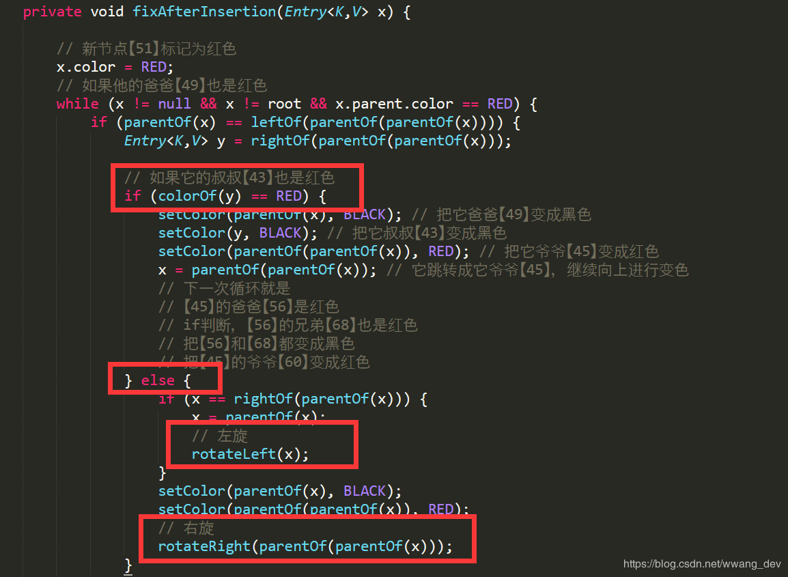

# 红黑树

https://blog.csdn.net/u014454538/article/details/120120216

https://zhuanlan.zhihu.com/p/273829162

## 一、基本概念

**二叉搜索树**（又叫二叉查找树、二叉排序树），具有以下特点：

1. 节点的左孩子的值小于节点本身；
2. 节点的右孩子的值大于节点本身；
3. 左右子树同样为二叉搜索树；

所以最终效果是:

- 节点左子树的所有节点的值都小于节点本身；
- 节点右子树的所有节点的值都大于节点本身；
- 对二叉搜素树的一次中序遍历就是一个递增有序序列 

**二叉平衡树(AVL)**：二叉平衡树是在二叉搜素树的基础上加上了限制：任意节点，左右子树的高度差不能超过1。这个约束常常借助左旋和右旋操作实现。

**左旋**：逆时针旋转两个节点，让一个节点被其右子节点取代，而该节点成为右子节点的左子节点

左旋操作步骤如下：

首先断开节点PL与右子节点G的关系，同时将其右子节点的引用指向节点C2；然后断开节点G与左子节点C2的关系，同时将G的左子节点的应用指向节点PL 

**右旋**：顺时针旋转两个节点，让一个节点被其左子节点取代，而该节点成为左子节点的右子节点

右旋操作步骤如下：

首先断开节点G与左子节点PL的关系，同时将其左子节点的引用指向节点C2；然后断开节点PL与右子节点C2的关系，同时将PL的右子节点的应用指向节点G 

>  

## 二、红黑树（带有自平衡功能的AVL树）

**1. 红黑树的规则特性：**

1. 节点分为红色或者黑色；
2. 根节点必为黑色；
3. 叶子节点都为黑色，且为null；
4. 连接红色节点的两个子节点都为黑色（红黑树不会出现相邻的红色节点）；
5. 从任意节点出发，到其每个叶子节点的路径中包含相同数量的黑色节点；
6. 新加入到红黑树的节点为红色节点；(其实这个是推断出来的，下面会说)

上面的6条就是红黑树给出的自动维持平衡所需要具备的规则

**我们需要注意的是第3条**：叶子节点都为黑色，且都为null，我们在java中空置是null，所以我们能看到的都是红色的非叶子节点，但要知道它并不是叶子节点。

我们看一看一个典型的红黑树到底是什么样儿？ 

**2、红黑树的规则特点能够推断出什么东西？**

**从根节点到叶子节点的最长路径不大于最短路径的2倍**

  怎么样的路径算最短路径？

  从规则5中，我们知道从根节点到每个叶子节点的黑色节点数量是一样的，那么纯由黑色节点组成的路径就是最短路径；

  什么样的路径算是最长路径？

  根据规则4和规则3，红黑树不可能出现连续的红色节点，若有红色节点，则必然有一个连接的黑色节点，当红色节点和黑色节点数量相同时，就是最长路径，也就是黑色节点（或红色节点）* 2

**3、对于第6条：新加入的节点为红色节点，为什么呢？**

从规则4中知道，当前红黑树中从根节点到每个叶子节点的黑色节点数量是一样的，此时假如新插入的是黑色节点的话，必然破坏规则(它所在的路径上会多出一个黑色节点)，但加入红色节点却不一定，除非其父节点就是红色节点才会破坏规则，因此加入红色节点，破坏规则的可能性小一些，下面我们也会举例来说明。

## 三、红黑树的插入操作

我们还是以这个红黑树为例： 

 **插入步骤：**

1. 根据二叉搜索树的特性，找到新的节点合适的插入位置，也就是找到它的爸爸
2. 决定将它作为它爸爸的左孩子还是右孩子(还是二叉搜树的特点)
3. 把它标记为红色节点，因为它可能破坏了原红黑树的规则，所以需要变色+旋转来进行调整

**情况一：插入之后不破坏规则，不需要旋转，也不需要变色**：

我们来看下面这种情况

当我们插入值为【66】的节点时，红黑树变成了这样 

 可以看到插入之后红黑树的特性并未被破坏原树的特性。

那么不妨考虑一下为什么？？？？

**原因很简单，因为【66】的爸爸【64】是黑色节点，我们说了，新的节点会作为红色节点插进去，那么它就不会破坏路径上的黑色节点数。**

那么是不是真的是这样呢？我们来用TreeMap的源码验证一下，不用细看，看流程就行： fixAfterInsertion()就是插入一个节点之后必须进行的调整过程 

 它一上来就是一个while循环，我们可以看到，它的条件里面就说明了除非它的爸爸是红色节点，所以，当它的爸爸是黑色节点的时候，会直接跳过，也就是说，我们的结论是正确的。

**情况二、插入之后只需要变色，不需要旋转**

我们再向上面的哪个树插入值为【51】的节点，这个时候红黑树变成了这样 

 很明显现在的结构不遵循规则 4 了(出现了连续的红色节点)，这个时候就需要启动自动平衡机制调整节点平衡状态

我们可以通过变色的方式，使结构满足红黑树的规则

1. 首先解决结构不遵循规则 4 这一点（红色节点相连，节点49-51），需将节点【49】改为黑色（我们说了新节点一定要作为红色节点，所以我们变色49）；
2. 此时我们发现又违反了规则5（56-49-51-XX路径中黑色节点超过了其他路径），那么我们将节点【45】改为红色节点；
3. 发现又违反了规则4（红色节点相连，节点56-45-43），那么我们将节点【56】和节点【43】改为黑色节点（我们肯定是要往前进行的，总不能把49再变回来吧）；
4. 但是我们发现此时又违反了规则5（60-56-XX路径的黑色节点比60-68-XX的黑色节点多），因此我们需要调整节点【68】为黑色；
5. 完成！！ 

 整个过程结束后这个树是这个样子 

 我们发现它已经满足了所有规则特性，不需要旋转。

那么问题来了，第一种情况是，当新插入的节点的父节点是黑色的时候，不会破坏树的特性，特也不用进行调整。那么你有没有想出来对于现在的这种情况，有没有什么规律呢？什么情况下只需要变色就能达到目的呢？

其实也不难，第一种情况是什么总结出来的？？因为插入的节点是红色，它爸爸是黑色，所以即不会出现连续的红色节点也不会破坏路径上原有的黑色节点数目，所以它不用改变。

也就是说我们需要考虑两个方面？第一，会不会破坏路径上原有的黑色节点数？第二，是不是会出现连续的红色节点。

我们再来看一下未调整之前的树和调整完成后的树 

**结合变色的整个过程，我们总结一下？**

1. 新插入的【51】的爸爸【49】和叔叔【43】都变成了黑色
2. 导致根到左边叶子节点路径上的黑色节点多出了一个，所以要把【49】和【53】的爸爸，也就是【51】的爷爷【45】变成红色来消除这个影响
3. 【45】变成红色之后，因为【56】也是红色，破坏规则，所以继续变色。我们先不继续下去
4. 但是！！！！我们刚开始的情况是什么？是因为【51】和【49】都是红色，导致我们开始变色，然后我们继续，你现在发现接下来是【45】和【56】都是红色，继续变色，

你有没有看出来什么？？？没错，这是一个重复的过程，只是要改变的节点不一样，所以我们可以肯定，调整过程，一定是一个while循环！！，是的，就是我们刚才看的fixAfterInsertion()一进来的那个while

另外，我们再想一下，当【51】和【49】都是红色时，是不是【43】和【49】这两个红的会一起变成黑的，当【45】和【56】都是红色时，【56】和【68】这两个红的是不是会一起变成黑的？

【43】是【49】的兄弟，【68】是【56】的兄弟，而且他们全是红的

**所以我们总结一下，刚才那个小循环过程：**

首先，插入【51】发现它爸爸【49】是红的，发现它爸爸的兄弟【43】也是红的，然后把他两都变成黑色，**把他的爷爷【45】变成黑的；(因为出现连续红了)** 接着，【45】和【56】都是红的，【56】的兄弟【68】也是红的，把他两变成黑的，再把【45】的爷爷【60】变成红色的

你可能会说，【60】没有变啊，是的，但是他是根节点，根节点一定是黑色的，我们看一下源码证明一下这个过程： 

 是不是明白啦？？？明白了我们就来看最难的吧，嘻嘻。

**情况三：既要变色、又要旋转**

小伙伴们可以想一下什么情况下会需要这么复杂的操作？？？

其实也不难，第一种情况是插入红色，它爸爸是黑色，不破坏黑色节点树也没有连续红色，所以不用操作；第二种是插入红色，它爸爸是红色，而且它叔叔也是红色，所以它爸爸和它叔叔会一起变色，它爷爷会随之变色，所以能够达到同一层红色统一变黑色，再高一层的黑色变红色，也是实现了既不改变黑色节点数，也不出现连续红色，所以只需要变色；

第二种情况的核心点在于它爸爸和它叔叔在一个层次上，而且都是红色，能够一起变色，**那只要不能一起变色，就会出现现在这种情况，需要旋转。**

先从代码来看，还是刚才的代码： 

 **发现没，只有它爸爸是红色，它叔叔不是红色的情况下才会进行旋转操作。**

好啦，关于put()和fixAfterPut()的具体过程和代码解释我会在下一篇博客做介绍 ，我们把今天的内容总结总结一下：

## 四、总结红黑树的调整情形：

**1. 新插入红黑树的节点一定是红色** **2. 若新插入节点的爸爸是黑色节点，红黑树不需要调整** **3. 若新插入节点的爸爸和它叔叔都是红色节点，红黑树只需要变色，不需要旋转** **4. 若新插入节点的爸爸是红色，但是它叔叔是黑色（可能为null，但是null是叶子节点，正儿八经的黑色），这时，一定是变色+旋转。**