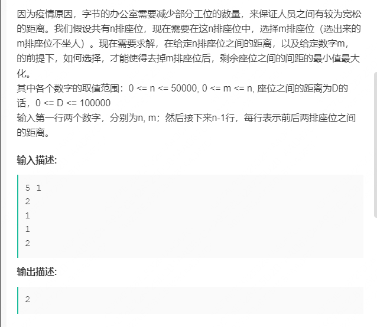
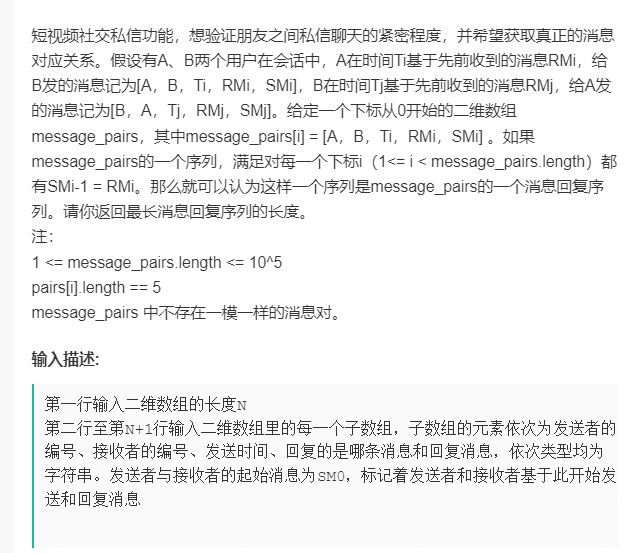
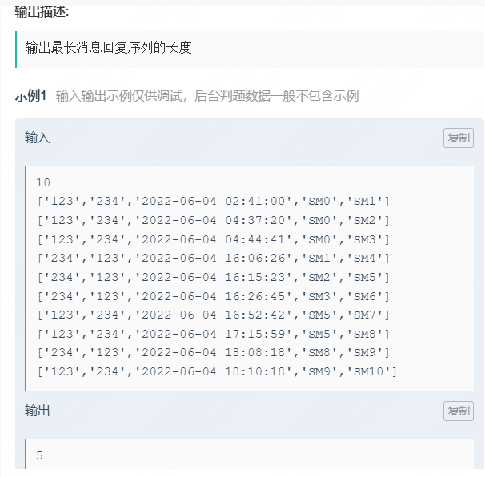

# 滴滴

## 2022年6月11日

> 判断一个num数组，是否可以划分成两个子序列，一个序列递增，另外一个序列递减

```java
import java.util.Scanner;
import java.util.Stack;

public class Test1 {
    public static void main(String[] args) {
        Scanner scanner = new Scanner(System.in);
        int t = scanner.nextInt();
        boolean[] res = new boolean[t];
        for (int i = 0; i < t; i++) {
            int n = scanner.nextInt();
            int[] nums = new int[n];
            for (int j = 0; j < n; j++) {
                nums[j] = scanner.nextInt();
            }
            res[i] = dfs(nums, 0, new Stack<>(), new java.util.Stack<>());
        }
        for (boolean re : res) {
            if (re) {
                System.out.println("OK");
            } else {
                System.out.println("NO");
            }
        }
    }

    public static boolean dfs(int[] nums, int idx, Stack<Integer> up, Stack<Integer> down) {
        if (idx == nums.length) {
            return true;
        }

        if (up.isEmpty() || nums[idx] > up.peek()) {
            up.push(nums[idx]);
            if (dfs(nums, idx + 1, up, down)) {
                return true;
            }
            up.pop();
        }

        if (down.isEmpty() || nums[idx] < down.peek()) {
            down.push(nums[idx]);
            if (dfs(nums, idx + 1, up, down)) {
                return true;
            }
            down.pop();
        }

        return false;
    }
}
```

- 测试用例

```
3
6
3 6 5 1 4 2
7
7 4 1 3 2 5 6
6
1 4 3 6 5 2
```

- 输出结果

```
NO
OK
NO
```

## 二维递增数组，如何查询第k小的数

二维数组的规律，没行从左到右依次递增，每列从上到下依次递增，查找出第k小的数

思路：

通过一个优先队列和一个visited数组，去遍历节点

代码实现：

```java
import java.util.Comparator;
import java.util.PriorityQueue;

public class Test2 {
    public static void main(String[] args) {
        int[][] arr = new int[][]{
                {1,3,7},
                {2,5,8},
                {4,6,9}
        };
        System.out.println(findK(arr, 9));
    }

    public static int findK(int[][] arr, int k) {
        int height = arr.length;
        int weight = arr[0].length;
        if (k > height*weight) {
            return -1;
        }
        PriorityQueue<int[]> priorityQueue = new PriorityQueue<>(new Comparator<int[]>() {
            @Override
            public int compare(int[] o1, int[] o2) {
                return o1[0] - o2[0];
            }
        });
        priorityQueue.add(new int[]{arr[0][0], 0, 0});
        boolean[][] visited = new boolean[height][weight];
        visited[0][0] = true;
        while (--k > 0) {
            int[] poll = priorityQueue.poll();
            int x = poll[1];
            int y = poll[2];
            int right = x + 1;
            int under = y + 1;
            if (right < weight && !visited[y][right]) {
                visited[y][right] = true;
                priorityQueue.add(new int[]{arr[y][right], y, right});
            }
            if (under < height && !visited[under][x]) {
                visited[under][x] = true;
                priorityQueue.add(new int[]{arr[under][x], under, x});
            }
        }
        return priorityQueue.poll()[0];
    }
}
```

# 蔚来

## n个数字中二进制1的个数

```java
public int count(int[] arr) {
    int res = 0;
    for (int i : arr) {
        int cur = 0;
        while (i != 0) {
            cur += i & 1;
            i >>>= 1;
        }
        res += cur;
    }
    return res;
}
```

## 删除链表倒数第n个节点

```java
class Node {
    private int val;
    private Node next;

    public Node(int val) {
        this.val = val;
    }
}

public Node deleteK(Node head, int k) {
    Node originHead = new Node(0);
    originHead.next = head;
    Node pre = originHead;
    Node slow = pre.next;
    Node fast = pre.next;
    while (k > 0) {
        if (fast.next == null) {
            return head;
        }
        fast = fast.next;
        k--;
    }
    
    while (fast.next != null) {
        pre = slow;
        slow = slow.next;
        fast = fast.next;
    }
    pre.next = slow.next;
    return originHead.next;
}
```

# 字节

## 旋转数组找最小值

无重复，leetcode153

```java
public int findMin(int[] nums) {
    int left = 0, right = nums.length - 1;
    while (left < right) {
        int mid = (left + right) / 2;
        if (nums[mid] > nums[right]) left = mid + 1;
        else right = mid;
    }
    return nums[left];
}
```

无重复，leetcode154

```java
public int findMin(int[] nums) {
    int left = 0, right = nums.length - 1;
    while (left < right) {
        int mid = (left + right) / 2;
        if (nums[mid] > nums[right]) left = mid + 1;
        else if (nums[mid] < nums[right]) right = mid;
        // 原因是此题中数组的元素可重复，难以判断分界点 ii 指针区间）
        // 例如 [1, 0, 1, 1, 1] 和 [1, 1, 1, 0, 1] ，
        // 在 left = 0, right = 4, mid = 2 时，无法判断 mid 在哪个排序数组中。
        // right = right - 1 解决此问题
        else right--;
    }
    return nums[left];
}
```

# 排序

## 快速排序

```java
import java.util.Arrays;

public class QuickSort {
    public static void main(String[] args) {
        int[] nums = new int[]{15, 19, 20, 13, 29, 30, 2, 6};
        quickSort(nums, 0 , nums.length - 1);
        System.out.println(Arrays.toString(nums));
    }

    public static void quickSort(int[] nums, int low, int high) {
        if (low < high) {
            int partition = partition(nums, low, high);
            quickSort(nums, low, partition - 1);
            quickSort(nums, partition + 1, high);
        }
    }

    private static int partition(int[] nums, int low, int high) {
        int pivot = nums[high];
        int pointer = low;
        int temp;
        for (int i = low; i < high; i++) {
            if (nums[i] < pivot) {
                temp = nums[i];
                nums[i] = nums[pointer];
                nums[pointer] = temp;
                pointer++;
            }
        }
        temp = nums[high];
        nums[high] = nums[pointer];
        nums[pointer] = temp;
        return pointer;
    }
}
```

## 堆排序

```java
import java.util.Arrays;

public class HeapSort {
    public static void main(String[] args) {
        int[] array = {91, 60, 96, 13, 35, 65, 46, 65, 10, 30, 20, 31, 77, 81, 22};
        System.out.println("排序前：" + Arrays.toString(array));
        heapSort(array);
        System.out.println("排序前：" + Arrays.toString(array));
    }

    /**
     * 堆排序1,从小到大
     * @param array
     */
    public static void heapSort(int[] array) {
        // 构建大顶堆
        for (int i = array.length/2 - 1; i >= 0; i--) {
            // 从第一个非叶子节点从下到上，从右至左调整结构
            siftDown(array, i, (i + 1) * 2);
        }
        // 调整堆结构，交换堆顶元素与末尾元素
        for (int i = array.length - 1; i > 0; i--) {
            // 将堆顶元素与末尾元素进行交换
            swap(array, 0, i);
            // 重新对堆进行调整
            siftDown(array, 0, i);
        }
    }

    /**
     * 将以 i 对应的非叶子节点的树调整为大顶堆
     * @param array
     * @param i
     * @param length
     */
    public static void siftDown(int[] array, int i, int length) {
        // 取出当前元素i
        int temp = array[i];
        // 从i节点的左子节点开始，也就是2*i+1处开始
        for (int j = i*2 + 1; j < length; j = j*2 + 1) {
            // 如果左子节点小于右子节点，j指向右子节点，因为需要构建大顶堆
            if (j + 1 < length && array[j] < array[j + 1]) {
                j++;
            }
            // 如果子节点大于父节点，将子节点的值赋值父节点，不用交换
            if (array[j] > temp) {
                array[i] = array[j];
                i = j;
            } else {
                break;
            }
        }
        array[i] = temp;
    }

    /**
     * 交换元素
     * @param array
     * @param a
     * @param b
     */
    public static void swap(int []array,int a ,int b){
        int temp=array[a];
        array[a] = array[b];
        array[b] = temp;
    }
}
```

# 字节跳动青训营

## 座位移除



只过了20，不知道哪里出错了

```java
import java.util.ArrayList;
import java.util.List;
import java.util.Scanner;

public class Main {
    public static void main(String[] args) {
        Scanner scanner = new Scanner(System.in);
        String[] split = scanner.nextLine().split(" ");
        int n = Integer.valueOf(split[0]), m = Integer.valueOf(split[1]);
        List<Integer> distances = new ArrayList<>(n - 1);
        for (int i = 0; i < n - 1; i++) {
            distances.add(Integer.valueOf(scanner.nextLine()));
        }
        while (m > 0) {
            int minIdx = 0;
            int min = distances.get(minIdx);
            for (int i = 1; i < distances.size(); i++) {
                if (distances.get(i) < min) {
                    minIdx = i;
                    min = distances.get(i);
                }
            }
            if (minIdx > 0 && minIdx < distances.size() - 1) {
                if (distances.get(minIdx - 1) >= distances.get(minIdx + 1)) {
                    distances.remove(minIdx);
                    distances.set(minIdx, distances.get(minIdx) + min);
                } else {
                    distances.remove(minIdx);
                    distances.set(minIdx - 1, distances.get(minIdx - 1) + min);
                }
            } else {
                if (minIdx == 0) {
                    distances.remove(minIdx);
                    distances.set(minIdx, distances.get(minIdx) + min);
                } else {
                    distances.remove(minIdx);
                    distances.set(minIdx - 1, distances.get(minIdx - 1) + min);
                }
            }
            m--;
        }
        int min = Integer.MAX_VALUE;
        for (Integer distance : distances) {
            min = Math.min(min, distance);
        }
        System.out.println(min);
    }
}
```

## 最长消息序列长度





```java
import java.util.*;

public class Main {
    public static void main(String[] args) {
        Scanner scanner = new Scanner(System.in);
        int n = Integer.parseInt(scanner.nextLine());
        List<Message> list = new ArrayList<>(n);
        while (n > 0) {
            Message message = new Message(scanner.nextLine());
            list.add(message);
            n--;
        }
        Collections.sort(list);
        int max = 0;
        for (int i = 0; i < list.size() - 1; i++) {
            int curMax = maxLen(list, list.get(i).s, i + 1) + 1;
            max = Math.max(max, curMax);
        }
        System.out.println(max);
    }

    public static int maxLen(List<Message> list, String need, int idx) {
        while (idx < list.size() && !list.get(idx).r.equals(need)) {
            idx++;
        }
        int max = 0;
        while (idx < list.size() && list.get(idx).r.equals(need)) {
            int curMax = maxLen(list, list.get(idx).s, idx + 1) + 1;
            max = Math.max(max, curMax);
            idx++;
        }
        return max;
    }

    static class Message implements Comparable<Message> {
        String r;
        String s;

        public Message(String str) {
            String[] split = str.substring(1, str.length() - 1).split(",");
            this.r = split[3];
            this.s = split[4];
        }

        @Override
        public int compareTo(Message o) {
            if (r.equals(o.r)) {
                return s.compareTo(o.s);
            }
            return r.compareTo(o.r);
        }
    }
}
```

# 常见

## LRU缓存

```java
import java.util.HashMap;
import java.util.Map;

public class LRUCache<K, V> {

    private int size, capacity;

    private Node<K, V> head, tail;

    private Map<K, Node<K, V>> cache;

    private class Node<K, V> {
        K k;
        V v;
        Node<K, V> pre, next;

        public Node(K k, V v) {
            this.k = k;
            this.v = v;
        }
    }

    public LRUCache(int capacity) {
        this.capacity = capacity;
        this.size = 0;
        this.cache = new HashMap<>(capacity);
        this.head = new Node<>(null, null);
        this.tail = new Node<>(null, null);
        this.head.next = tail;
        this.tail.pre = head;
    }
    
    public void put(K k, V v) {
        Node<K, V> node = cache.get(k);
        if (node == null) {
            node = new Node<>(k, v);
            cache.put(k, node);
            addToHead(node);
            if (size > capacity) {
                removeTail();
            }
        } else {
            node.v = v;
            moveToHead(node);
        }
    }
    
    public V get(K k) {
        Node<K, V> node = cache.get(k);
        if (node != null) {
            moveToHead(node);
            return node.v;
        } else {
            return null;
        }
    }
    
    public void remove(K k) {
        Node<K, V> node = cache.get(k);
        if (node != null) {
            removeNode(node);
            cache.remove(k);
        }
    }
    
    private void removeNode(Node node) {
        node.next.pre = node.pre;
        node.pre.next = node.next;
        size--;
    }
    
    private void moveToHead(Node node) {
        removeNode(node);
        node.pre = head;
        node.next = head.next;
        head.next.pre = node;
        head.next = node;
        size++:
    }
    
    private void addToHead(Node node) {
        node.pre = head;
        node.next = head.next;
        head.next.pre = node;
        head.next = node;
        size++;
    }
    
    private void removeTail() {
        removeNode(tail.pre);
    }
}
```

## 单例模式

```java
public class SingleTonDemo {

    private static SingleTonDemo instance;

    enum SingleTon {
        INSTANCE;

        public SingleTonDemo getInstance() {
            return new SingleTonDemo();
        }
    }

    public SingleTonDemo getInstance1() {
        return SingleTon.INSTANCE.getInstance();
    }

    public SingleTonDemo getInstance2() {
        if (instance == null) {
            synchronized (SingleTonDemo.class) {
                if (instance == null) {
                    instance = new SingleTonDemo();
                }
            }
        }
        return instance;
    }

    private static class Holder {
        public static SingleTonDemo instance = new SingleTonDemo();
    }

    public SingleTonDemo getInstance3() {
        return Holder.instance;
    }
}
```

## 接雨水

```java
/**
 * @see <a href="https://leetcode-cn.com/problems/trapping-rain-water/">leetcode</a>
 */
public int trap(int[] height) {
    int sum = 0;
    int[] max_left = new int[height.length];
    int[] max_right = new int[height.length];

    // 从右开始遍历，获取每个位置左边最高墙
    for (int i = 1; i < height.length - 1; i++) {
        max_left[i] = Math.max(max_left[i - 1], height[i - 1]);
    }
    // 从左开始遍历，获取每个位置右边最高墙
    for (int i = height.length - 2; i >= 0; i--) {
        max_right[i] = Math.max(max_right[i + 1], height[i + 1]);
    }

    // 遍历每个位置
    for (int i = 1; i < height.length - 1; i++) {
        // 判断min 为 左右两边高墙中较低的
        int min = Math.min(max_left[i], max_right[i]);
        // 判断min是否比当前height[i]高
        if (min > height[i]) {
            // 当前位置可以接的雨水为min - height[i]
            sum = sum + (min - height[i]);
        }
    }
    return sum;
}
```

## 最小栈

```java
import java.util.Stack;

public class MinStack {
    private Stack<Integer> stack;
    private Stack<Integer> minStack;

    public MinStack() {
        stack = new Stack<>();
        minStack = new Stack<>();
    }

    public void push(int val) {
        stack.push(val);
        if (minStack.isEmpty() || val <= minStack.peek()) {
            minStack.push(val);
        }
    }

    public Integer pop() {
        if (stack.isEmpty()) {
            return null;
        }
        Integer pop = stack.pop();
        if (!minStack.isEmpty()) {
            if (pop.equals(minStack.peek())) {
                minStack.pop();
            }
        }
        return pop;
    }

    public Integer top() {
        return stack.isEmpty() ? null : stack.peek();
    }

    public Integer getMin() {
        return minStack.isEmpty() ? null : minStack.peek();
    }
}
```

## 无序数组查找第K大的数

```java
import java.util.Random;

public class Test {

    private static Random rand = new Random();

    public static void main(String[] args) {
        // 无序数组，待查找
        int[] arr = {30, 60, 80, 40, 300, 250, 110, 255, 257, 256, 280, 45, 200, 50};
        // 有序数组，用于对照
        int[] arr1 = {30, 40, 45, 50, 60, 80, 110, 200, 250, 255, 256, 257, 280, 300};
        //测试对整个数组的的查找结果
        for (int i = 1; i < arr.length + 1; ++i) {
            int r = findK(arr, 0, arr.length - 1, i);
            System.out.print(r + " ");
        }
    }

    /**
     * 主元素随机选取的划分
     *
     * @param arr:待处理数组
     * @param l:数组的左边界
     * @param r:数组的右边界
     * @return:此次选取的主元素一趟排序后的最终下标
     */
    private static int randomizedPartition(int[] arr, int l, int r) {
        // 产生的随机数范围是[p, r-1];
        int pivot = rand.nextInt(r - l + 1) + l;
        // 随机产生的元素设为主元素
        int x = arr[pivot];
        int i = l, j = r;
        while (true) {
            while (arr[i] < x)
                i++;
            while (arr[j] > x)
                j--;
            if (i < j) {
                int temp = arr[i];
                arr[i] = arr[j];
                arr[j] = temp;
            } else {
                return j;
            }
        }
    }

    /**
     * 非随机划分
     *
     * @param arr:待处理数组
     * @param l:数组的左边界
     * @param r:数组的右边界
     * @return:此次选取的主元素一趟排序后的最终下标
     */
    private static int partition(int[] arr, int l, int r) {
        int pivot = arr[r];
        int pointer = l;
        int temp;
        for (int i = l; i < r; i++) {
            if (arr[i] < pivot) {
                temp = arr[i];
                arr[i] = arr[pointer];
                arr[pointer] = temp;
                pointer++;
            }
        }
        arr[r] = arr[pointer];
        arr[pointer] = pivot;
        return pointer;
    }


    public static int findK(int[] arr, int l, int r, int k) {
        if (l == r)
            return arr[l];
        // 随机选取主元素进行划分
        // int partition = randomizedPartition(arr, l, r);
        // 固定每次选择最左边的元素作为主元素进行划分
        int partition = partition(arr, l, r);
        if ((partition + 1) == k) return arr[partition];
        else if ((partition + 1) < k) return findK(arr, partition + 1, r, k);
        else return findK(arr, l, partition - 1, k);
    }
}
```
