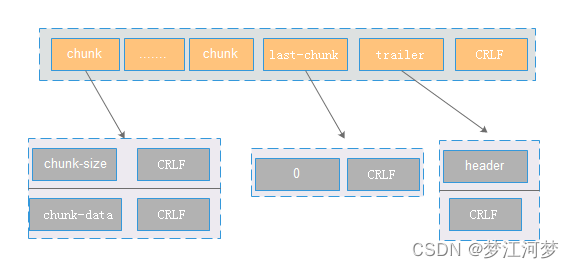

# 互联网

- 万维网WWW
  - 万维网是一个大规模、联机式的信息储藏所
  - 是一个分布式的超媒体系统，它是超媒体系统的的扩充。
  - 万维网以客户服务器方式工作，客户程序向服务器程序发出请求，服务器程序向客户程序送回客户所要的万维网文档
  - 万维网使用统一资源定位符URL来标志万维网上的各种文档，并使每一个文档再整个互联网的范围内具有

# 什么是TCP粘包/半包？怎么解决这个问题

在[socket](https://so.csdn.net/so/search?q=socket&spm=1001.2101.3001.7020)网络编程中，都是端到端通信，由客户端端口+服务端端口+客户端IP+服务端IP+传输协议组成的五元组可以明确的标识一条连接。在TCP的socket编程中，发送端和接收端都有成对的socket。**发送端为了将多个发往接收端的包，更加高效的发给接收端，于是采用了Nagle算法，将多次间隔较小，数据量较小的数据，合并成一个数据量大的数据块，然后进行封包**。那么这样一来，接收端就必须使用高效科学的拆包机制来分辨这些数据。

## 什么是TCP粘包/半包问题

**所谓TCP粘包**就是连续给对端发送两个或者两个以上的数据包，对端在一次收取中可能收到的数据包大于 1 个，大于 1 个，可能是几个（包括一个）包加上某个包的部分，或者干脆就是几个完整的包在一起（从接收缓冲区来看，后一包数据的头紧接着前一包数据的尾）。当然，也可能收到的数据只是一个包的部分，这种情况一般也叫**半包**。

> 举个具体的例子

- A 与 B 进行 TCP 通信，A 先后给 B 发送了一个 100 字节和 200 字节的数据包，那么 B 是如何收到呢？B 可能先收到 100 字节，再收到 200 字节；也可能先收到 50 字节，再收到 250 字节；或者先收到 100 字节，再收到 100 字节，再收到 100 字节；或者先收到 20 字节，再收到 20 字节，再收到 60 字节，再收到 100 字节，再收到 50 字节，再收到 50 字节……
- 从上面可以看出：A一共给B发送了300字节，B可能以一次或者多次任意形式的总数为300字节收到。假设A给B发送的100字节和200字节分别都是一共数据包，对于发送端A来说，这个是可以区分的，但是对B来说，如果不人为规定多长为一个数据包，B每次是不知道应该把收到的数据中多少字节作为一个有效的数据包的。

这也是为什么说TCP是一个流式协议的具体原因。

> 为什么要解决粘包问题呢？

因为B不知道应该把收到的数据中多少字节作为一个有效的数据包，可能会有新手写出类似下面这样的代码

发送端：

```cpp
//...省略创建socket，建立连接等部分不相关的逻辑...
char buf[] = "the quick brown fox jumps over a lazy dog.";
int n = send(socket, buf, strlen(buf), 0);
//...省略出错处理逻辑...
1234
```

接收端：

```cpp
//省略创建socket，建立连接等部分不相关的逻辑...
char recvBuf[50] = { 0 };
int n = recv(socket, recvBuf, 50, 0);
//省略出错处理逻辑...
printf("recvBuf: %s", recvBuf);
12345
```

类似这样的代码在本机一般会工作的很好，接收端也如期打印出来预料的字符串，但是一放到局域网或者公网环境就出问题了，即接收端可能打印出来字符串并不完整；如果发送端连续多次发送字符串，接收端会打印出来的字符串不完整或出现乱码。不完整的原因很好理解，即对端某次收到的数据小于完整字符串的长度，recvBuf 数组开始被清空成 0，收到部分字符串后，该字符串的末尾仍然是 0，printf 函数寻找以 0 为结束标志的字符结束输出；乱码的原因是如果某次收入的数据不仅包含一个完整的字符串，还包含下一个字符串部分内容，那么 recvBuf 数组将会被填满，printf 函数输出时仍然会寻找以 0 为结束标志的字符结束输出，这样读取的内存就越界了，一直找到为止，而越界后的内存可能是一些不可读字符，显示出来后就乱码了。

## 造成TCP粘包的原因

出现粘包的原因是多方面的，可能是来自接收方，也可能是来自发送方。

### 发送方原因

TCP默认使用Nagle算法（主要作用：减少网络中报文段的数量），而Nagle算法主要做两件事：

- 只有上一个分组得到确认，才会发送下一个分组
- 收集多个小分组，在一个确认到来时一起发送。

Nagle算法造成了发送方可能会出现粘包问题

> - TCP有一个数据流接口，应用程序可以通过它将任意尺寸的数据放入TCP栈中----即使一次只放一个字节也可以（！！！造成“发送端傻窗口综合征”）。但是，每个TCP段中都至少装载了40个字节的标记和首部，所以如果TCP发送了大量包含少量数据的分组，网络的性能就会严重下降，
> - Nagle算法试图在发送一个分组之前，将大量的TCP数据绑定在一起，以提高网络效率。
> - Nagle算法鼓励发送全尺寸的段，只有当所有其他分组都被确认之后，Nagle算法才允许发送非全尺寸的分组。如果其他分组仍然在传输过程中，就将那部分数据缓存起来。只有当挂起分组被确认，或者缓存中积累了足够发送一个全尺寸分组的数据时，才会将缓存的数据发送出去。
> - Nagle算法会引发几种HTTP性能问题。首先，小的HTTP报文可能无法填满一个分组，可能会因为等待哪些永远不会到达的额外数据而产生时延。其次，Nagle算法与延迟确认之间的交互存在问题------Nagle算法会阻止数据的发送，直到有确认分组到达为止。但确认分组自身会被延迟确认算法延迟100-200ms，当使用管道化连接时这些问题可能会更加严重，因为客户端可能会有多条报文要发送给同一个服务器，而且不希望有时延存在。
> - **HTTP应用程序常常会在自己的栈中设置参数TCP_NODELAY，禁用Nagle算法，提高性能。如果这样做的话，一定要确保会向TCP写入大块的数据，这样就不会产生一堆小分组了**。

### 接收方原因

TCP接收到数据包时，并不会马上交到应用层处理，或者说应用层并不会立即处理。实际上，TCP将接收到的数据包保存在接收缓存里，然后应用程序主动从缓存读取收到的分组。**这样一来，如果TCP接收数据报到缓存的速度岛屿应用程序从缓存中读取数据报的速度，多个包就会被缓存，应用程序就有可能读取到多个收尾相接粘到一起的包**

## 如何处理粘包现象

### 发送方

对于发送方造成的粘包问题，可以通过关闭Nagle算法来解决，使用TCP_NODELAY选项来关闭算法。

```cpp
        acl_socket* conn_fd = listen_fd_->acl_accept(NULL, 0, NULL);
        if (conn_fd == NULL) {
            if (open_flag_ & ACL_NON_BLOCKING) {
                logger_error("accept error %s", strerror(errno));
            } else if (errno != EAGAIN && errno != EWOULDBLOCK) {
                logger_error("accept error %s", strerror(errno));
                return NULL;
            }
        }

        conn_fd->acl_tcp_set_nodelay();
1234567891011
void acl_tcp_set_nodelay(ACL_SOCKET fd)
{
	acl_tcp_nodelay(fd, 1);
}
// 1表示打开 TCP_NODELAY选项
void acl_tcp_nodelay(ACL_SOCKET fd, int onoff)
{
	const char *myname = "acl_tcp_nodelay";
	int   on = onoff ? 1 : 0;
	int   n = acl_getsocktype(fd);

#ifdef AF_INET6
	if (n != AF_INET && n != AF_INET6)
#else
	if (n != AF_INET)
#endif
		return;

	if (setsockopt(fd, IPPROTO_TCP, TCP_NODELAY,
		(char *) &on, sizeof(on)) < 0) {

		acl_msg_error("%s(%d): set nodelay error(%s), onoff(%d)",
			myname, __LINE__, acl_last_serror(), onoff);
	}
}
```

### 接收方

接收方没有办法来处理粘包问题，只能将问题交给应用层来处理

### 应用层

应用层的解决办法简单可行，不仅能解决接收方的粘包问题，还可以解决发送方的粘包问题。

解决方法：**循环处理，应用程序从接收缓存中读取分组时，读完一条数据，就应该循环读取下一条数据，直到所有数据都被处理完成**，但是如何判断每条数据的长度呢？也就是说**怎么从收到的数据中包包与包的边界给区分出来**（这也是最关键的地方）

> 无论是半包还是粘包问题，其根源就是因为TCP是一个流式协议。所谓流式协议，即协议的内容是像流水一样的字节流，内容与内容之间没有明确的分界标志，需要我们人为的去给这些协议划分边界，以便接收端知道从什么位置取出多少字节来当成一个数据包去解析，这就是我们设计网络通信协议格式要做的工作之一。

目前主要有三种方法：

- 固定包长
- 以指定字符(串)为包的结束标志
- 包头 + 包体格式

ps:在使用大多数网络库时，通常你需要根据协议格式自己给数据包分界和解析，一般的网络库不提供这种功能是处于需要支持不同的协议，由于协议的不确定性，因此没法预先提供具体的解包代码。当然，这不是绝对的，也有一些网络库提供了这种功能

#### 固定包长的数据包

顾名思义，即每个协议包的长度都是固定的。举个例子，比如我们可以规定协议包的大小是64个字节，每次收满64个字节，就取出来解析（如果不够，就先存起来）。

这种通信协议的格式简单但灵活性差。**如果包内容不足指定的字节数，剩余的空间需要填充特殊的信息，如 \0**（如果不填充特殊内容，如何区分包里面的正常内容与填充信息呢？）；如果包内容超过指定字节数，又得分包分片，需要增加额外处理逻辑-------在发送端进行分包分片，在接收端重新组装包片。

#### 以指定字符(串)为包的结束标志

这种协议包比较常见，即字节流中遇到特殊的符号值时就认为到一个包的末尾了。比如，我们熟悉的FTP协议，发邮件的SMTP协议，一个命令或者一段数据后面加上"\r\n"（即所谓的 CRLF）表示一个包的结束。对端收到后，每遇到一个"\r\n"就把之前的数据当做一个数据包。

这种协议一般用于一些包含各种命令控制的应用中，其不足之处就是如果协议数据包内容部分需要使用包结束标志字符，就需要对这些字符做转码或者转义操作，以免被接收方错误地当成包结束标志而误解析。

#### 包头 + 包体格式

这种格式的包一般分为两部分，即包头和包体，包头是固定大小的，而且包头中必须含有一个字段来说明接下来的包体有多大。

比如：

```cpp
struct msg_header{
	int32_t bodySize;
	int32_t cmd;
};
```

这就是一个典型的包头格式，bodySize 指定了这个包的包体是多大。由于包头大小是固定的（这里是 size(int32_t) + sizeof(int32_t) = 8 字节），对端先收取包头大小字节数目（当然，如果不够还是先缓存起来，直到收够为止），然后解析包头，根据包头中指定的包体大小来收取包体，等包体收够了，就组装成一个完整的包来处理。在有些实现中，包头中的 bodySize可能被另外一个叫 packageSize 的字段代替，这个字段的含义是整个包的大小，这个时候，我们只要用 packageSize 减去包头大小（这里是 sizeof(msg_header)）就能算出包体的大小，原理同上。

## UDP会不会产生粘包问题呢？

TCP为了保证可靠传输并减少额外的开销(每次发包都要验证)，采用了基于流的传输，基于流的传输不认为消息是一条条的，是无保护消息边界的（保护消息边界：指传输协议把数据当做一条独立的消息在网上传输，接收端一次只能接受一条独立的消息）。

UDP则是面向消息的，是由保护边界的，接收方一次只接收一条独立的消息，所以不存在粘包问题

举个例子：有三个数据包，大小分别为2k、4k、6k，如果采用UDP发送的话，不管接受方的接收缓存有多大，我们必须要进行至少三次以上的发送才能把数据包发送完，但是使用TCP协议发送的话，我们只需要接受方的接收缓存有12k的大小，就可以一次把这3个数据包全部发送完毕。

## 面试题：网络通信时，如何解决粘包、丢包或者包乱序问题？

- 如果是TCP协议，在大多数场景下，是不存在丢包和包乱序的问题的，TCP通信是可靠通信方式，TCP协议栈通过序列号和包重传确认机制保证数据包的有序和一定被正确发到目的地
- 如果是UDP协议，如果不能接受少量丢包，那就要自己在UDP的基础上实现类似TCP这种有序和可靠传输机制（比如RTP协议、RUDP协议）。所以，问题拆解后，只剩下如何解决粘包的问题了

那么怎么解决粘包问题呢？

- 发送端：关闭Nagle算法算法
- 接收端只能在应用层解决：
  - 固定包长
  - 以指定字符(串)为包的结束标志
  - 包头 + 包体格式
- [TCP 协议如何解决粘包、半包问题(待研究)](https://mp.weixin.qq.com/s/sbBhBowAfhnaydErmoTxDg)

# 如何正确在TCP流中提取HTTP包，并处理可能的错误情况？

发送端：
应用层协议的每个包到达传输层，如果是tcp，会可能出现以下情况:

- 应用层的每个包被拆成多个tcp报文，分别发送，这是拆包；
- 应用层的多个包组成一个tcp报文发送，这是粘包；

接收端：
发送端的数据通过网络传输到了接受端的tcp缓冲区，不知道如何组成一个应用层的包，这必须由应用层解决，方法如下：

- 定长：应用层指定每个包的长度，如果数据不够，用空格补充，缺点是不够灵活，不能发送超出这个长度的包；
- 分割符：指定分割符，接收端一直读取数据直到读取到指定的分割符；
- 指定长度+数据：比如先发送4个字节的长度，表示后面要发送数据的字节数；

> Http怎么解决拆包粘包的？

http请求报文格式

- 请求行：以\r\n结束；
- 请求头：以\r\n结束；
- \r\n；
- 数据；

http响应报文格式

- 响应行：以\r\n结束；
- 响应头：以\r\n结束；
- \r\n；
- 数据；


1. 遇到第一个\r\n表示读取请求行或响应行结束；

2. 遇到\r\n\r\n表示读取请求头或响应头结束；

3. 怎么读取body数据呢？

  1. 根据请求头或响应头的Content-Length，单位是字节；

  2. chunked协议，取代Content-Length，如果请求头或者响应头有Transfer-Encoding: chunked，表示根据chunked协议协议读取数据，具体如下图：

    

    读取第一个chunk，遇到CRLF表示读取长度完毕，接下来是第一个chunk的数据，也是以CRLF结束。当遇到长度为0的chunk，表示数据读取完毕。


知乎：https://www.zhihu.com/question/24598268

应该说这是一个很简单很常见的问题，也不太想纠结“粘包”这个术语是否正确，如果将其定义为“HTTP[解析器](https://www.zhihu.com/search?q=解析器&search_source=Entity&hybrid_search_source=Entity&hybrid_search_extra={"sourceType"%3A"answer"%2C"sourceId"%3A625136503})一次读socket操作获得的数据可能并不直接对应一个HTTP message”，那么应该说这个问题是必然会存在的。

在面向stream的协议基础上实现一个面向message的协议，那么一般来说应用层和底层之间必然存在一个缓冲区和定时器。于是解析的过程就是，从socket中读取一次数据放入缓冲区，并检查目前buffer中内容是否是一个完整的message，如果是，提交给上层并修改队列起始位置，如果不是，不提交数据给上层。

这里存在两个问题，一个是缓冲区必然要设定一个最大上限，另一方面是一般要设置定时器，一段时间内某个连接没有传输足够数据就断开连接并清除[buffer](https://www.zhihu.com/search?q=buffer&search_source=Entity&hybrid_search_source=Entity&hybrid_search_extra={"sourceType"%3A"answer"%2C"sourceId"%3A625136503})，否则很容易被恶意请求占用过多内存而影响整体稳定性。

具体到HTTP协议，HTTP 1.0无keep alive或HTTP 0.9时，一个TCP连接只能传输一个HTTP message，所以一次性读到对端关闭写即可；有keep alive的情况下，一个TCP连接可能顺序传过来多个请求，就需要利用content-length等字段，于是文本协议解析部分，从解析整个报文变为解析HTTP头，并根据HTTP头中相关字段选择后续解析策略了，也就是上面提到的缓冲区和定时器的问题。

至于具体的流解析实现，可以采用有状态实现，即保存一个状态，记录当前扫描到何处，当前状态如何，之后再有新的数据传过来，就不必再把前面扫描过的数据再扫描一遍了；也可以采用无状态的实现，即不记录扫描到何处，不记录当前状态，某次解析后发现不足一个message，就丢弃当前状态，待下次读取数据进队列尾部，再重头开始解析。（对于每个message比较小的场景，无状态版更快，事实上NGINX也是如此实现的）

关于buffer的底层实现，最简单的版本无疑是算法与[数据结构](https://www.zhihu.com/search?q=数据结构&search_source=Entity&hybrid_search_source=Entity&hybrid_search_extra={"sourceType"%3A"answer"%2C"sourceId"%3A625136503})入门课上的[单数组](https://www.zhihu.com/search?q=单数组&search_source=Entity&hybrid_search_source=Entity&hybrid_search_extra={"sourceType"%3A"answer"%2C"sourceId"%3A625136503})实现；更详细的优化版往往是元素为数组的链表结构，不过具体的性能表现需要经过非常多的测试之后设定参数与策略。

关于HTTP body比较大的情况，一般需要对上层提供流读写的API，避免完全将超大报文体放在内存中。这样也可以传输超大文件，而不是只能用chunked机制。