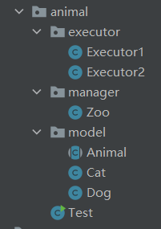

# 项目代码设计

## 动态的动物管理园

> 需求

- 需要一个动物管理员类，管理不同的动物类
- 动物种类的个数是动态的、不确定的，可以新增动物种类，删除动物种类
- 新增动物，用户可以新增一个动物，动物管理员需要根据动物的种类进行区分处理，将动物加入
- 删除动物，用户传入一个动物对象，动物管理员需要判断动物的类型并且判断是否存在并且进行删除
- 统计用户数量，用户传入动物类型，需要返回出对应动物类型的数量
- 在多线程执行情况下，如何既充分利用资源又高效的保证数据一致

> 设计思路

- 代码设计截图，包含多线程执行器用于测试、Zoo动物管理员对象，model动物类



- 动物类为一个抽象类，声明动物的共有属性和抽象方法，具体的动物类继承这个抽象

```java
public abstract class Animal{}
public class Cat extends Animal{}
public class Dog extends Animal{}
```

- 动物管理员，维护一个Map，Key为`Class<T>`对象，Value为一个链表`List<Animal>`

```java
private Map<Class<? extends Animal>, List<Animal>> map = new ConcurrentHashMap<>();
```

- 新增动物的时候，根据动物的`Class`对象判断动物的类型，然后对当前这个`Class`对象加锁，从Map中取出对应的动物链表，然后操作对应的链表数据，删除同理

> 代码

- executor

```java
import com.wu.scene.animal.model.Cat;
import com.wu.scene.animal.model.Dog;
import com.wu.scene.animal.manager.Zoo;

import java.util.UUID;

public class Executor1 implements Runnable {
    private Zoo zoo;

    public Executor1(Zoo zoo) {
        this.zoo = zoo;
    }

    /**
     * 插入10000条cat，5000条dog
     */
    @Override
    public void run() {
        for (int i = 0; i < 5000; i++) {
            zoo.addAnimal(new Dog("dog" + UUID.randomUUID().toString()));
            zoo.addAnimal(new Cat("cat" + UUID.randomUUID().toString()));
            zoo.addAnimal(new Cat("cat" + UUID.randomUUID().toString()));
        }
    }
}
```

```java
import java.util.UUID;

public class Executor2 implements Runnable{
    private Zoo zoo;

    public Executor2(Zoo zoo) {
        this.zoo = zoo;
    }

    /**
     * 插入10000条dog，5000条cat
     */
    @Override
    public void run() {
        for (int i = 0; i < 5000; i++) {
            zoo.addAnimal(new Dog("dog" + UUID.randomUUID().toString()));
            zoo.addAnimal(new Dog("dog" + UUID.randomUUID().toString()));
            zoo.addAnimal(new Cat("cat" + UUID.randomUUID().toString()));
        }
    }
}
```

- model

```java
public abstract class Animal {
    private String name;

    public Animal(String name) {
        this.name = name;
    }

    public abstract void call();
}

public class Cat extends Animal{
    public Cat(String name) {
        super(name);
    }

    @Override
    public void call() {
        System.out.println("cat");
    }
}

public class Dog extends Animal {
    public Dog(String name) {
        super(name);
    }

    @Override
    public void call() {
        System.out.println("dog");
    }
}
```

- manager

```java
import java.util.LinkedList;
import java.util.List;
import java.util.Map;
import java.util.concurrent.ConcurrentHashMap;

public class Zoo {
    private Map<Class<? extends Animal>, List<Animal>> map = new ConcurrentHashMap<>();

    public void addAnimal(Animal animal) {
        Class<? extends Animal> animalType = animal.getClass();
        synchronized (animalType) {
            List<Animal> animals = map.get(animalType);
            if (animals == null) {
                LinkedList<Animal> list = new LinkedList<>();
                list.add(animal);
                map.put(animalType, list);
            } else {
                animals.add(animal);
            }
        }
    }

    public boolean deleteAnimal(Animal animal) throws RuntimeException {
        Class<? extends Animal> animalType = animal.getClass();
        synchronized (animalType) {
            List<Animal> animals = map.get(animalType);
            if (animals == null) {
                throw new RuntimeException("such animal type is null");
            }
            if (animals.contains(animal)) {
                animals.remove(animal);
                return true;
            } else {
                throw new RuntimeException("no such animal in zoo");
            }
        }
    }

    public int countAnimalByType(Class<? extends Animal> type) {
        List<Animal> animals = map.get(type);
        return animals == null ? 0 : animals.size();
    }
}
```

# 如何有效避免token泄露导致的安全问题

- 首先，Token 一般放在 Header 或者 Cookies 中，Http 是明文传输，Https 是密文传输。可以一定程度防止Token 截获。
- 第二，Token 一般会和 Ip，MAC地址，或者 DeviceID 进行绑定。如果服务端检测这些发生了变化，可以将 Token 失效让用户重新登录。
- 第三，Token 可以加密，例如AES对称加密，客户端与服务端先交换对称秘钥之后用对称秘钥将 Token + 当前时间戳 对称加密后发往服务端解密验证 Token 和时间戳都有效。或者直接通过 RSA 公钥加密。增加了截取成本。
- 第四，敏感操作一般要求二次安全验证，例如支付的时候，需要支付密码，或者验证手机短信验证码等等。
  
